# 系统全景图（Layer × Module × 冻结状态）

> 状态：草案
>
> 角色：一张图回答"这个项目分几层、每层有什么模块、每个模块当前到哪一步"。
>
> 权威来源：本图模块名与编号 100% 来自 README.md / 00-overview.md / adr/*；本图不发明任何新模块。

---

## 1. 全景图

```mermaid
flowchart TB
    subgraph UI["UI Layer  (40-47, 39 计划)"]
        direction LR
        U_PLAN[/"39 UI Implementation Plan<br/>📝 计划草案"/]
        U_DIR[/"ui-design/<br/>📝 UI 工作区"/]
        U40["40 UI Overview<br/>⚪ 未启动"]
        U41["41 Workbench Layout<br/>⚪ 未启动"]
        U42["42 Card System<br/>⚪ 未启动"]
        U43["43 Structure Panel<br/>⚪ 未启动"]
        U44["44 Reading Mode<br/>⚪ 未启动"]
        U45["45 Guided Flows<br/>⚪ 未启动"]
        U46["46 State & Feedback<br/>⚪ 未启动"]
        U47["47 Copy Guidelines<br/>⚪ 未启动"]
        U_PEN[/"ui-design/novel-studio-v2.pen<br/>⚪ 未启动"/]
    end

    subgraph Domain["Domain Layer  (20-34)"]
        direction LR
        D20["20 Domain Overview<br/>🟡 草案"]
        D21["21 Object Model<br/>🟡 草案"]
        D22["22 Continuity Model<br/>🟡 草案"]
        D23["23 Style / Author Intent<br/>🟡 草案"]
        D24["24 Intent Catalog<br/>🟡 草案"]
        D25["25 Maintenance Hooks<br/>🟡 草案"]
        D26["26 Context Assembly<br/>🟡 草案"]
        D27["27 Reading Projection<br/>🟡 草案"]
        D28["28 Authoring Lifecycle<br/>🟡 草案"]
        D30["30 Contract Glossary<br/>🟡 收口草案"]
        D31["31 Quality Gates<br/>🟡 草案<br/>UI 最小投影 ADR-0012"]
        D32["32 Approval Policy<br/>🟡 草案<br/>UI 最小投影 ADR-0013"]
        D33["33 Experience Engine<br/>🟡 草案<br/>UI 边界 ADR-0014"]
        D34["34 Element Priority<br/>🟡 草案<br/>结构面板 ADR-0015"]
        D29["29 Integrity Review<br/>🟡 草案"]
    end

    subgraph Foundation["Foundation Layer  (00-12)"]
        direction LR
        F00["00 Overview<br/>🟡 草案"]
        F01["01 Foundation Contract<br/>🟡 草案"]
        F02["02 Turn / Task FSM<br/>🟡 草案"]
        F03["03 Conversation Behaviors<br/>🟡 草案"]
        F04["04 Capability + Intent Registry<br/>🟡 草案"]
        F05["05 Memory Retention<br/>🟡 草案"]
        F06["06 Planning + Long-Run<br/>🟡 草案"]
        F07["07 Consistency + Concurrency<br/>🟡 草案"]
        F08["08 Provider Abstraction<br/>🟡 草案"]
        F09["09 Observability + Audit<br/>🟡 草案"]
        F10["10 Security + Budget<br/>🟡 草案"]
        F11["11 UX Contract<br/>🟡 草案"]
        F12["12 Multi-Agent Composition<br/>🟡 草案"]
    end

    subgraph ADR["ADR Layer  (硬骨权威, 15 项全部 Accepted)"]
        direction LR
        A01[("ADR-0001<br/>TurnResult v2 schema<br/>🟢")]
        A02[("ADR-0002<br/>State Enums<br/>🟢")]
        A03[("ADR-0003<br/>Authority/Budget/Escalation<br/>🟢")]
        A04[("ADR-0004<br/>Volume / Arc<br/>🟢")]
        A05[("ADR-0005<br/>Behavior UI Hint<br/>🟢")]
        A06[("ADR-0006<br/>Card / Action Schema<br/>🟢")]
        A07[("ADR-0007<br/>Maintenance Artifact<br/>🟢")]
        A08[("ADR-0008<br/>First Batch Intents<br/>🟢")]
        A09[("ADR-0009<br/>Projection Object Schema<br/>🟢")]
        A10[("ADR-0010<br/>Intent Slot Schema<br/>🟢")]
        A11[("ADR-0011<br/>Projection Refresh<br/>🟢")]
        A12[("ADR-0012<br/>Quality Finding<br/>🟢")]
        A13[("ADR-0013<br/>Approval Policy / Record<br/>🟢")]
        A14[("ADR-0014<br/>Experience Objects<br/>🟢")]
        A15[("ADR-0015<br/>Structure Panel Priority<br/>🟢")]
    end

    UI -. 必须严格投影 .-> Domain
    Domain -. 必须严格消费 .-> Foundation
    ADR -. 冻结约束注入 .-> Foundation
    ADR -. 冻结约束注入 .-> Domain
    ADR -. UI 前提条件 .-> UI

    classDef frozen fill:#d6f5e0,stroke:#2e8b57,color:#000
    classDef draft fill:#fff4d6,stroke:#c9a227,color:#000
    classDef warn fill:#ffe0c2,stroke:#d35400,color:#000
    classDef planned fill:#eee,stroke:#888,color:#444
    classDef plan fill:#e0e7ff,stroke:#4a5db0,color:#000

    class A01,A02,A03,A04,A05,A06,A07,A08,A09,A10,A11,A12,A13,A14,A15 frozen
    class F00,F01,F02,F03,F04,F05,F06,F07,F08,F09,F10,F11,F12 draft
    class D20,D21,D22,D23,D24,D25,D26,D27,D28,D29,D30,D31,D32,D33,D34 draft
    class U40,U41,U42,U43,U44,U45,U46,U47,U_PEN planned
    class U_PLAN,U_DIR plan
```

---

## 2. 颜色与状态语义

| 色标 | 含义 | 判定依据 |
|---|---|---|
| 🟢 Frozen | ADR Accepted，schema/枚举已机器可校验 | `adr/0000-index.md` 登记为 Accepted |
| 🟡 Draft | 文档存在，章节齐全，但顶部仍标"状态：草案" | 文档 frontmatter |
| ⚠ Warn | 草案，且存在未闭合 Blocking 项 | 当前无未闭合 UI 前 Blocking 项 |
| 📝 Plan | 计划文档（不是产品 contract）| 39 frontmatter |
| ⚪ Planned | 文件尚未创建 | 文件系统 |

---

## 3. 阶段进度速览

| 阶段 | 完成度 | 说明 |
|---|---|---|
| Foundation 文档骨架 | ✅ 13/13 全部存在为草案 | 见 README §3.F-01 到 F-12 |
| Domain 文档骨架 | ✅ 14/14 全部存在为草案 | 见 README §4.D-01 到 D-14 |
| ADR 硬骨冻结 | ✅ 15/15 Accepted | 见 `adr/0000-index.md` |
| 29 §7.1 UI 前阻塞项 | ✅ 15/15 已冻结 | ADR-0012 到 ADR-0015 已收口 quality_finding / approval / experience / 字段优先级 |
| UI 工作区 | 📝 已规划 | `ui-design/README.md` |
| UI 文档（40-47） | ⚪ 0/8 未启动 | 位于 `ui-design/`，待按 39 顺序启动 |
| Pencil 原型 | ⚪ 未启动 | 目标文件 `ui-design/novel-studio-v2.pen` |

---

## 4. ADR 与文档的对照（哪条 ADR 服务哪份文档）

| ADR | 主要服务的 Foundation / Domain 文档 |
|---|---|
| 0001 TurnResult v2 schema | 01 / 02 / 11 / 30 |
| 0002 State Enums | 02 / 04 / 06 / 11 / 30 |
| 0003 Authority / Budget / Escalation | 01 / 06 / 10 / 12 |
| 0004 Volume / Arc | 21 / 28 |
| 0005 Behavior UI Hint | 03 / 11 |
| 0006 Card / Action Schema | 11 |
| 0007 Maintenance Artifact | 25 |
| 0008 First Batch Intents | 24 / 28 |
| 0009 Projection Object Schema | 27 |
| 0010 Intent Slot Schema | 04 / 24 |
| 0011 Projection Refresh | 27 / 11 |
| 0012 Quality Finding | 31 / 42 / 46 |
| 0013 Approval Policy / Record | 32 / 42 / 45 / 46 |
| 0014 Experience Objects | 33 / 26 / 43 / 46 |
| 0015 Structure Panel Priority | 34 / 43 |

---

## 5. 缺口（按优先级）

### 5.1 UI 前阻塞项已收口

来源：`29-design-integrity-review.md` §7.1 第 12-15 项。

1. **quality_finding 最小 schema**：已由 ADR-0012 冻结（影响 31 / 42-card-system / 46-state-and-feedback）
2. **approval_policy / approval_record 最小 schema + risk_class**：已由 ADR-0013 冻结（影响 32 / 45-guided-flows / 46）
3. **experience_evidence/artifact/rule + 进入 context assembly 控制规则**：已由 ADR-0014 冻结（影响 33 / 26 / 43 / 46）
4. **首批结构面板对象字段优先级与渐进披露**：已由 ADR-0015 冻结（影响 34 / 43-structure-panel）

> `39-ui-design-implementation-plan.md` §4.2 已更新为引用 ADR-0012 到 ADR-0015；UI 文档可进入 40-47，但不得反向发明字段、状态、card type、action type 或对象语义。

### 5.2 Foundation 草案需要冻结的核心子系统

按"先决定 v2 能不能跑"的优先级：

1. 01 Foundation Contract（顶层硬骨）
2. 02 Turn / Task FSM（已有 ADR-0001/0002 兜底，文档侧需回写）
3. 06 Planning + Long-Run（长跑是产品差异化卖点）
4. 07 Consistency + Concurrency（多 agent + 长跑必备）
5. 05 Memory Retention（决定能不能长期连载）

---

## 6. 配套阅读

- `00b-end-to-end-flow.md`：主链路图（数据流）
- `00c-reading-map.md`：按角色入门导航（怎么读这堆文档）
- `00d-state-machine-atlas.md`：3 张关键状态机
- `README.md`：文档路线图（设计阶段顺序）
- `adr/0000-index.md`：ADR 索引（硬骨权威）
