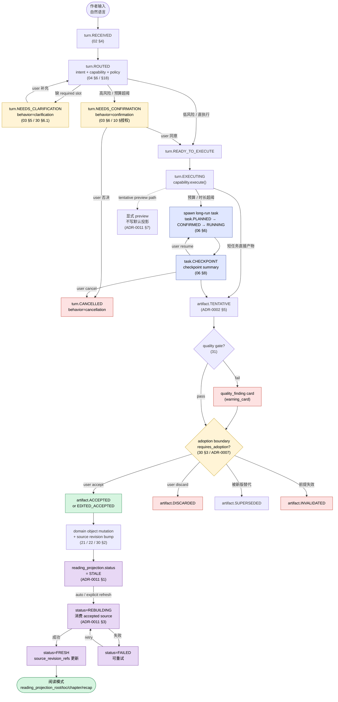

# 端到端主链路图

> 状态：草案
>
> 角色：把"用户一句话 → Agent → Domain 对象 → 阅读投影"的完整链路画成一张图，让任何人 5 分钟看懂数据是怎么流的。
>
> 权威来源：本文不发明任何运行语义，所有节点名都来自下列权威 contract，正文给出引用。
>
> 本文不负责：UI 视觉、代码实现、provider 选型、prompt 模板。

---

## 1. 这张图回答什么

- 用户输入到底走了哪些 Agent 子系统？
- 哪些步骤会"等用户"，哪些步骤系统自己跑完？
- 一份 artifact 是怎么从"AI 暂时写出来的"变成"作者认可的权威状态"的？
- 阅读模式里看到的内容到底从哪里来？

---

## 2. 主链路图



颜色含义：

- 黄：等待用户的关卡
- 绿：成功终态 / 用户可读
- 红：失败 / 拒绝 / 失效
- 蓝：long-run 子链路
- 紫：阅读投影刷新链路

---

## 3. 五条分支详解

### 3.1 Clarification 分支：缺 slot 就回退问

```text
turn.NEEDS_CLARIFICATION
  next_action = ASK_USER
  behavior_state.active = { type: clarification, status: WAITING_USER }
  ui_cards += clarification_card
```

触发条件：`04 §6` slot policy 判定 required slot 缺失，或 `ADR-0010` 的 first-batch intent slot 缺失。
回退路径：用户补充后 turn 重新进入 `ROUTED`，clarification behavior 写入 `behavior_state.history` 并带 `resolution_ref`（ADR-0001 §决策内容 4 第 7 条）。

### 3.2 Confirmation 分支：高风险要确认

```text
turn.NEEDS_CONFIRMATION
  next_action = CONFIRM_BEFORE_EXECUTE
  behavior_state.active = { type: confirmation, status: WAITING_USER }
  ui_cards += confirmation_card
```

触发条件之一即可：

- `estimated_budget` 超过 `10 §预算` 阈值
- `write_scope` 进入 `production_write`（30 §5.3）
- `authority_scope` 触发 escalation（ADR-0003）
- Domain 高风险 intent（如 `intent.PUBLISH_CHAPTER`，按 32 approval policy）

否决路径：写入 `cancellation` behavior，turn 进入 `CANCELLED`。

### 3.3 直接执行分支：低风险一气呵成

`turn.READY_TO_EXECUTE → EXECUTING → COMPLETED`，`next_action = SHOW_RESULT` 或 `NO_FURTHER_ACTION`，无需用户干预。

### 3.4 Long-run 分支：长跑切出主流

```text
spawn task: PLANNED → ESTIMATED → CONFIRMATION_REQUIRED → CONFIRMED → RUNNING
  → CHECKPOINT (UNIT_COMPLETED / BUDGET_LIMIT_REACHED / ...)
  → RESUMING → RUNNING → COMPLETED
```

触发条件：`06 §3` 长跑判定（estimated_budget / 时长 / unit 数超阈）。
checkpoint 触发原因见 `06 §8.3`，至少 9 类。
checkpoint 期间产出的 artifact 仍走 `TENTATIVE → adoption` 同一通道，不绕开（06 §4.3）。

### 3.5 Quality gate 分支：质量门拦截

quality gate 在 `EXECUTING` 之后、`adoption boundary` 之前介入（31 §gate 调用点）。

- pass：artifact 正常进入 adoption。
- fail：产出 `quality_finding`（投影为 `warning_card`，参见 ADR-0011 §8.2 类比模式），仍然进入 adoption boundary，由作者决定 accept / discard。

> ⚠ 注：`quality_finding` 最小 schema 尚未 ADR 冻结（29 §7.1 第 12 项）。本图按当前 31 草案绘制；contract 冻结后回写。

---

## 4. canonical 字段读取路径

| 主链路位置 | UI / Domain 应读 | 权威来源 |
|---|---|---|
| 主消息 | `assistant_message` | ADR-0001 §3 |
| 卡片列表 | `ui_cards[]` | ADR-0001 §3 + ADR-0006 |
| 当前等待行为 | `behavior_state.active` | ADR-0001 §3 |
| 待审 artifact | `adoption_state.pending[]` | ADR-0001 §3 |
| 已结案 artifact | `adoption_state.resolved[]` | ADR-0001 §3 |
| 受影响投影 | `projection_refs[]` | ADR-0001 §3 / ADR-0009 |
| 投影刷新状态 | `projection_refs[i].refresh_status` | ADR-0011 §1 |
| 下一步动作 | `next_action` | ADR-0002 §6 |

---

## 5. 反向约束（这张图禁止的事）

1. tentative artifact 默认不进入 reading projection（ADR-0011 §7）。
2. UI 不得通过新增 `next_action` / `card_type` / `action_type` 绕过本图节点（ADR-0011 §8）。
3. `EXECUTE_DIRECTLY` 不是 canonical `next_action`，执行许可由 `phase=READY_TO_EXECUTE` + policy 决定（ADR-0002 §6）。
4. quality_finding 不替代 adoption；它只是给作者更多信息再决定。
5. checkpoint 产物仍要走 adoption，长跑不能"边跑边写权威状态"。

---

## 6. 配套阅读

- `00a-system-landscape.md`：模块地图
- `00d-state-machine-atlas.md`：本图涉及的状态机详图
- `examples/end-to-end-trace-001.md`：用真实 prompt 走一遍本图
- ADR-0001 / 0002 / 0011：权威 schema
