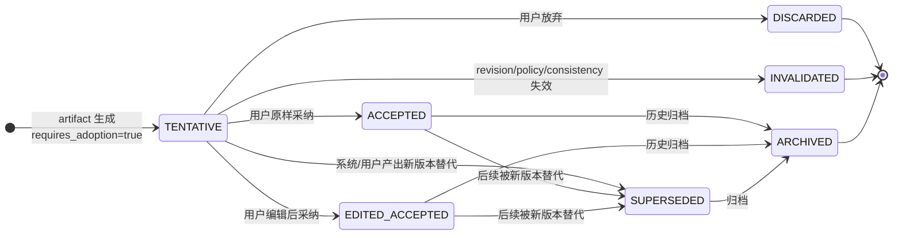
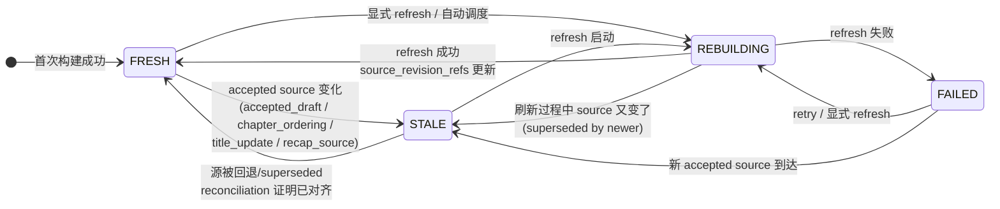
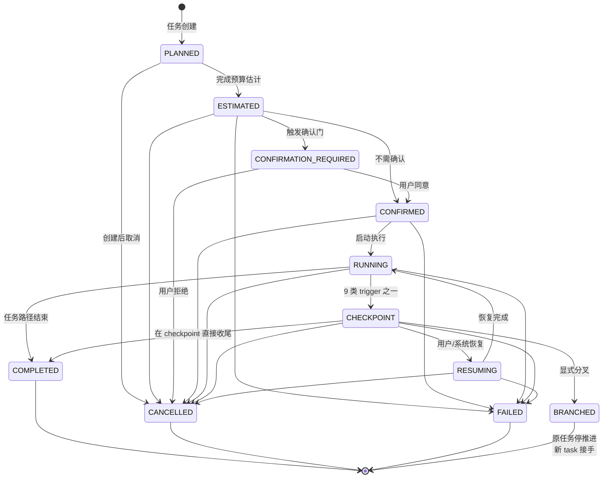

# 关键状态机图集

> 状态：草案
>
> 角色：把项目里"最容易混淆 / 最容易实现错"的 3 套状态机集中成图。其它状态机（turn / task）请直接看 ADR-0002 §9 的 Mermaid。
>
> 权威来源：本文不发明任何状态值。每张图下都标了 canonical 出处，发现与 ADR 不一致以 ADR 为准。

---

## 0. 这里有什么

| # | 状态机 | canonical 来源 | 为什么单独画 |
|---|---|---|---|
| 1 | Adoption 7 态 | `30 §3.2` + ADR-0001 §2 | 7 态散落，UI / 后端常把 SUPERSEDED 与 INVALIDATED 弄混 |
| 2 | Reading Projection 4 态 | ADR-0011 §1 §3 | UI 常自己猜 stale，必须以 system status 为准 |
| 3 | Long-run Task 生命周期 | 06 §6 + ADR-0002 §4 | 11 态 + checkpoint 子环，最容易实现错 |

---

## 1. Adoption 7 态

### 1.1 状态机



### 1.2 状态语义

| 状态 | 含义 | 可读性 / 影响 |
|---|---|---|
| `TENTATIVE` | 已生成但未采纳 | 不进入权威状态，不污染 reading projection |
| `ACCEPTED` | 原样采纳 | 进入权威状态，触发 projection refresh |
| `EDITED_ACCEPTED` | 编辑后采纳 | 同 ACCEPTED，但需保留编辑差异审计 |
| `DISCARDED` | 用户主动放弃 | 终态，不可逆 |
| `SUPERSEDED` | 被新版本替代 | 必须填 `supersedes_artifact_id` |
| `INVALIDATED` | 前提失效（revision 漂移、policy 变更、一致性冲突） | 不能再被静默采纳 |
| `ARCHIVED` | 已归档 | 不再作为当前候选 |

### 1.3 易混淆区分

| 区别 | 说明 |
|---|---|
| `DISCARDED` vs `INVALIDATED` | DISCARDED 是用户决定，INVALIDATED 是系统判定（如 revision 已变） |
| `SUPERSEDED` vs `ARCHIVED` | SUPERSEDED 必有继任者，ARCHIVED 不必，仅表示退出当前候选 |
| `TENTATIVE` 的 status 映射 | ADR-0002 §5 固定为 Foundation `PAUSED`，不是 `READY`，避免被误读为"已就绪进入权威" |

### 1.4 反模式

1. ❌ 把 `TENTATIVE` 直接渲染进 reading projection。必须 ACCEPTED 之后。
2. ❌ 跳过 adoption boundary，直接把 LLM 输出写入权威状态。`tentative_write` write_scope 应阻止此行为（30 §5.3）。
3. ❌ 把 INVALIDATED 静默重提交为 ACCEPTED。必须先解决冲突，重新生成新 artifact，进入新一轮 TENTATIVE。
4. ❌ 在 ADR-0002 中重定义 7 态。canonical 单一权威是 30 §3.2 + ADR-0001 §2。

---

## 2. Reading Projection 4 态

### 2.1 状态机



### 2.2 状态语义

| 状态 | 可读性 | UI 提示 | 触发器 |
|---|---|---|---|
| `FRESH` | 可读 | 正常 | 首次构建或 refresh 成功 |
| `STALE` | 可读旧投影 | refresh recommended | accepted source 变化 |
| `REBUILDING` | 可读旧投影或 progress | progress 或 secondary warning | refresh 启动 |
| `FAILED` | 可读旧投影（如有）| warning / failure | refresh 失败 |

### 2.3 stale 触发器（最小集合）

| trigger | 来源 |
|---|---|
| `accepted_draft_changed` | draft adoption 后 |
| `chapter_ordering_changed` | 章节顺序 adoption 后 |
| `title_update_changed` | accepted title 更新 |
| `reader_recap_source_changed` | accepted recap source 变化 |
| `explicit_refresh_intent` | `intent.REFRESH_READING_PROJECTION` |

来源：ADR-0011 §2。

### 2.4 反模式

1. ❌ UI 自己比较 draft 字段去猜 stale。stale 必须由系统判定（ADR-0011 §4 第 1 条）。
2. ❌ tentative source 通过 refresh 进入默认投影。preview 必须走显式路径（§7）。
3. ❌ `REBUILDING` 时立即清空旧投影。除非实现层明确放弃可读保证，否则保留旧投影。
4. ❌ 新增 "refresh recommended" 作为第 5 态。它是 `STALE` 的 UI hint，不是状态（§4 第 4 条）。
5. ❌ 把 `FAILED` 静默回退为 `FRESH`。失败必须可审计（§3 第 3 条）。

### 2.5 与 Foundation 的关系

projection status 是 **Domain 对象 status**，不是 Foundation 通用 `status` family（READY/RUNNING/...）。两者不可互相替代。Foundation 投影时复用 ADR-0006 现有 card_type / ADR-0002 现有 next_action，不新增（ADR-0011 §8）。

---

## 3. Long-run Task 生命周期

### 3.1 状态机



### 3.2 状态语义

| phase | Foundation status | 含义 |
|---|---|---|
| `PLANNED` | READY | 任务骨架已建 |
| `ESTIMATED` | READY | 预算估计已完成 |
| `CONFIRMATION_REQUIRED` | WAITING_USER | 等待用户确认 |
| `CONFIRMED` | READY | 已获准执行 |
| `RUNNING` | RUNNING | 正在执行 unit |
| `CHECKPOINT` | PAUSED | 安全暂停点 |
| `RESUMING` | WAITING_SYSTEM | 正在从 checkpoint 恢复 |
| `COMPLETED` | DONE | 任务路径结束（终态） |
| `CANCELLED` | CANCELLED | 显式终止（终态） |
| `FAILED` | ERROR | 不可恢复失败（终态） |
| `BRANCHED` | DONE | 已分叉，原任务停推进（终态） |

来源：ADR-0002 §4 + 06 §6。

### 3.3 checkpoint 9 类触发原因

```text
UNIT_COMPLETED
BUDGET_LIMIT_REACHED
CONFIRMATION_REQUIRED
CLARIFICATION_REQUIRED
VALIDATOR_FAILED
CONSISTENCY_CONFLICT
USER_PAUSED
RETRY_LIMIT_REACHED
AUTHORITY_ESCALATION_REQUIRED
```

来源：06 §8.3。每个 checkpoint 必须填 `trigger_reason`，作为 audit & UI 文案依据。

### 3.4 checkpoint 必出字段

| 字段 | 含义 |
|---|---|
| `checkpoint_id` | 唯一 id |
| `task_ref` | 所属 task |
| `trigger_reason` | 上述 9 类之一 |
| `checkpoint_summary` | 摘要文案，UI 直接显示 |
| `current_consumed` | 已消耗预算（与 task `consumed_budget` 同形） |
| `pending_artifact_refs` | 尚未采纳的 artifact 列表 |
| `accepted_artifact_refs` | 已采纳的 artifact 列表 |
| `warning_refs` | 本段产生的警告 |
| `unresolved_refs` | 未解决项（如 clarification） |
| `recommended_next_actions` | 用 ADR-0002 canonical next_action 表达 |
| `created_at` | 时间戳 |

来源：06 §8.1。

### 3.5 终态约束

| 终态 | 不可逆？ | 后续操作 |
|---|---|---|
| `COMPLETED` | ✅ | 通过新 task 继续推进 |
| `CANCELLED` | ✅ | 通过新 task 重启 |
| `FAILED` | ✅ | 写新 task 或诊断后修复 |
| `BRANCHED` | ✅ | 通过分叉出的新 task 接手；原 task 不再推进原路径 |

### 3.6 反模式

1. ❌ 在纯 `RUNNING` 中无 checkpoint 直接 BRANCHED。必须先 `CHECKPOINT -> BRANCHED`（06 §7.10）。
2. ❌ 把 `CHECKPOINT` 当 status 写。它是 task phase，对应的 Foundation status 是 `PAUSED`（ADR-0002 §4）。
3. ❌ checkpoint 不写 `trigger_reason`。这是审计与 UI 文案的唯一依据。
4. ❌ `CONFIRMATION_REQUIRED` 直接跳到 `RUNNING`。必须经 `CONFIRMED`（06 §7.3）。
5. ❌ checkpoint 期间产物不走 adoption boundary。必须走，长跑没有"边跑边写权威"特权（06 §4.3）。
6. ❌ 用 `EXECUTE_DIRECTLY` 作为 next_action。它不是 canonical（ADR-0002 §6）。

---

## 4. 三套状态机的共同纪律

1. **status 不是 phase**：Foundation 8 态 status family 是观察口径，phase 是流程口径。UI 可以按 status 上色，但禁止把 phase 替换为 status。
2. **终态不可逆**：所有图中的终态（DISCARDED / INVALIDATED / ARCHIVED / COMPLETED / CANCELLED / FAILED / BRANCHED）一律不可逆。需要"复活"必须新建 artifact / task。
3. **不发明状态**：新增任何状态值必须走 ADR；UI / 后端不得自造。
4. **不混 family**：adoption 状态、projection 状态、task phase 是三个互不相同的集合，不可互相强行映射。

---

## 5. 配套阅读

- `00b-end-to-end-flow.md`：这 3 套状态机如何串到主链路
- `examples/end-to-end-trace-001.md`：用真实 prompt 走完三套状态机
- ADR-0001 / 0002 / 0011：权威 schema
- 06 §6 §7 §8：long-run 详细规则
- 30 §3.2：adoption canonical 来源
