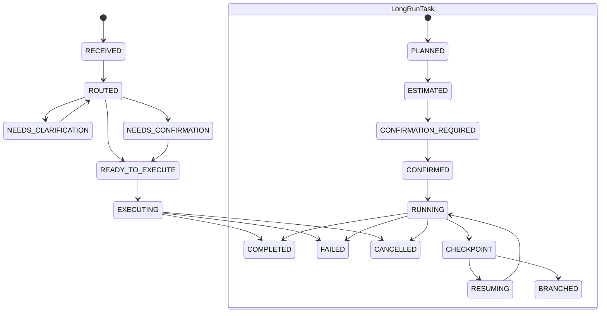

# ADR-0002：Turn / Task / Artifact 状态枚举

- 状态：Accepted
- 日期：2026-04-24（Accepted 于 2026-04-24，oracle 二轮复审 ACCEPT）
- 涉及范围：Foundation 子系统 2（Turn & Task State Machines）/ 子系统 1（Agent Foundation Contract）/ 子系统 11（UX Contract）
- 相关文档：
  - `../02-turn-and-task-state-machines.md` §4 / §5 / §8 / §10 / §11 / §15
  - `../01-agent-foundation-contract.md` §9 / §10 / §27
  - `../30-contract-glossary.md` §3.2 / §9 / §10
  - `../29-design-integrity-review.md` §4.2.2 / §7.1
  - `0001-turn-result-v2-schema.md`
- 取代：无
- 取代者：无

---

## 背景

ADR-0001 已冻结 `TurnResult v2` 顶层 schema，但其中 `phase`、`status`、`next_action`、`behavior_state.*.status` 等字段仍通过 `$ref` 指向后续状态枚举。

`02-turn-and-task-state-machines.md` 已描述 turn / task 的阶段、状态映射与 `phase × next_action` 约束，但目前仍存在三类风险：

1. `phase` 与 `status` 的职责边界容易混淆。
2. `next_action` 在 `02 §11.1` 与 `30 §9` 中存在名称漂移风险。
3. `artifact adoption` 7 态已由 `30 §3.2` 与 ADR-0001 冻结，ADR-0002 若再次内联会形成双权威源。

本 ADR 的目标是冻结 W2 需要的最小完整枚举集合，使 ADR-0001 的 `$ref` 占位闭环，同时不吞并 adoption、authority/budget、card/action 或 UI hint 的后续 ADR 范围。

---

## 考虑过的方案

### 方案 A：直接沿用 `02` 的 phase/status/next_action 原文，不新增 ADR

优点：

- 改动最小。
- 不会引入新的命名层。

缺点：

- ADR-0001 的 `$ref` 无法闭环。
- `02 §11.1` 与 `30 §9` 的 `next_action` 名称差异仍然存在。
- 后续 UI / registry / long-run contract tests 没有单一枚举权威。

### 方案 B：冻结完整 phase/status/next_action 枚举，但不人为压缩既有 phase

优点：

- 保留 `02` 中已经表达清楚的 turn/task 生命周期语义。
- 通过 8 个 `status` family 给 UI、日志和测试提供压缩态。
- 能明确处理 `CANCEL_TASK`、`EXECUTE_DIRECTLY` 等漂移项。
- 与 ADR-0001 `$ref` 占位形成闭环。

缺点：

- turn phase 为 9 个、task phase 为 11 个，不满足“所有枚举都不超过 8 个”的形式性口径。
- 需要在本 ADR 中解释为什么不按数量硬裁剪。

### 方案 C：把 turn/task phase 合并压缩到不超过 8 个

优点：

- 表面上更短。
- 更容易写成 UI 状态标签。

缺点：

- 会丢失 `NEEDS_CLARIFICATION` / `NEEDS_CONFIRMATION`、`CHECKPOINT` / `RESUMING` 等关键运行语义。
- 会把 phase 误用成 UI 展示 status。
- 与 `02 §5.1`、`02 §8.1`、ADR-0001 约束 4 的 turn/task phase 分离原则冲突。

---

## 最终决策

选择 **方案 B：冻结完整 phase/status/next_action 枚举，但不人为压缩既有 phase**。

本 ADR 冻结：

1. Foundation 通用 `status` family。
2. turn phase + turn status 映射。
3. task phase + task status 映射。
4. artifact lifecycle state 与 Foundation status 映射。
5. `next_action` 完整集合与 `phase × next_action` 兼容表。
6. behavior status 最小集合。

本 ADR 显式不冻结：

1. adoption 7 态本身：由 `30 §3.2` + ADR-0001 作为唯一 canonical 权威，本 ADR 仅 `$ref` 引用，不重定义。
2. TurnResult 顶层 schema：已由 ADR-0001 冻结。
3. authority / budget / escalation 枚举：留待 ADR-0003。
4. behavior-specific UI hint：留待 ADR-0005。
5. card / action 最小 schema：留待 ADR-0006。
6. assistant message / envelope / render mode schema：留待独立 ADR。
7. UI 文案、颜色、图标或展示层状态标签。

---

## 决策内容

### 1. 命名与分层规则

1. 所有运行态枚举值使用 `UPPER_SNAKE_CASE`。
2. `phase` 表示“流程走到哪一步”。
3. `status` 表示“当前可观测运行态”。
4. `next_action` 表示 runtime 下一步语义，不是按钮文案或 UI hint。
5. 同一语义只能有一个 canonical 名称；别名只能出现在迁移说明中。
6. turn phase 与 task phase 是不同集合，不得互相复用或强制相等。

### 2. Foundation 通用 status family

| status | 语义 | 允许对象 |
| --- | --- | --- |
| `READY` | 已准备好进入下一运行步骤 | turn / task / artifact projection |
| `WAITING_USER` | 阻塞于用户输入、确认或选择 | turn / task |
| `WAITING_SYSTEM` | 阻塞于系统内部调度、恢复或异步依赖 | turn / task |
| `RUNNING` | 正在执行 | turn / task |
| `PAUSED` | 可恢复暂停态，不是错误 | task / artifact projection |
| `DONE` | 成功终态 | turn / task / artifact projection |
| `ERROR` | 失败或无效终态 | turn / task / artifact projection |
| `CANCELLED` | 用户或系统取消终态 | turn / task / artifact projection |

`status` family 固定为以上 8 个。新增 status 必须经新 ADR。

### 3. Turn phase 与 status 映射

| turn phase | status | 语义 |
| --- | --- | --- |
| `RECEIVED` | `WAITING_SYSTEM` | 已接收输入，尚未完成路由 |
| `ROUTED` | `READY` | 已完成 intent / capability / policy 路由 |
| `NEEDS_CLARIFICATION` | `WAITING_USER` | 需要用户补充信息 |
| `NEEDS_CONFIRMATION` | `WAITING_USER` | 需要用户确认高风险或有副作用动作 |
| `READY_TO_EXECUTE` | `READY` | 已满足执行前置条件 |
| `EXECUTING` | `RUNNING` | 正在执行本轮工作 |
| `COMPLETED` | `DONE` | 本轮成功结束 |
| `FAILED` | `ERROR` | 本轮失败 |
| `CANCELLED` | `CANCELLED` | 本轮取消 |

Turn phase 固定为以上 9 个。不得为了满足数量上限合并 `NEEDS_CLARIFICATION` 与 `NEEDS_CONFIRMATION`，二者对应不同用户义务与不同 audit 语义。

### 4. Task phase 与 status 映射

| task phase | status | 语义 |
| --- | --- | --- |
| `PLANNED` | `READY` | 已形成 task plan |
| `ESTIMATED` | `READY` | 已完成预算 / 时长 / 风险预估 |
| `CONFIRMATION_REQUIRED` | `WAITING_USER` | 需要用户确认后才能启动或继续 |
| `CONFIRMED` | `READY` | 用户已确认，等待执行 |
| `RUNNING` | `RUNNING` | 正在执行 |
| `CHECKPOINT` | `PAUSED` | 到达可恢复检查点 |
| `RESUMING` | `WAITING_SYSTEM` | 正在从 checkpoint 恢复 |
| `COMPLETED` | `DONE` | task 成功结束 |
| `CANCELLED` | `CANCELLED` | task 被取消 |
| `FAILED` | `ERROR` | task 失败 |
| `BRANCHED` | `DONE` | 当前 task 已显式分叉并完成交接 |

Task phase 固定为以上 11 个。不得把 `CHECKPOINT` 合并进 `PAUSED` phase；`PAUSED` 是 status，`CHECKPOINT` 是 long-run task phase。

### 5. Artifact lifecycle state 与 status 映射

本 ADR 不重定义 adoption 7 态的 semantic source；下表仅规定 Foundation 在消费 artifact lifecycle 时的 status 映射。adoption state 的 canonical 值仍以 `30 §3.2` + ADR-0001 为权威。

| artifact lifecycle state | status | 语义 |
| --- | --- | --- |
| `TENTATIVE` | `PAUSED` | 已生成但未采纳，等待用户或系统后续处理 |
| `ACCEPTED` | `DONE` | 原样采纳 |
| `EDITED_ACCEPTED` | `DONE` | 编辑后采纳 |
| `DISCARDED` | `CANCELLED` | 放弃 |
| `SUPERSEDED` | `DONE` | 被更新版本替代 |
| `INVALIDATED` | `ERROR` | 因 revision / policy / consistency 等原因失效 |
| `ARCHIVED` | `DONE` | 已归档，不再作为当前候选 |

`02 §10.2` 曾允许 `TENTATIVE → PAUSED or READY`。本 ADR 收敛为 `PAUSED`，原因是 `TENTATIVE` 的核心语义是“已生成但尚未进入 authoritative state，需要等待 adoption / edit / discard / invalidation 的下一步处理”。若 UI 需要表达“可采纳”，应由 `next_action=ADOPT_ARTIFACTS` 或 adoption card 投影，而不是把 artifact 自身 status 提升为 `READY`。这样可以避免把“可操作”误写成“已准备进入 authoritative state”。

如果 adoption 被阻塞，artifact 必须进入 `INVALIDATED`，或保持 `TENTATIVE` 并携带 blocked reason；不得伪装成 `ACCEPTED`。

### 6. next_action 完整集合

| next_action | 语义 | 典型 UI 投影 |
| --- | --- | --- |
| `ASK_USER` | 需要用户提供信息、选择或回复 | clarification / question |
| `CONFIRM_BEFORE_EXECUTE` | 执行前需要用户确认 | confirmation card |
| `SHOW_RESULT` | 展示本轮结果 | result card / message |
| `RETRY_SYSTEM` | 系统可重试 | retry affordance |
| `RESUME_TASK` | 可恢复 long-run task | resume control |
| `ADOPT_ARTIFACTS` | 可采纳 tentative artifacts | adoption card |
| `CANCEL_TASK` | 可取消当前 task | cancel control |
| `NO_FURTHER_ACTION` | 无需后续动作 | passive terminal state |

`EXECUTE_DIRECTLY` 不进入 canonical `next_action` 集合。执行许可由 `phase=READY_TO_EXECUTE` / `task phase=CONFIRMED` 与 policy 决定，不作为对 UI 或 orchestrator 的下一步动作输出。

### 7. phase × next_action 兼容表

表格约定：`允许的 next_action` 是该 phase / context 下的完整允许集合；除非后续 ADR 明确扩展，未列入允许集合的组合一律视为禁止。`禁止的 next_action` 只列高风险或历史漂移项，用于优先补契约测试，不代表未列项可用。

| phase / context | 允许的 next_action | 禁止的 next_action |
| --- | --- | --- |
| turn `NEEDS_CLARIFICATION` | `ASK_USER` | `SHOW_RESULT`, `NO_FURTHER_ACTION`, `RESUME_TASK`, `ADOPT_ARTIFACTS`, `CANCEL_TASK` |
| turn `NEEDS_CONFIRMATION` | `CONFIRM_BEFORE_EXECUTE` | `ASK_USER`, `SHOW_RESULT`, `NO_FURTHER_ACTION`, `RESUME_TASK`, `ADOPT_ARTIFACTS`, `CANCEL_TASK` |
| turn `READY_TO_EXECUTE` | `NO_FURTHER_ACTION` | `ASK_USER`, `CONFIRM_BEFORE_EXECUTE`, `SHOW_RESULT`, `RESUME_TASK`, `ADOPT_ARTIFACTS`, `CANCEL_TASK` |
| turn `EXECUTING` | `NO_FURTHER_ACTION` | `ASK_USER`, `CONFIRM_BEFORE_EXECUTE`, `SHOW_RESULT`, `ADOPT_ARTIFACTS` |
| turn `COMPLETED` | `SHOW_RESULT`, `ADOPT_ARTIFACTS`, `NO_FURTHER_ACTION` | `ASK_USER`, `CONFIRM_BEFORE_EXECUTE`, `RETRY_SYSTEM`, `RESUME_TASK`, `CANCEL_TASK` |
| turn `FAILED` | `RETRY_SYSTEM`, `NO_FURTHER_ACTION` | `SHOW_RESULT`, `ADOPT_ARTIFACTS`, `RESUME_TASK` |
| turn `CANCELLED` | `NO_FURTHER_ACTION` | `ASK_USER`, `CONFIRM_BEFORE_EXECUTE`, `SHOW_RESULT`, `RETRY_SYSTEM`, `RESUME_TASK`, `ADOPT_ARTIFACTS`, `CANCEL_TASK` |
| task `CHECKPOINT` context | `ASK_USER`, `RESUME_TASK`, `ADOPT_ARTIFACTS`, `CANCEL_TASK` | `SHOW_RESULT` as sole action |
| task `RUNNING` context | `NO_FURTHER_ACTION` | `ASK_USER` unless the turn phase is separately `NEEDS_CLARIFICATION` |

兼容规则：

1. `phase=COMPLETED` 不得搭配非 canonical 的 `EXECUTE_DIRECTLY`。
2. `phase=RUNNING` 不得直接搭配 `ASK_USER`；若执行中需要用户输入，必须产生新的 turn，并将该 turn phase 置为 `NEEDS_CLARIFICATION` 或 `NEEDS_CONFIRMATION`。
3. `behavior_state.active != null` 时，`next_action` 必须属于等待用户集合：`ASK_USER`、`CONFIRM_BEFORE_EXECUTE`、`ADOPT_ARTIFACTS`、`RESUME_TASK`、`CANCEL_TASK`。
4. `errors[]` 非空时，`status` 不得为成功终态 `DONE`。
5. `warnings[]` 非空不影响 `DONE`，但必须可审计。
6. `CANCEL_TASK` 仅用于 task context；普通 clarification / confirmation turn 的放弃或拒绝应写入对应 behavior resolution，而不是把 turn 伪装成 task cancel。

### 8. behavior status 最小集合

| behavior status | 语义 |
| --- | --- |
| `OPEN` | durable behavior 已创建，等待处理 |
| `WAITING_USER` | durable behavior 已呈现给用户，正在等待用户输入或选择 |
| `RESOLVED` | durable behavior 已解决 |
| `CANCELLED` | durable behavior 被取消 |
| `EXPIRED` | durable behavior 因上下文或时间窗口失效 |

`02 §6` / §7 的 clarification / confirmation lifecycle 使用 `OPEN` 表示 pending behavior，并把其运行态映射为 Foundation `WAITING_USER`。本 ADR 在 `behavior_status` 中保留二者的原因是分离“behavior 已创建但尚未展示/送达用户”（`OPEN`）与“behavior 已呈现且等待显式响应”（`WAITING_USER`）。这是对 `02` 映射关系的显式细化，不新增 behavior 类型。

`behavior_state.active` 只允许 `OPEN` 或 `WAITING_USER`。`RESOLVED`、`CANCELLED`、`EXPIRED` 只能出现在 `behavior_state.history[]`；若 active behavior 进入 resolved/closed 类终态，必须先写入 `resolution_ref`，再移入 history。

### 9. Mermaid 状态机摘要

---

## 决策原因

选择方案 B 的原因：

1. `phase` 与 `status` 是两个不同维度，不能用 8 个 status family 反推压缩 phase。
2. `NEEDS_CLARIFICATION`、`NEEDS_CONFIRMATION`、`CHECKPOINT`、`RESUMING` 都承担独立 contract 语义；合并会让 UI、audit、retry、long-run resume 失去判断依据。
3. `next_action` 必须是 runtime 语义，不是 UI 按钮全集；因此 `CANCEL_TASK` 应进入 canonical 集合，而 `EXECUTE_DIRECTLY` 不应作为输出动作。
4. adoption 7 态已有权威来源，本 ADR 只定义 artifact lifecycle 到 Foundation status 的消费映射，避免双权威。
5. 与其满足形式数量上限，不如保留可验证的状态机边界；真正需要压缩展示时使用 `status` family。
6. `TENTATIVE` 固定映射为 `PAUSED`，把“是否可采纳”交给 `next_action=ADOPT_ARTIFACTS` 表达，避免 artifact status 同时承担 lifecycle 与 UI affordance 两种职责。

不选择方案 A，因为它不能解决 ADR-0001 `$ref` 与 `next_action` 漂移问题。

不选择方案 C，因为它会牺牲已被 `02` 和 ADR-0001 依赖的流程语义。

---

## 影响

### 对 Foundation 的影响

- ADR-0001 中 `phase`、`status`、`next_action`、`behavior_state.*.status` 的 `$ref` 由本 ADR 闭环。
- `status` family 固定为 8 个：`READY`、`WAITING_USER`、`WAITING_SYSTEM`、`RUNNING`、`PAUSED`、`DONE`、`ERROR`、`CANCELLED`。
- `next_action` canonical 集合固定为 8 个，不包含 `EXECUTE_DIRECTLY`。
- `phase × next_action` 兼容表成为契约测试输入。

### 对 Domain 的影响

- Domain intent / capability / hook 输出不得发明新的 `phase`、`status` 或 `next_action`。
- Domain artifact 仍使用 adoption 7 态表达采纳生命周期；本 ADR 只规定其映射到 Foundation status 的方式。
- Domain 扩展属性纪律仍由 ADR-0001 的 `domain_ext.` 前缀规则约束。

### 对 UI 的影响

- UI 可使用 `status` family 做压缩展示，但不得把展示标签反写成 Foundation phase。
- UI action 必须由 `next_action` 投影；不能自造 Foundation 未定义的下一步动作。
- `CONFIRM_BEFORE_EXECUTE` 与 `ASK_USER` 不得都渲染成无差别“继续”按钮。

### 迁移策略

- 若旧文档或实现使用 `EXECUTE_DIRECTLY` 作为 `next_action`，迁移为：`phase=READY_TO_EXECUTE` + `next_action=NO_FURTHER_ACTION`，由 orchestrator/policy 决定是否执行。
- 若旧文档或实现使用 `CANCEL_TASK` 但未列入 `30 §9`，以本 ADR 为准补入 canonical `next_action`。
- 若旧实现把 `CHECKPOINT` 当作 status，迁移为：`task phase=CHECKPOINT` + `status=PAUSED`。
- 若旧实现把 adoption 7 态重新定义在 ADR-0002 范围内，删除重定义并改为 `$ref` 到 ADR-0001 / `30 §3.2` 的 canonical 来源。

---

## 后续工作

### 必须更新的文档

1. `../02-turn-and-task-state-machines.md`
   - 将 §5.1 / §5.2 / §8.1 / §8.2 / §11.1 / §11.2 标注为由 ADR-0002 冻结。
   - 在 §11.1 补入 `CANCEL_TASK` 的 canonical 地位，并移除或降级 `EXECUTE_DIRECTLY`。
2. `../01-agent-foundation-contract.md` §27
   - 将 “phase / status 的完整枚举表” 标注为已由 ADR-0002 冻结。
3. `../30-contract-glossary.md` §9 / §10
   - 将 `CANCEL_TASK` 补入 NextAction 与 UI Action 映射。
   - 标注 `EXECUTE_DIRECTLY` 非 canonical `next_action`。
4. `../29-design-integrity-review.md` §7.1
   - 将 Foundation 第 2 项标注为已由 ADR-0002 冻结，但 adoption 7 态仍指向 ADR-0001 + `30 §3.2`。
5. `0001-turn-result-v2-schema.md`
   - 在依赖 ADR section 中把 ADR-0002 从占位依赖更新为已冻结枚举权威。
   - 将 `status` 字段 `$ref` 从 `foundation/enums/turn_status.json` 调整为 `foundation/enums/status.json`；status family 是 turn / task / artifact projection 共用的 8 态，不是 turn 专属枚举。
6. `0000-index.md`
   - 新增 ADR-0002 条目。
7. `../04-capability-and-intent-registry.md` §18.5
   - 将 `next_action` 输出校验指向 ADR-0002。
8. `../06-planning-and-long-run.md` §4 / §24
   - 将 task phase / status 映射指向 ADR-0002。
9. `../11-ux-contract.md`
   - 将 UI action 投影规则指向 ADR-0002 的 `next_action` 集合。

### 必须补的契约测试

1. turn phase / status 映射测试：所有 turn phase 都能映射到 8 个 status family 之一。
2. task phase / status 映射测试：所有 task phase 都能映射到 8 个 status family 之一。
3. artifact lifecycle / status 映射测试：artifact lifecycle state 不得映射到未定义 status。
4. `next_action` enum 测试：只允许本 ADR §6 的 8 个 canonical 值。
5. `phase × next_action` 兼容测试：至少覆盖本 ADR §7 的禁止组合。
6. `errors[]` 测试：`errors[]` 非空时 `status != DONE`。
7. behavior status 测试：`behavior_state.active.status` 只允许 `OPEN` / `WAITING_USER`，closed/resolved 类状态只允许进入 history。
8. adoption authority 测试：ADR-0002 不得内联或重定义 adoption 7 态，只能 `$ref` 引用 ADR-0001 / `30 §3.2`。

### Schema 引用基址约定

本 ADR 继续沿用 ADR-0001 的 schema 根目录约定：`docs/design-v2/schemas/`。

本 ADR 对应的建议 `$id`：

- `foundation/enums/status.json`
- `foundation/enums/turn_phase.json`
- `foundation/enums/task_phase.json`
- `foundation/enums/artifact_lifecycle_state.json`
- `foundation/enums/next_action.json`
- `foundation/enums/behavior_status.json`

命名调和：ADR-0001 草稿阶段曾将 TurnResult 顶层 `status` `$ref` 命名为 `foundation/enums/turn_status.json`。本 ADR 将该文件名收敛为 `foundation/enums/status.json`，因为该 8 态 status family 同时服务 turn、task 与 artifact projection；turn / task 的差异由各自 phase → status 映射表约束，而不是复制多个 status enum 文件。

### 依赖 ADR

- ADR-0001（W1，TurnResult v2 顶层 schema）：本 ADR 闭合 ADR-0001 的 `phase` / `status` / `next_action` / `behavior_status` `$ref`。
- ADR-0003（W5，authority / budget / escalation）：不属于本 ADR 范围。
- ADR-0005（W3，behavior-specific UI hint）：不属于本 ADR 范围。
- ADR-0006（W4，card / action schema）：不属于本 ADR 范围。

---

## 状态

当前状态为 Accepted。oracle 二轮复审已确认：

1. `CANCEL_TASK` / `EXECUTE_DIRECTLY` 的 canonical 处理无跨文档矛盾。
2. adoption 7 态没有被本 ADR 重定义。
3. turn phase 与 task phase 没有混用。
4. `phase × next_action` 兼容表足以支撑 ADR-0001 的约束 6。
