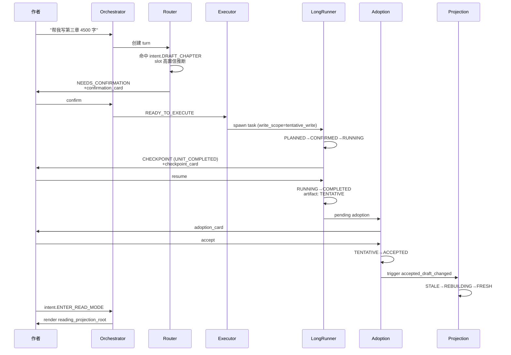

# Trace 001：作者一句话写完一章并发布

> 状态：草案
>
> 角色：把抽象的 contract 投射到一个真实场景。同一 prompt 走完完整链路，每一步都给真实 JSON、真实状态、真实 ADR 引用。
>
> 用法：和 `00b-end-to-end-flow.md` 配合看。主链路图给"地图"，本文给"实地走一趟"。
>
> 本 trace 不是产品文案演示，所有 JSON 字段名都来自 ADR-0001 / 0002 / 0008 / 0010 / 0011 / 30。如发现字段漂移以 ADR 为准。

---

## 0. 场景设定

- 作品：《云海凡修》（已存在 work，work_id = `work-yhfx`）
- 已完成：立项、世界观、主线、第一章 / 第二章草稿与采纳、第三章 outline 已采纳
- 当前 work context：第三章存在 chapter_ref = `ch-yhfx-3`，且已有 chapter_outline
- 用户输入：

```text
帮我把第三章正文写出来，按之前的纲要走，目标 4500 字。
```

预期链路：clarification 跳过 → confirmation → long-run → checkpoint → adoption → projection refresh → reading。

---

## 1. turn 创建：RECEIVED

| 字段 | 值 | 来源 |
|---|---|---|
| `turn_id` | `turn-2026-04-25-0001` | Orchestrator 生成 |
| `phase` | `RECEIVED` | ADR-0002 §3 |
| `status` | `WAITING_SYSTEM` | ADR-0002 §3 |
| `next_action` | `NO_FURTHER_ACTION`（暂未定）| ADR-0002 §6 |

用户视角：消息发出去，UI 显示"思考中"。

---

## 2. ROUTED：intent + slot 解析

router 命中 `intent.DRAFT_CHAPTER`（ADR-0008 §3.3）。

ADR-0010 §7.3 规定：

- required slots：`chapter_ref`
- optional preference：`scene_refs`、`target_word_count`、`style_ref`

slot 抽取：

```json
{
  "slot_resolution": {
    "chapter_ref": {
      "value": "ch-yhfx-3",
      "source": "context_inference",
      "confidence": "high"
    },
    "target_word_count": {
      "value": 4500,
      "source": "user_utterance"
    },
    "style_ref": {
      "value": "style-yhfx-default",
      "source": "context_default"
    }
  }
}
```

判定：required slot `chapter_ref` 可高置信推断（ADR-0010 §8 第 1 行规则），**clarification 跳过**。

```json
{
  "phase": "ROUTED",
  "status": "READY",
  "next_action": "NO_FURTHER_ACTION"
}
```

---

## 3. 风险评估：触发 NEEDS_CONFIRMATION

ADR-0008 §3.3 标记 `intent.DRAFT_CHAPTER`：

- `risk_class = HIGH`
- `requires_confirmation = true`

因此：

```json
{
  "schema_version": "2.0.0",
  "turn_id": "turn-2026-04-25-0001",
  "phase": "NEEDS_CONFIRMATION",
  "status": "WAITING_USER",
  "next_action": "CONFIRM_BEFORE_EXECUTE",
  "assistant_message": {
    "text": "我准备启动第三章正文创作（约 4500 字，预计消耗 ~12k tokens）。这是一次较长的写作任务，需要你确认。"
  },
  "ui_cards": [
    {
      "card_type": "confirmation_card",
      "card_id": "card-confirm-draft-ch3",
      "payload": {
        "intent": "intent.DRAFT_CHAPTER",
        "summary": "续写第三章 4500 字",
        "estimated_budget": {
          "tokens": 12000,
          "wall_clock_seconds": 90
        }
      },
      "actions": [
        { "action_type": "confirm", "label": "开始写" },
        { "action_type": "reject", "label": "取消" }
      ]
    }
  ],
  "behavior_state": {
    "active": {
      "behavior_type": "confirmation",
      "behavior_id": "beh-conf-001",
      "status": "WAITING_USER"
    },
    "history": []
  },
  "adoption_state": { "pending": [], "resolved": [] },
  "projection_refs": [],
  "validation": { "ok": true },
  "usage": { "tokens_in": 320, "tokens_out": 0 },
  "trace_ref": "trace-001",
  "produced_at": "2026-04-25T10:12:30Z"
}
```

字段引用路径见 ADR-0001 §3。

用户视角：UI 弹出确认卡片，预算可见。

---

## 4. 用户点 confirm → READY_TO_EXECUTE

新 turn `turn-2026-04-25-0002`：

```json
{
  "phase": "READY_TO_EXECUTE",
  "status": "READY",
  "behavior_state": {
    "active": null,
    "history": [
      {
        "behavior_type": "confirmation",
        "behavior_id": "beh-conf-001",
        "status": "RESOLVED",
        "resolution_ref": "res-conf-001"
      }
    ]
  }
}
```

confirmation 已 resolved，写入 `behavior_state.history`（ADR-0001 §决策内容 4 第 7 条）。

---

## 5. EXECUTING：判定为 long-run，spawn task

estimated_budget.tokens > 10k 阈值，触发 long-run 判定（06 §3）。

spawn long-run task `task-draft-ch3-001`：

```json
{
  "task_id": "task-draft-ch3-001",
  "phase": "PLANNED",
  "goal": "draft chapter ch-yhfx-3 to ~4500 words",
  "plan_ref": "plan-draft-ch3-001",
  "estimated_budget": { "tokens": 12000, "wall_clock_seconds": 90 },
  "consumed_budget": { "tokens": 0, "wall_clock_seconds": 0 },
  "authority_scope": {
    "write_scope": "tentative_write"
  }
}
```

`write_scope = tentative_write` 意味着 task 只能写 TENTATIVE artifact，不能直接写权威状态（30 §5.3）。

state 转换（06 §6.1）：

```text
PLANNED -> ESTIMATED -> CONFIRMED  (用户已在第 3 步同意，跳过 CONFIRMATION_REQUIRED)
       -> RUNNING
```

turn 此时：

```json
{
  "task_id": "task-draft-ch3-001",
  "phase": "EXECUTING",
  "status": "RUNNING",
  "next_action": "NO_FURTHER_ACTION",
  "ui_cards": [
    {
      "card_type": "progress_card",
      "card_id": "card-progress-001",
      "payload": {
        "task_ref": "task-draft-ch3-001",
        "progress_hint": "running"
      }
    }
  ]
}
```

---

## 6. 第一个 unit 完成 → CHECKPOINT

写完 ~2200 字（约一半），unit 完成，触发 checkpoint：

```json
{
  "checkpoint_id": "ckpt-001",
  "task_ref": "task-draft-ch3-001",
  "trigger_reason": "UNIT_COMPLETED",
  "checkpoint_summary": "已完成第三章上半段，约 2200 字，覆盖剧情节拍 1-3。",
  "current_consumed": { "tokens": 5800, "wall_clock_seconds": 42 },
  "pending_artifact_refs": ["draft-ch3-partial-001"],
  "accepted_artifact_refs": [],
  "warning_refs": [],
  "unresolved_refs": [],
  "recommended_next_actions": ["RESUME_TASK", "CANCEL_TASK"],
  "created_at": "2026-04-25T10:13:42Z"
}
```

来源：06 §8.1 / §8.3 `UNIT_COMPLETED`。

task state：

```text
RUNNING -> CHECKPOINT  (PAUSED, ADR-0002 §4)
```

UI 收到：

```json
{
  "phase": "EXECUTING",
  "status": "PAUSED",
  "next_action": "RESUME_TASK",
  "ui_cards": [
    {
      "card_type": "checkpoint_card",
      "card_id": "card-ckpt-001",
      "payload": {
        "checkpoint_ref": "ckpt-001",
        "summary": "已完成上半段（2200 字）",
        "consumed": { "tokens": 5800 }
      },
      "actions": [
        { "action_type": "resume" },
        { "action_type": "cancel" }
      ]
    }
  ]
}
```

用户视角：UI 显示"已完成上半，是否继续"。

---

## 7. 用户 resume → RUNNING → COMPLETED

```text
CHECKPOINT -> RESUMING -> RUNNING -> COMPLETED  (06 §6.1)
```

完成时产出 artifact：

```json
{
  "artifact_id": "draft-ch3-final",
  "artifact_type": "chapter_draft",
  "adoption_status": "TENTATIVE",
  "requires_adoption": true,
  "revision_base": "ch-yhfx-3@accepted_outline_rev=7",
  "supersedes_artifact_id": "draft-ch3-partial-001"
}
```

来源：ADR-0001 §2 `artifact_adoption_entry`。

注意：`adoption_status = TENTATIVE`，未经作者同意不会进入权威状态。

---

## 8. quality gate：风格一致性检查

31 草案规定的某 gate 跑了一遍，结果 pass。

> ⚠ quality_finding 最小 schema 尚未 ADR 冻结（29 §7.1 第 12 项）。本 trace 假设 pass；fail 路径会在 `ui_cards` 中追加 `warning_card`，但仍进入 §9 adoption。

---

## 9. adoption boundary：用户决定

turn 投影：

```json
{
  "phase": "COMPLETED",
  "status": "DONE",
  "next_action": "ADOPT_ARTIFACTS",
  "assistant_message": {
    "text": "第三章草稿已完成（4520 字）。需要你审阅后采纳。"
  },
  "ui_cards": [
    {
      "card_type": "adoption_card",
      "card_id": "card-adopt-ch3",
      "payload": {
        "artifact_ref": "draft-ch3-final",
        "preview_excerpt": "（章节正文摘要 200 字）..."
      },
      "actions": [
        { "action_type": "accept" },
        { "action_type": "edit_then_accept" },
        { "action_type": "discard" }
      ]
    }
  ],
  "adoption_state": {
    "pending": [
      {
        "artifact_id": "draft-ch3-final",
        "artifact_type": "chapter_draft",
        "adoption_status": "TENTATIVE",
        "requires_adoption": true,
        "revision_base": "ch-yhfx-3@accepted_outline_rev=7"
      }
    ],
    "resolved": []
  }
}
```

用户选 accept：

```json
{
  "adoption_state": {
    "pending": [],
    "resolved": [
      {
        "artifact_id": "draft-ch3-final",
        "artifact_type": "chapter_draft",
        "adoption_status": "ACCEPTED",
        "requires_adoption": true,
        "revision_base": "ch-yhfx-3@accepted_outline_rev=7"
      }
    ]
  }
}
```

来源：30 §3.2 adoption 7 态。

---

## 10. domain mutation：chapter 对象升级

```text
chapter ch-yhfx-3:
  accepted_draft_revision_ref: rev-draft-ch3-001
  accepted_at: 2026-04-25T10:18:11Z
```

source revision 推进，触发 ADR-0011 §2 trigger `accepted_draft_changed`。

---

## 11. projection 进入 STALE → REBUILDING → FRESH

```json
{
  "projection_refs": [
    {
      "projection_type": "reading_projection_root",
      "projection_id": "proj-yhfx-root",
      "source_revision_refs": ["rev-draft-ch1-001", "rev-draft-ch2-001"],
      "refresh_status": "STALE"
    },
    {
      "projection_type": "reading_projection_chapter",
      "projection_id": "proj-yhfx-ch3",
      "source_revision_refs": [],
      "refresh_status": "STALE"
    }
  ]
}
```

事件 `projection_marked_stale` 写入审计（ADR-0011 §9）。

系统选择自动刷新（§6.1）：

```text
STALE -> REBUILDING -> FRESH
```

刷新后：

```json
{
  "projection_refs": [
    {
      "projection_type": "reading_projection_root",
      "projection_id": "proj-yhfx-root",
      "source_revision_refs": [
        "rev-draft-ch1-001",
        "rev-draft-ch2-001",
        "rev-draft-ch3-001"
      ],
      "refresh_status": "FRESH"
    },
    {
      "projection_type": "reading_projection_chapter",
      "projection_id": "proj-yhfx-ch3",
      "source_revision_refs": ["rev-draft-ch3-001"],
      "refresh_status": "FRESH"
    }
  ]
}
```

事件 `projection_refreshed` 写入审计。

---

## 12. 用户进入阅读模式

用户点"阅读"，触发 `intent.ENTER_READ_MODE`（ADR-0008 §3.5）。

required slot `work_ref` 上下文唯一推断 → 跳过 clarification。
低风险（risk_class=LOW，requires_confirmation=false）→ 跳过 confirmation。

UI 直接渲染 `reading_projection_root`：

```text
《云海凡修》
  目录:
    第一章 ...
    第二章 ...
    第三章 ...   <-- 新章
```

第三章正文取自 `reading_projection_chapter` (FRESH)。

---

## 13. 全链路时序图



---

## 14. 这次走查覆盖了什么

| 主链路阶段 | 本 trace 是否覆盖 |
|---|---|
| Clarification 分支 | ❌（slot 全部高置信推断，没触发） |
| Confirmation 分支 | ✅ §3-§4 |
| 直接执行分支 | ❌（本例直接走 long-run） |
| Long-run + Checkpoint 分支 | ✅ §5-§7 |
| Quality gate 分支 | ⚠ §8（pass 路径，未走 fail）|
| Adoption boundary | ✅ §9 |
| Projection refresh | ✅ §11 |
| Reading mode | ✅ §12 |

未覆盖的分支建议另写 trace-002（clarification 触发） / trace-003（quality_finding fail） / trace-004（user reject confirmation）。

---

## 15. canonical 字段引用核对表

| 本 trace 字段 | ADR / 文档引用 |
|---|---|
| `schema_version`, `turn_id`, `phase`, `status`, `next_action` | ADR-0001 §1 / ADR-0002 |
| `assistant_message`, `ui_cards[]` | ADR-0001 §3 / ADR-0006 |
| `behavior_state.active/history` | ADR-0001 §1 / ADR-0002 §8 |
| `adoption_state.pending/resolved` | ADR-0001 §1 §2 / 30 §3.2 |
| `projection_refs[]` + `refresh_status` | ADR-0001 §1 / ADR-0009 / ADR-0011 |
| `task_id`, `phase`, `estimated_budget`, `consumed_budget` | 06 §5 / 30 §4 |
| `authority_scope.write_scope` | 30 §5 / ADR-0003 |
| `artifact_adoption_entry` | ADR-0001 §2 |
| `checkpoint_id`, `trigger_reason`, ... | 06 §8.1 §8.3 |
| `intent.DRAFT_CHAPTER` 元数据 | ADR-0008 §3.3 |
| `chapter_ref` slot | ADR-0010 §7.3 |
| `projection_marked_stale` event | ADR-0011 §9 |

如发现引用与现行 ADR 不一致，以 ADR 为准并回写本文。

---

## 16. 配套阅读

- `00b-end-to-end-flow.md`：本 trace 是其图的具象化
- `00d-state-machine-atlas.md`：本 trace 涉及的状态机详图
- ADR-0001 / 0002 / 0008 / 0010 / 0011：权威 contract
- 06 / 30：long-run / 字段术语
