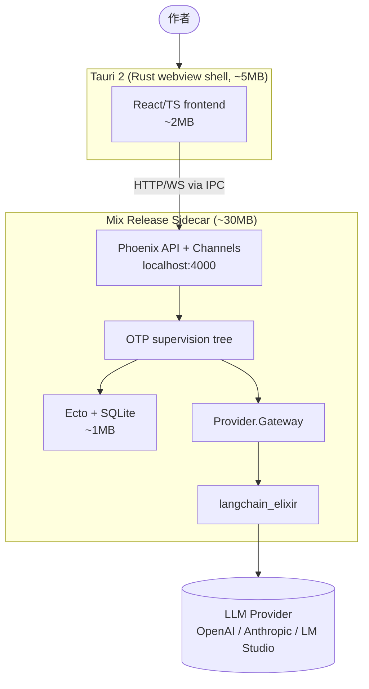
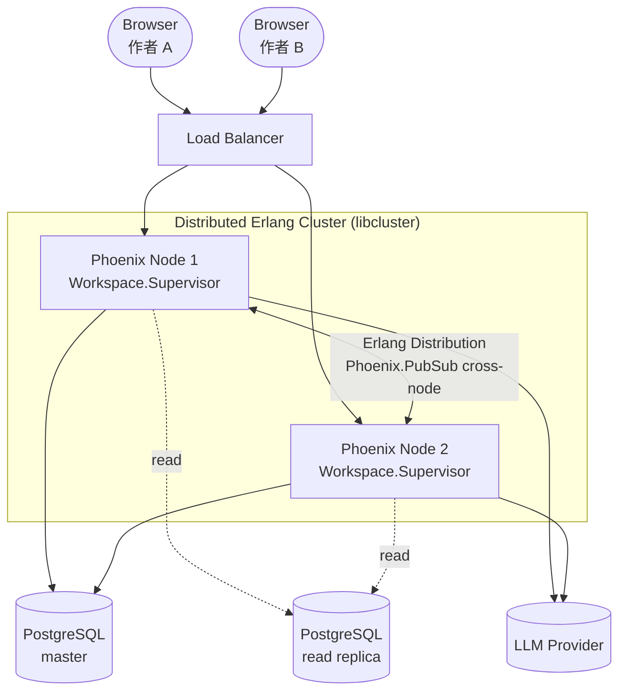

# 技术栈总纲

> 状态：草案
>
> 目的：把"v2 应该用什么技术栈实现"这个问题从讨论收敛成可执行的工程基线。本文不重复 [`../00-overview.md`](../00-overview.md) 的系统设计语义，只回答语义如何落地。

---

## 1. 核心约束

技术栈选型由**四个不可妥协的约束**驱动，缺一不可：

### 约束 1：阶段 1 是开箱即用的桌面应用

- 单机长期使用，不是 alpha throwaway
- 用户期望：下载安装包 → 双击运行 → 就能写小说
- 部署形态：原生桌面应用（macOS / Windows / Linux）
- 包体积、启动时间、内存底盘是硬要求

### 约束 2：阶段 2 是 B/S 多用户多作者 web 服务

- 不是阶段 1 重写，而是平滑升级
- 后端代码共享 ≥95%
- 前端代码共享 ~100%（Tauri 壳 → 浏览器）
- 数据库从 SQLite 切换到 PostgreSQL，业务代码 0 改动
- 多作者隔离从 day 1 设计（即使阶段 1 只有 1 个作者）

### 约束 3：Multi-Agent 在阶段 1 就是核心功能

- 不是"未来扩展点"，是 day-1 产品差异化
- 对应 [`../00-overview.md`](../00-overview.md) §4.12 子系统 12 多 Agent 组合
- 不能延后到阶段 2 才上

### 约束 4：Multi-Agent 是 process-isolated，不是 prompt orchestration

具体三个**联合杀手条件**：

1. **后台 24x7**：Reviewer / Maintainer 在主交互以外持续工作
2. **独立取消**：用户取消一个 Agent 不影响其他 Agent
3. **Crash isolation**：一个 Agent 崩溃，其他 Agent 继续工作

这三条任何一条单独成立都倾向 process-isolated，三条同时成立 = process-isolated 是**绝对必须**。

---

## 2. 最终方案

```yaml
# Backend (Elixir + Phoenix as API server, NOT LiveView)
language:        Elixir 1.17+
runtime:         Erlang/OTP 27+
web:             Phoenix 1.7 (API only)
db_orm:          Ecto 3.x
db_alpha:        SQLite (Ecto.Adapters.SQLite3)
db_beta:         PostgreSQL (Ecto.Adapters.Postgres)
migrations:      Ecto.Migration
revision_audit:  paper_trail (Hibernate Envers 等价)
event_bus:       Phoenix.PubSub (in-node) + Distributed Erlang (cross-node)
long_run:        GenServer + GenStage + Task.Supervisor
schema_validate: Ecto.Changeset + Dialyxir (static analysis)
llm_client:      langchain_elixir + instructor_ex + 自封装 Provider Gateway
http_client:     Req
testing:         ExUnit + Mox + StreamData (property-based)
observability:   opentelemetry-erlang + Phoenix.Telemetry

# Frontend (independent SPA, shared between Tauri shell and Web)
language:        TypeScript 5.x
framework:       React 18+
build:           Vite
state:           TanStack Query + Zustand
schema:          Zod (runtime validation, generated from JSON Schema)
ws_client:       phoenix-js (Phoenix Channels client)
ui_kit:          Radix UI primitives + Tailwind CSS

# Desktop shell (Stage 1 only)
shell:           Tauri 2 (Rust webview, ~5MB)
sidecar:         Mix Release (Elixir, ~30MB；含 ERTS)
frontend_bundle: ~2-5MB（React + Radix + TanStack Query + phoenix-js + Lucide，gzip 后）
total_pkg:       ~50-60MB 单安装包（压缩前；签名 / notarize 不显著影响体积）
                 # 与 Electron 同等功能 ~200MB+ 仍有 3-4 倍优势

# Schema as single source of truth
schemas_root:    docs/design-v2/schemas/*.json   # ADR-0001 锁定路径
ecto_codegen:    自定义 mix task: schemas → Ecto schemas
ts_codegen:      openapi-typescript / @hey-api/openapi-ts → Zod + TS types

# Experimental work (隔离, 不进 production)
experiments:     experiments/ 目录, Python + Jupyter, 输出 prompt 模板
                 产品代码读取模板, 不依赖 Python

# Design prototype
prototype:       pencil (already locked in v2)
```

---

## 3. 阶段 1 形态



**关键指标**：

| 指标 | 目标 |
|---|---|
| 安装包体积 | ~50-60MB（压缩前；含 ERTS + Tauri runtime + frontend bundle）|
| 启动时间（用户感知） | Tauri 立即显示 splash → 2s 内可交互 |
| 内存底盘 | ~150-250MB（BEAM VM + Tauri webview）|
| 退出时数据安全 | 0 丢失（OTP graceful shutdown + SQLite WAL） |

---

## 4. 阶段 2 形态



**与阶段 1 的差异**：

| 维度 | 阶段 1 | 阶段 2 | 业务代码改动 |
|---|---|---|---|
| 部署 | Tauri shell + sidecar | Phoenix server | 0 |
| 数据库 | SQLite | PostgreSQL | 业务核心 0；跨方言能力差异（FTS / LISTEN-NOTIFY / JSON 操作）走 `EventBus.Adapter` / `Search.Adapter` 抽象，详见 [`06-database.md`](./06-database.md) §2.2 |
| Event Bus | Phoenix.PubSub 单节点 | Phoenix.PubSub 跨节点 | 0（Distributed Erlang）|
| 认证 | Device key (Tauri 安全存储) | OAuth/SSO（auth middleware）| **接口层** 0（统一 Bearer plug），但 token 校验、用户身份提取、刷新逻辑在 plug 内部不同实现 |
| Multi-Agent | 单节点 supervision | 跨节点 process registry | 0（Erlang 原生）|
| 路由 | 直连 | Load balancer + consistent hashing | 0（infrastructure 层） |

> **关于"业务代码改动 0"的边界**：本目录所说的"0 改动"指 Domain / Foundation 业务核心逻辑无需修改。Foundation 内部的 adapter 层（数据库、事件总线、认证、跨节点路由）必然会有切换实现，这部分按"边界适配层"对待，不算业务代码。

---

## 5. 与 v2 设计文档的对应关系

| v2 子系统 | 实现位置 |
|---|---|
| [`../00-overview.md`](../00-overview.md) §4.1 交互契约 | Phoenix Channels + JSON Schema codegen |
| §4.2 回合与任务状态 | OTP GenStateMachine + Ecto schemas |
| §4.3 意图与对话行为 | Domain.Intents 注册表 |
| §4.4 能力与 Executor | OTP supervision tree per capability |
| §4.5 记忆体系 | Ecto 多表 + ETS hot tier |
| §4.6 规划与编排 | Domain.Orchestrator GenServer + Task.Supervisor |
| §4.7 一致性与并发 | Ecto.Multi + paper_trail + 乐观锁 |
| §4.8 Provider 抽象 | [`07-provider.md`](./07-provider.md) |
| §4.9 观测性 | [`10-observability.md`](./10-observability.md) |
| §4.10 安全、权限与预算 | OTP process authority + Plug pipeline |
| §4.11 UX 基础语义 | TurnResult.ui_cards → React 组件投影 |
| §4.12 多 Agent 组合 | [`08-multi-agent.md`](./08-multi-agent.md) |

| v2 Domain 模块 | 实现位置 |
|---|---|
| §5.1 小说生命周期对象 | Domain.Objects Ecto schemas |
| §5.2 时序连续性对象 | Domain.Continuity Ecto schemas |
| §5.3 风格与作者意志 | Domain.Style Ecto schemas |
| §5.4 小说 intent 族 | Domain.Intents 注册表 + Capability 映射 |
| §5.5 维护 post-hook | Hook.Registry + GenServer per hook |
| §5.6 上下文组装策略 | Domain.ContextAssembler 模块 |
| §5.7 阅读模式 | Domain.Projection + 独立 Ecto schemas |
| §5.8 创作生命周期 | Domain.Lifecycle 状态机 |

---

## 6. 当前共识

1. **技术栈基线已锁**：Elixir + React/TS + Tauri，无栈级争议待解决。
2. **confidence 90%+**：会动摇推荐的 3 个外部条件详见 [`01-decision-rationale.md`](./01-decision-rationale.md) §5。
3. **风险已识别**：LLM 实验工具弱、招人困难、BEAM 启动延迟，缓解策略详见 [`13-risks.md`](./13-risks.md)。
4. **决策过程透明**：18 个候选剔除链路全部记录在 [`02-alternatives.md`](./02-alternatives.md)。
5. **不绑定具体子系统实现**：本文档只锁栈，子系统具体设计在 [`07-provider.md`](./07-provider.md) ~ [`10-observability.md`](./10-observability.md) 各自展开。
6. **v2 README §8 第 6 条共识仍然成立**：现有 v1 代码不作为迁移目标，本目录围绕 v2 从零设计。

---

## 7. 阅读引导

- 想知道为什么选这个 → [`01-decision-rationale.md`](./01-decision-rationale.md)
- 想知道别的为什么不行 → [`02-alternatives.md`](./02-alternatives.md)
- 想开始动手 → [`14-roadmap.md`](./14-roadmap.md) + [`12-development.md`](./12-development.md)
- 想看具体子系统怎么落地 → [`07-provider.md`](./07-provider.md) ~ [`10-observability.md`](./10-observability.md)
- 担心风险 → [`13-risks.md`](./13-risks.md)
