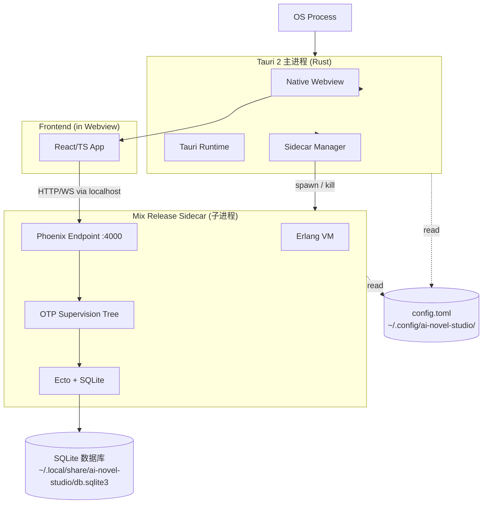
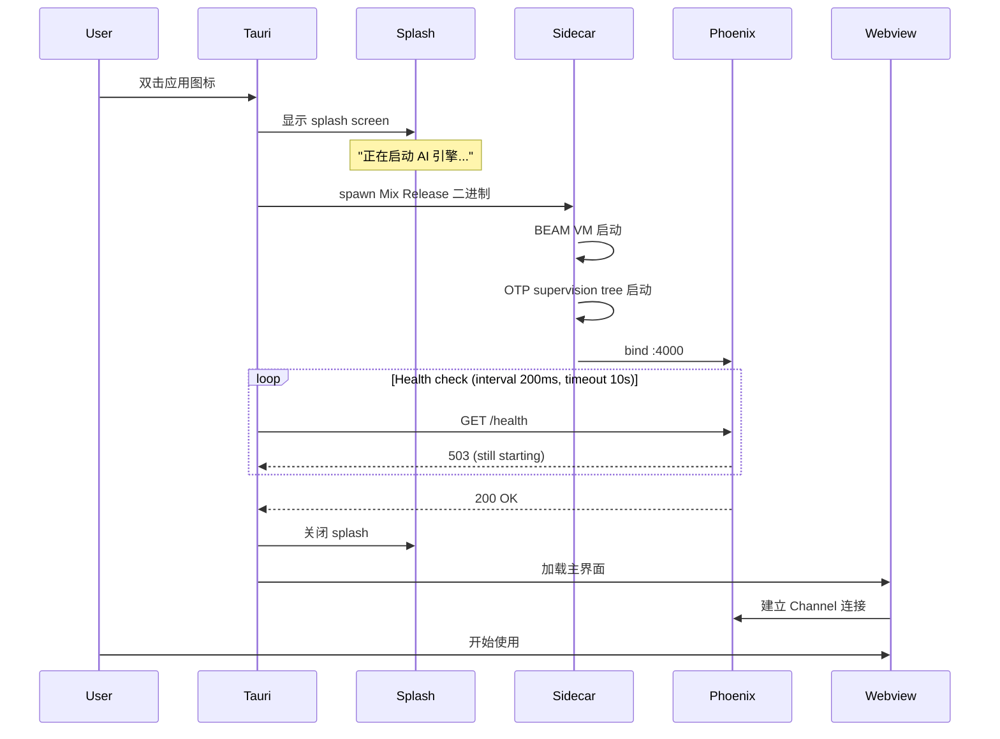

# Desktop Shell 桌面壳

> 状态：草案
>
> 目的：定义阶段 1 单机桌面应用的封装方案——Tauri 2 + Mix Release sidecar 的具体集成。本文档不重复 [`03-backend.md`](./03-backend.md) 的后端栈，只回答"怎么把后端 + 前端 + 数据库打包成一个 macOS / Windows / Linux 桌面应用"。

---

## 1. 选型：Tauri 2

### 1.1 选 Tauri 不选 Electron

| 维度 | Tauri 2 | Electron |
|---|---|---|
| 包体积（仅 shell，未含 sidecar / frontend bundle）| ~5MB | ~80-150MB |
| 包体积（本项目完整安装包）| ~50-60MB（shell + Mix Release + frontend bundle） | ~200-300MB（同等功能）|
| 内存占用 | ~50MB | ~150-300MB |
| 启动时间 | <100ms | ~500ms-1s |
| Webview | 系统原生（macOS WKWebView / Win WebView2 / Linux WebKitGTK） | 内嵌 Chromium |
| 安全模型 | Capability-based + CSP | IPC 自由 |
| Sidecar 支持 | 原生支持外部二进制 sidecar | 需要自实现 |
| 维护方 | Tauri Foundation | OpenJS Foundation |
| Rust 生态 | 一等公民（Rust 写 plugin） | Node 生态 |
| 长期信心 | Tauri 2 (2024 GA) 稳定 | 多年长期项目 |

**Tauri 在本项目的关键优势**：

1. **包体积**：单作者期下载 ~40MB 总包 vs ~200MB 是用户体验差异
2. **Sidecar**：Tauri 原生支持启动外部二进制（Mix Release），不需要自己写 process 管理
3. **安全模型**：Capability allowlist 可以严格限制前端能做的事，符合 [`../00-overview.md`](../00-overview.md) §4.10 安全要求
4. **多平台一致性**：用系统 Webview 而非 Chromium，跨 macOS/Win/Linux 行为一致

---

## 2. 单机部署架构



**关键点**：

1. Tauri 是主进程，启动后立即显示 splash screen
2. Tauri 通过 sidecar manager 启动 Mix Release 二进制
3. Mix Release 启动后绑定 `localhost:4000`
4. Tauri webview 加载 `http://localhost:4000` 或 `tauri://localhost`
5. SQLite 文件位于 OS 标准用户数据目录
6. Tauri 退出时优雅关闭 sidecar（SIGTERM → 30s timeout → SIGKILL）

---

## 3. 启动流程



**用户感知时序**：

| 时刻 | 用户看到 |
|---|---|
| 0ms | 双击图标 |
| 100-200ms | Splash 显示 "AI Novel Studio" + loading 动画 |
| 1-2s | Splash 显示 "正在初始化数据库..." |
| 2-3s | Splash 关闭，主界面出现 |
| 3s+ | 完全可交互 |

---

## 4. Tauri 配置

### 4.1 `tauri.conf.json` 关键配置

```json
{
  "$schema": "../node_modules/@tauri-apps/cli/schema.json",
  "productName": "AI Novel Studio",
  "version": "0.1.0",
  "identifier": "com.ai-novel-studio.app",
  
  "build": {
    "frontendDist": "../frontend/dist",
    "devUrl": "http://localhost:5173",
    "beforeDevCommand": "pnpm --filter frontend dev",
    "beforeBuildCommand": "pnpm --filter frontend build"
  },
  
  "app": {
    "windows": [
      {
        "title": "AI Novel Studio",
        "width": 1280,
        "height": 800,
        "resizable": true,
        "fullscreen": false,
        "center": true
      }
    ],
    "security": {
      "csp": "default-src 'self'; connect-src 'self' http://localhost:4000 ws://localhost:4000",
      "capabilities": ["main-capability"]
    }
  },
  
  "bundle": {
    "active": true,
    "targets": ["app", "dmg", "msi", "deb", "appimage"],
    "icon": ["icons/32x32.png", "icons/128x128.png", "icons/icon.ico"],
    "externalBin": ["binaries/novel-studio-sidecar"],
    "resources": ["migrations/*"]
  }
}
```

### 4.2 Sidecar 启动（`src-tauri/src/main.rs`）

```rust
use tauri::{Manager, RunEvent, WindowEvent};
use tauri_plugin_shell::process::CommandEvent;
use tauri_plugin_shell::ShellExt;

fn main() {
  tauri::Builder::default()
    .plugin(tauri_plugin_shell::init())
    .setup(|app| {
      // Spawn Mix Release sidecar
      let sidecar_command = app
        .shell()
        .sidecar("novel-studio-sidecar")
        .expect("failed to find sidecar binary");
      
      let (mut rx, child) = sidecar_command
        .spawn()
        .expect("failed to spawn sidecar");
      
      // Save child handle for graceful shutdown
      app.manage(SidecarHandle(child));
      
      // Stream sidecar logs to Tauri stderr
      tauri::async_runtime::spawn(async move {
        while let Some(event) = rx.recv().await {
          if let CommandEvent::Stderr(line) = event {
            eprintln!("[sidecar] {}", String::from_utf8_lossy(&line));
          }
        }
      });
      
      // Health check loop
      let app_handle = app.handle().clone();
      tauri::async_runtime::spawn(async move {
        wait_for_sidecar_ready().await;
        // Close splash window, show main window
        if let Some(splash) = app_handle.get_webview_window("splash") {
          splash.close().unwrap();
        }
        if let Some(main) = app_handle.get_webview_window("main") {
          main.show().unwrap();
        }
      });
      
      Ok(())
    })
    .build(tauri::generate_context!())
    .expect("error while running tauri application")
    .run(|app_handle, event| {
      // Graceful shutdown
      if let RunEvent::ExitRequested { .. } = event {
        if let Some(handle) = app_handle.try_state::<SidecarHandle>() {
          // Send SIGTERM to sidecar (Erlang :init.stop())
          let _ = handle.0.kill();
        }
      }
    });
}

struct SidecarHandle(tauri_plugin_shell::process::CommandChild);
```

### 4.3 Sidecar Mix Release 配置（`mix.exs`）

```elixir
def project do
  [
    app: :ai_novel_studio,
    version: "0.1.0",
    elixir: "~> 1.17",
    releases: [
      sidecar: [
        applications: [ai_novel_studio: :permanent],
        steps: [:assemble, :tar],
        include_erts: true,
        include_executables_for: [:unix, :windows]
      ]
    ]
  ]
end
```

构建命令：

```bash
MIX_ENV=prod mix release sidecar
# 产出 _build/prod/rel/sidecar/bin/sidecar
# 复制到 src-tauri/binaries/novel-studio-sidecar-<arch>
```

---

## 5. IPC 协议

Tauri ↔ Sidecar 之间通过两条通道：

### 5.1 HTTP/WebSocket（业务流量）

- 前端 → Phoenix `:4000`：常规 REST + WebSocket
- 没有特殊 IPC，就是 localhost HTTP

### 5.2 Tauri Command（系统级操作）

部分操作前端不通过 Phoenix，直接调 Tauri Rust：

- 文件系统访问（导出小说为 `.docx` / `.epub`）
- 系统通知（章节完成通知）
- 打开外部链接
- 应用更新检查

```rust
#[tauri::command]
fn export_novel(work_id: String, format: String) -> Result<String, String> {
  // 调用 sidecar 取小说内容 + 用 Rust 库生成文件
}
```

```ts
// Frontend
import { invoke } from "@tauri-apps/api/core";
const path = await invoke("export_novel", { workId, format: "docx" });
```

---

## 6. 用户数据存储位置

| 平台 | 路径 |
|---|---|
| macOS | `~/Library/Application Support/com.ai-novel-studio.app/` |
| Windows | `%APPDATA%/com.ai-novel-studio.app/` |
| Linux | `~/.local/share/com.ai-novel-studio.app/` |

存储内容：

```
<data dir>/
├── db.sqlite3                # 主数据库
├── db.sqlite3-wal            # WAL 文件
├── db.sqlite3-shm
├── attachments/              # 用户上传的 style sample 等
├── exports/                  # 导出的小说文件
└── cache/
    └── llm/                  # LLM 响应缓存（可选）
```

配置文件：

```
<config dir>/
├── config.toml               # 用户偏好
├── credentials.encrypted     # device key + LLM API keys（OS keychain 加密）
└── logs/                     # JSONL 日志（轮转）
```

---

## 7. 安装包构建

### 7.1 macOS

- 格式：`.dmg`（双击拖拽安装）+ `.app`（标准 bundle）
- 签名：Apple Developer ID（codesign）
- 公证：notarize（避免 Gatekeeper 警告）
- Universal binary（Intel + Apple Silicon）

### 7.2 Windows

- 格式：`.msi`（标准）+ `.exe`（NSIS）
- 签名：EV / OV code signing certificate
- WebView2 Runtime：作为依赖，安装包检测+ 提示安装

### 7.3 Linux

- 格式：`.deb`（Debian/Ubuntu）+ `.AppImage`（universal）+ `.rpm`（RHEL，可选）
- WebKitGTK 作为系统依赖

---

## 8. 自动更新

Tauri 2 内置 Updater 插件：

```json
{
  "plugins": {
    "updater": {
      "endpoints": [
        "https://releases.example.com/{{target}}/{{current_version}}"
      ],
      "pubkey": "..."
    }
  }
}
```

- 检查更新：启动时 + 用户手动
- 下载：背景下载新二进制
- 安装：用户确认后重启替换
- 数据库迁移：新版本启动后 `mix ecto.migrate`（自动）

---

## 9. 开发体验

### 9.1 本地开发

```bash
# 一个终端：启动 Elixir backend (dev mode)
cd apps/novel_web
mix phx.server

# 另一个终端：启动 Tauri dev (frontend HMR + sidecar)
pnpm tauri dev
```

Tauri dev 会：

- 启动 Vite dev server (`localhost:5173`)
- 不启动 sidecar（因为已经独立跑了 mix phx.server）
- 加载 webview 指向 `http://localhost:5173`

### 9.2 Mock 模式

为了让前端开发不依赖 backend：

- `VITE_MOCK_BACKEND=true` 启动一个 MSW（Mock Service Worker）拦截 API
- Phoenix Channels 用一个简单 mock socket 实现

---

## 10. 阶段 2 时如何拆掉 Tauri

阶段 2 切到 B/S 时：

1. 不再 build Tauri 包
2. 只 build `frontend/` 为静态资源
3. 部署到 CDN（CloudFront / Cloudflare Pages）
4. Phoenix server 直接监听公网 `:4000`（背后通过 nginx + TLS）
5. 前端代码 100% 不变，只改环境变量 `VITE_API_BASE_URL`

阶段 1 → 阶段 2 切换不影响：

- 业务逻辑（Phoenix 同代码）
- 数据库 schema（Ecto migrate）
- UI（前端代码 100% 共享）
- LLM provider gateway

详见 [`11-deployment.md`](./11-deployment.md)。

---

## 11. 当前 TBD

- 自动更新签名密钥管理
- macOS Apple Developer ID 申请流程（需要个人或公司账户）
- Windows EV 证书购买
- 分平台 CI/CD（GitHub Actions matrix build）
- LLM API key 的安全存储（用 OS Keychain via Tauri Stronghold plugin）

以上在 Phase 0 末期 / 阶段 1 中期处理，不阻塞早期开发。
