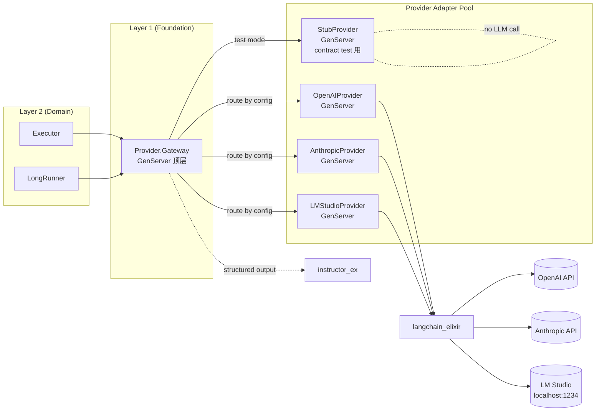

# LLM Provider Gateway

> 状态：草案
>
> 目的：定义 [`../00-overview.md`](../00-overview.md) §4.8 Provider 抽象在 Elixir 上的具体实现。本文不是完整设计文档，是技术栈层面的实现选型与关键纪律，详细 contract 待 `../08-provider-abstraction.md` 写完后落地。

---

## 1. 总览

```yaml
core_lib:        langchain_elixir
struct_output:   instructor_ex
http_client:     Req
fallback_lib:    自实现 ProviderGateway（OpenAI 兼容协议直连）
gateway_pattern: GenServer per provider + Registry + DynamicSupervisor
usage_tracker:   Telemetry events + Persistence
retry:           Req retry middleware + 自定义 backoff
circuit_breaker: fuse 或自实现
streaming:       Phoenix.Channel push + GenStage
```

---

## 2. 架构



---

## 3. Provider 抽象 behaviour

```elixir
defmodule AINovelStudio.Foundation.Provider do
  @moduledoc """
  对应 v2 §4.8 Provider Abstraction。
  所有 LLM 调用必须穿过此抽象。
  """
  
  @type message :: %{role: :system | :user | :assistant | :tool, content: String.t()}
  @type params :: %{
          required(:model) => String.t(),
          optional(:temperature) => float(),
          optional(:max_tokens) => pos_integer(),
          optional(:tools) => list(map()),
          optional(:response_format) => map()
        }
  @type usage :: %{
          prompt_tokens: non_neg_integer(),
          completion_tokens: non_neg_integer(),
          cost_usd: float() | nil,
          latency_ms: non_neg_integer(),
          model_id: String.t(),
          provider_id: String.t()
        }
  @type result :: %{
          content: String.t(),
          tool_calls: list(map()) | nil,
          usage: usage(),
          finish_reason: :stop | :length | :tool_calls | :content_filter
        }
  @type stream_event :: 
          {:content_delta, String.t()} 
          | {:tool_call_delta, map()} 
          | {:done, usage()}
  
  @callback complete(messages :: list(message()), params :: params()) ::
              {:ok, result()} | {:error, term()}
  
  @callback stream(messages :: list(message()), params :: params()) ::
              {:ok, Enumerable.t()} | {:error, term()}
  
  @callback supports?(capability :: :streaming | :tool_calling | :structured_output) ::
              boolean()
end
```

---

## 4. Gateway 实现

```elixir
defmodule AINovelStudio.Foundation.Provider.Gateway do
  use GenServer
  
  # Public API
  def complete(messages, params, opts \\ []) do
    provider = select_provider(opts)
    GenServer.call({:via, Registry, {ProviderRegistry, provider}}, {:complete, messages, params})
  end
  
  def stream(messages, params, opts \\ []) do
    provider = select_provider(opts)
    GenServer.call({:via, Registry, {ProviderRegistry, provider}}, {:stream, messages, params})
  end
  
  defp select_provider(opts) do
    cond do
      opts[:provider] -> opts[:provider]
      opts[:agent_id] -> get_agent_provider_preference(opts[:agent_id])
      true -> default_provider()
    end
  end
end
```

每个具体 provider 是独立 GenServer：

```elixir
defmodule AINovelStudio.Foundation.Provider.OpenAI do
  use GenServer
  @behaviour AINovelStudio.Foundation.Provider
  
  @impl true
  def complete(messages, params) do
    case LangChain.ChatModels.ChatOpenAI.call(
      %LangChain.ChatModels.ChatOpenAI{
        model: params.model,
        temperature: params[:temperature] || 0.7,
        api_key: api_key(),
        endpoint: endpoint()
      },
      messages
    ) do
      {:ok, response} ->
        {:ok, normalize_result(response, "openai")}
      {:error, reason} ->
        {:error, normalize_error(reason)}
    end
  end
  
  defp normalize_result(response, provider_id) do
    %{
      content: response.content,
      tool_calls: response.tool_calls,
      usage: %{
        prompt_tokens: response.usage.input_tokens,
        completion_tokens: response.usage.output_tokens,
        cost_usd: calculate_cost(response.usage, response.model),
        latency_ms: response.latency_ms,
        model_id: response.model,
        provider_id: provider_id
      },
      finish_reason: response.finish_reason
    }
  end
end
```

---

## 5. Multi-Provider 路由

每个 Agent 可以配置自己的 provider 偏好：

```elixir
# config/runtime.exs 或运行时数据库
%{
  agent_type: :writer,
  provider_preferences: [
    %{provider: :openai, model: "gpt-4o", priority: 1},
    %{provider: :anthropic, model: "claude-sonnet-4", priority: 2}
  ]
}

%{
  agent_type: :reviewer,
  provider_preferences: [
    %{provider: :openai, model: "gpt-4o-mini", priority: 1},   # 便宜的
    %{provider: :lm_studio, model: "qwen-32b", priority: 2}    # 本地兜底
  ]
}
```

Gateway 根据 Agent ID + capability 路由到对应 provider。

---

## 6. Usage 追踪

`usage` 字段标准化（[`../00-overview.md`](../00-overview.md) §4.8）：

```elixir
defmodule AINovelStudio.Foundation.Provider.UsageTracker do
  def record(workspace_id, agent_id, usage) do
    :telemetry.execute(
      [:ai_novel_studio, :provider, :complete],
      %{
        prompt_tokens: usage.prompt_tokens,
        completion_tokens: usage.completion_tokens,
        cost_usd: usage.cost_usd,
        latency_ms: usage.latency_ms
      },
      %{
        workspace_id: workspace_id,
        agent_id: agent_id,
        provider_id: usage.provider_id,
        model_id: usage.model_id
      }
    )
    
    # 持久化（用于长期 budget 报表）
    AINovelStudio.Persistence.UsageLog.insert(...)
  end
end
```

通过 Budget Meter 实时检查（[`03-backend.md`](./03-backend.md) §5.4）。

---

## 7. 错误标准化

不同 provider 错误格式不一，必须标准化：

```elixir
@type error_kind :: 
  :rate_limit
  | :quota_exceeded
  | :invalid_request
  | :context_length
  | :content_filter
  | :provider_unavailable
  | :network
  | :auth_failed
  | :unknown

@spec normalize_error(any) :: %{kind: error_kind, message: String.t(), retry_after: nil | pos_integer()}

def normalize_error(%LangChain.LangChainError{type: "rate_limit", retry_after: ra}) do
  %{kind: :rate_limit, message: "rate limited", retry_after: ra}
end

def normalize_error(%LangChain.LangChainError{type: "context_length"}) do
  %{kind: :context_length, message: "context too long", retry_after: nil}
end
# ...
```

---

## 8. Streaming

LLM 流式响应通过 Phoenix Channel push：

```elixir
defmodule AINovelStudio.Foundation.Provider.Streaming do
  def stream_to_channel(messages, params, channel_topic) do
    {:ok, stream} = Gateway.stream(messages, params)
    
    Stream.each(stream, fn
      {:content_delta, text} ->
        Phoenix.PubSub.broadcast(
          AINovelStudio.PubSub,
          channel_topic,
          {:streaming_chunk, %{kind: :content, delta: text}}
        )
      
      {:done, usage} ->
        Phoenix.PubSub.broadcast(
          AINovelStudio.PubSub,
          channel_topic,
          {:streaming_done, %{usage: usage}}
        )
    end)
    |> Stream.run()
  end
end
```

前端订阅 channel → 增量更新 UI。

---

## 9. Retry + Circuit Breaker

```elixir
# Req 自带 retry middleware
defp build_req_client(provider) do
  Req.new(
    base_url: provider.endpoint,
    auth: {:bearer, provider.api_key},
    retry: :transient,                # network errors, 5xx
    max_retries: 3,
    retry_delay: fn attempt -> 2 ** attempt * 500 end  # exp backoff
  )
end

# Circuit breaker via :fuse library
:fuse.install(:provider_openai, {{:standard, 5, 30_000}, {:reset, 60_000}})

def call_openai(req) do
  case :fuse.ask(:provider_openai, :sync) do
    :ok ->
      result = Req.post(req)
      if {:error, _} = result, do: :fuse.melt(:provider_openai)
      result
    
    :blown ->
      {:error, %{kind: :provider_unavailable, message: "circuit breaker open"}}
  end
end
```

---

## 10. 与 Authority / Budget 横切的关系

每次 `Gateway.complete/3` 调用前：

1. `Authority.Gate.check/3` 验证 Agent 有权调此 provider + model
2. `Budget.Meter.allocate/3` 预分配 token / cost 配额
3. 真正调用 provider
4. `Budget.Meter.consume/3` 扣减实际消耗
5. 如果 consume > allocate（超预算），触发 escalation（ADR-0003）

---

## 11. Stub Provider（contract test 用）

```elixir
defmodule AINovelStudio.Foundation.Provider.Stub do
  @behaviour AINovelStudio.Foundation.Provider
  
  @impl true
  def complete(messages, params) do
    # 从 fixtures 读预录响应
    fixture = find_fixture(messages, params)
    {:ok, fixture}
  end
  
  defp find_fixture(messages, params) do
    # 按消息 hash + model 匹配 fixture
  end
end
```

测试中：

```elixir
setup do
  Application.put_env(:ai_novel_studio, :default_provider, :stub)
  :ok
end

test "executor calls provider stub" do
  result = Executor.run(intent, params)
  assert result.usage.provider_id == "stub"
end
```

---

## 12. 当前 TBD

- 具体 cost calculation（按 model 不同 pricing 维护表）
- Provider 选择策略：成本最优 vs 质量最优 vs 延迟最优
- Multi-provider parallel call（同 prompt 调多家做 ensemble）
- Provider 健康检测探针（health check endpoint）
- Token counting：是否本地预估（tiktoken_elixir）vs 仅事后从响应取
- Prompt caching（Anthropic / OpenAI 都支持）
- Fine-tuning model 接入

以上 TBD 在 Phase 0 后展开。
