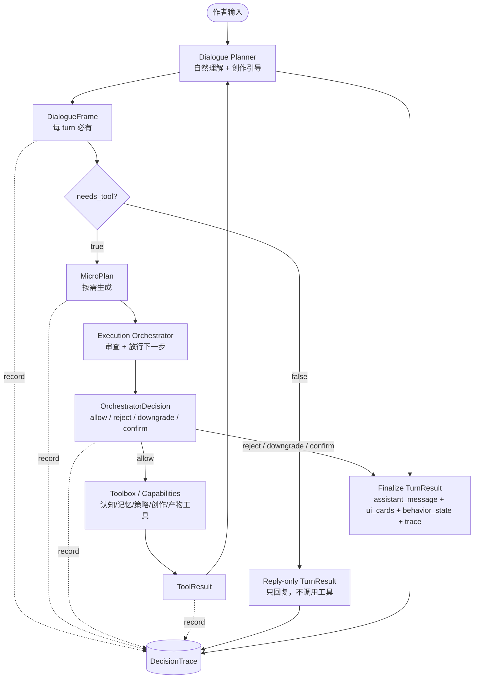

# v3 端到端对话主链

> 状态：草案（2026-05-02）
>
> 角色：v3 动态主链文档。本文回答“作者一次输入如何经过 Dialogue Planner、DialogueFrame、MicroPlan、Toolbox、Execution Orchestrator，最终变成 TurnResult 与可回放 trace”。
>
> 关联文档：
> - `00-vision-and-engineering-roadmap.md` — v3 推进阶段与实现门槛
> - `00a-reading-map.md` — v3 阅读路径
> - `01-user-llm-workbench-interaction-model.md` — 用户、LLM、工作台交互模型
>
> 不负责范围：
> - 不冻结 DialogueFrame / MicroPlan 字段全集，字段冻结留给 `02-dialogue-frame-and-micro-plan.md`
> - 不冻结 Capability Toolbox 注册格式，留给 `03-capability-toolbox-contract.md`
> - 不冻结 Execution Orchestrator 模块边界，留给 `04-execution-orchestrator.md`
> - Workbench UI 消费契约由 `07-workbench-ui-contract.md` 承接；视觉呈现仍不在本文冻结

---

## 1. 主链核心判断

v3 的端到端主链不再是：

```text
User → Router → TurnService → Executor → TurnResult
```

而是：

```text
AuthorInput
→ Dialogue Planner
→ DialogueFrame
→ MicroPlan（按需）
→ Execution Orchestrator
→ Toolbox / Capabilities
→ TurnResult + DecisionTrace
```

这条链路有两个目标：

1. **作者体验自然**：作者感觉自己在和 LLM 创作伙伴讨论，而不是回答工作台表单。
2. **系统行为可审计**：每个 turn 都有结构化认知、行动建议、执行决策和最终结果。

因此，v3 的主链不是“LLM 自由发挥”，而是：

```text
LLM 负责理解与表达；
DialogueFrame 负责结构化认知；
MicroPlan 负责行动建议；
Execution Orchestrator 负责批准与执行；
Toolbox 负责能力边界；
TurnResult 负责对外出口；
DecisionTrace 负责可回放解释。
```

---

## 2. 主链总览



这张图表达的是动态责任，不代表最终模块部署图。部署与组件边界后续由 `00d-runtime-architecture.md` 细化。

---

## 3. 流经对象

v3 主链至少包含以下流经对象。本文只定义它们在链路中的角色，不冻结字段全集。

| 对象 | 是否每 turn 必有 | 责任 |
|---|---:|---|
| `AuthorInput` | 是 | 作者本轮输入，包含文本、上下文入口、可选行为引用 |
| `DialogueContext` | 是 | Planner 可见的最小上下文包，如会话摘要、当前作品、未关闭 behavior |
| `DialogueFrame` | 是 | 本轮结构化认知：这是闲聊、探索、补槽、确认、纠错、取消还是执行候选 |
| `MicroPlan` | 否 | Planner 提出的下一步行动建议，只在需要工具或状态推进时出现 |
| `ToolRequest` | 否 | Orchestrator 批准后的具体工具调用请求 |
| `ToolResult` | 否 | 工具实际返回的结构化结果 |
| `OrchestratorDecision` | 需要行动时必有 | Execution Orchestrator 对 MicroPlan / ToolRequest 的裁决 |
| `TurnResult` | 是 | 对 UI / Channel / replay 的 canonical 输出 |
| `DecisionTrace` | 是 | 本轮认知、建议、裁决、工具结果的可回放记录 |

关键点：

- `DialogueFrame` 取代 v2 `RouterResult` 成为 turn 认知入口。
- `MicroPlan` 不是执行授权，只是行动建议。
- `ToolRequest` 必须由 Execution Orchestrator 产生或批准。
- `TurnResult` 仍是对外唯一稳定出口。

---

## 4. 标准 turn 流程

### 4.1 Step 1：接收作者输入

输入来源可以是 Workbench 对话框、快捷操作、卡片 action、未来的 CLI / batch 入口。

进入主链前，系统只做入口标准化：

```text
AuthorInput:
  text
  workspace_ref
  author_ref
  optional_behavior_ref
  optional_object_scope_ref
  idempotency_key
```

入口层不做 intent 判断，不做 slot 表单化追问，不直接调用 capability。

### 4.2 Step 2：组装 DialogueContext

Dialogue Planner 不应面对全量数据库，也不应凭空聊天。它接收一个受控的 `DialogueContext`。

`DialogueContext` 至少来自：

| 来源 | 用途 |
|---|---|
| 会话摘要 | 理解最近对话 |
| 当前作品 / 范围 | 理解作者正在创作什么 |
| open behavior | 知道是否正在等待 clarification / confirmation / correction |
| slot draft / current parameters | 继续探索或补槽 |
| registry 摘要 | 知道系统会什么，但不暴露全部内部细节 |
| policy hints | 知道哪些动作可能高风险或需要确认 |

上下文组装必须可 trace。`06-memory-context-and-trace.md` 负责定义细节。

在 AI 引导式创作链路中，`DialogueContext` 同时承担 `VS-00D` 的当前作品层投影：它只提供有来源的作品状态、会话状态和省略说明，不承载小说层原则本身，也不让 AI 从自由文本里静默猜当前作品事实。

### 4.3 Step 3：Dialogue Planner 生成 DialogueFrame

每个 turn 必须有 `DialogueFrame`。

它回答：

```text
本轮输入在系统看来是什么性质？
```

示例 frame 类型：

| frame_type | 含义 |
|---|---|
| `casual_reply` | 普通回应，不推进创作状态 |
| `exploration` | 作者意图模糊，系统应共同探索方向 |
| `slot_update` | 用户补充了可合并到 slot draft 的信息 |
| `execution_candidate` | Planner 认为可能可以进入执行候选 |
| `confirmation_answer` | 用户在回答确认 |
| `correction` | 用户修正前文理解、参数或结果 |
| `cancellation` | 用户取消当前等待态或任务 |
| `rejection_candidate` | Planner 认为请求可能不应执行 |

`DialogueFrame` 可以包含 `author_visible_message` 草案，但该消息仍要经过 Execution Orchestrator envelope 校验后才进入 TurnResult。

Planner 调用 AI 时，message 必须由 `VS-00D` 的三层 message envelope 推导：

```text
Planner messages
  NovelLayerMessage      = 本轮需要的小说原则、要素焦点、质量门
  WorkStateMessage       = DialogueContext 投影出的当前作品状态、refs、omission
  TurnGuidanceMessage    = 作者原始输入、本轮判断任务、输出 schema、越权禁止项
```

Planner 的输出不是直接执行，而是把 AI 对本轮引导方式的判断压缩为 `DialogueFrame` / FrameTrace：本轮应探索、结构化、执行、质量诊断、澄清还是确认；关注哪些小说要素；哪些当前作品状态缺失或冲突。

### 4.4 Step 4：判断是否需要 MicroPlan

如果 `DialogueFrame.needs_tool = false`：

```text
DialogueFrame → envelope validation → reply-only TurnResult
```

如果 `DialogueFrame.needs_tool = true`，Planner 必须生成 `MicroPlan`。

触发 MicroPlan 的典型情况：

- 需要读取记忆或对象上下文。
- 需要解释 intent 或更新 slot draft。
- 需要校验 blocking slots。
- 需要生成候选方向。
- 需要进入 durable behavior。
- 需要调用创作 capability。
- 需要创建 tentative artifact。
- 需要处理 confirmation / correction / cancellation。

### 4.5 Step 5：Execution Orchestrator 审查 MicroPlan

Execution Orchestrator 不替作者创作，也不生成主文案。它负责审查行动建议：

| 审查项 | 问题 |
|---|---|
| contract | proposed action 是否属于已注册工具或 capability |
| state | 当前 turn / behavior / task 状态是否允许该动作 |
| slot | execution_candidate 是否满足 blocking slot 门槛 |
| authority | 是否涉及写入、采纳、生产状态变更 |
| budget | 是否可能触发高成本 LLM / 长跑 |
| confirmation | 是否必须先让作者确认 |
| trace | 是否能完整记录输入、输出和裁决原因 |

可能裁决：

| decision | 含义 |
|---|---|
| `allow_next_action` | 放行下一步安全动作 |
| `downgrade_to_dialogue` | 不允许执行，降级为继续对话或探索 |
| `require_confirmation` | 信息足够但需要作者确认 |
| `require_clarification` | 进入 durable clarification |
| `reject` | 请求不应执行，返回 rejection |
| `cancel_or_close` | 关闭等待态或任务 |
| `fail_with_recovery` | 工具或契约失败，返回可恢复错误 |

默认原则：

```text
只放行下一步；
高风险先确认；
写入先 tentative；
Planner 不批准自己的执行。
```

### 4.6 Step 6：调用 Toolbox / Capability

只有被 Execution Orchestrator 放行的动作才能变成 `ToolRequest`。

工具按职责分层：

| 工具层 | 示例 | 允许做什么 | 禁止做什么 |
|---|---|---|---|
| 认知工具 | `IntentInterpreter`, `SlotStateUpdater` | 解释、抽取、更新草稿 | 直接执行创作或写入 |
| 记忆工具 | `MemoryRecall`, `ContextReader` | 读取上下文 | 写生产状态 |
| 策略工具 | `SlotValidator`, `AuthorityChecker`, `BudgetEstimator` | 判断是否允许推进 | 生成作者主文案 |
| 创作工具 | `CandidateDirectionGenerator`, `DraftGenerator` | 生成候选或内容 | 绕过 adoption |
| 产物工具 | `ArtifactValidator`, `AdoptionBoundary`, `ProjectionRefresher` | 校验、采纳、投影刷新 | 绕过权限和 trace |

工具返回 `ToolResult`，而不是直接拼 UI 消息。

### 4.7 Step 7：Planner 基于 ToolResult 生成最终回应

工具返回后，Planner 可以生成下一版 `DialogueFrame` 或最终 `author_visible_message`。

但此时仍有边界：

- Planner 可以解释工具结果。
- Planner 可以继续引导作者。
- Planner 可以建议下一步。
- Planner 不能把未批准的动作写成“已经执行”。
- Planner 不能把 tentative 说成 production accepted。

### 4.8 Step 8：组装 TurnResult + DecisionTrace

每个 turn 最终输出 `TurnResult`。

TurnResult 至少承载：

| 区域 | 用途 |
|---|---|
| `assistant_message` | 作者可见主回应 |
| `ui_cards` | clarification / confirmation / adoption / candidate 等卡片 |
| `behavior_state` | durable behavior 的 open / history |
| `adoption_state` | tentative / resolved artifacts |
| `projection_refs` | 阅读投影刷新状态 |
| `validation` | contract / policy 检查结果 |
| `usage` | LLM / tool / budget 使用 |
| `trace_ref` | 指向 DecisionTrace |

`DecisionTrace` 至少记录：

```text
AuthorInput
DialogueContext 摘要引用
DialogueFrame
MicroPlan（如有）
OrchestratorDecision（如有）
ToolRequest / ToolResult（如有）
TurnResult 摘要
```

---

## 5. 三条基础路径

### 5.1 Reply-only 路径

适用于普通闲聊、轻量解释、无需更新系统状态的回应。

```text
AuthorInput
→ DialogueContext
→ DialogueFrame(frame_type=casual_reply, needs_tool=false)
→ envelope validation
→ TurnResult(next_action=NO_FURTHER_ACTION)
```

不变量：

- 仍必须有 DialogueFrame。
- 不调用工具。
- 不更新 slot draft。
- 不创建 behavior。
- 不创建 artifact。

### 5.2 Exploration 路径

适用于作者表达模糊创作意图，例如“我想开本新书，但没想好”。

```text
AuthorInput
→ DialogueFrame(frame_type=exploration, intent_hypothesis=CREATE_WORK_SEED)
→ MicroPlan(generate_candidate_directions)
→ OrchestratorDecision(allow_next_action)
→ CandidateDirectionGenerator
→ ToolResult(candidate_directions)
→ Planner author_visible_message
→ TurnResult(next_action=ASK_USER or NO_FURTHER_ACTION)
```

不变量：

- 不因为缺 slot 直接展示字段表单。
- 候选方向在确认前只是 draft，不是执行参数。
- 不创建 production work。
- 可以记录 intent hypothesis 和 slot draft。

### 5.3 Execution Candidate 路径

适用于 Planner 认为可以执行某个 intent，但仍需执行层校验。

```text
AuthorInput
→ DialogueFrame(frame_type=execution_candidate, execution_readiness=ready_candidate)
→ MicroPlan(validate_slots, check_authority, maybe_invoke_capability)
→ Execution Orchestrator
→ SlotValidator
→ AuthorityChecker / BudgetEstimator
→ require_confirmation 或 invoke capability
→ TurnResult
```

不变量：

- `ready_candidate` 不是 `READY_TO_EXECUTE`。
- blocking slot 必须由策略工具校验。
- 高风险、写入、长跑必须 confirmation。
- 产物默认 tentative。

---

## 6. 对话行为路径

### 6.1 Clarification

v3 中，clarification 是 durable behavior，不是缺字段的第一反应。

触发条件：

- 已经有明确 execution candidate。
- 缺失信息阻断安全或正确执行。
- 无法通过探索、上下文、高置信默认继续推进。

链路：

```text
DialogueFrame(frame_type=slot_update or execution_candidate)
→ MicroPlan(validate_slots)
→ SlotValidator reports blocking missing
→ OrchestratorDecision(require_clarification)
→ TurnResult(behavior_state.active=clarification)
```

作者可见形态可以是自然问题、候选方向、对比方案或 clarification card，不应默认是字段表单。

### 6.2 Confirmation

confirmation 表示信息足够，但执行有风险或成本。

触发条件：

- 写入生产状态。
- 长跑任务。
- 高预算调用。
- 高风险 intent。
- adoption / irreversible action。

链路：

```text
DialogueFrame(frame_type=execution_candidate)
→ MicroPlan(check_authority, estimate_budget, invoke_capability)
→ OrchestratorDecision(require_confirmation)
→ TurnResult(behavior_state.active=confirmation, next_action=CONFIRM_BEFORE_EXECUTE)
```

Planner 可以建议需要确认，但最终由 Execution Orchestrator 决定。

### 6.3 Correction

correction 表示用户修正前一轮理解、参数、结果或状态。

链路：

```text
AuthorInput("刚才不是这个意思")
→ DialogueFrame(frame_type=correction)
→ MicroPlan(resolve_target, update_slot_draft or supersede_artifact)
→ Execution Orchestrator
→ ToolResult
→ TurnResult
```

不变量：

- 不能把 correction 当成全新 intent 粗暴覆盖。
- 如果涉及已采纳内容，必须走 revision / adoption / confirmation 边界。

### 6.4 Cancellation

cancellation 表示用户取消等待态、当前 turn、长跑任务或 pending action。

链路：

```text
AuthorInput("算了，不做了")
→ DialogueFrame(frame_type=cancellation)
→ MicroPlan(close_behavior or cancel_task)
→ Execution Orchestrator
→ TurnResult(status=CANCELLED or behavior closed)
```

不变量：

- cancellation 必须明确关闭对象范围。
- 不能误取消无关任务。
- 关闭 durable behavior 时必须有 resolution。

---

## 7. 示例：开本新书但没想好

### 7.1 Turn 1：模糊立项

作者：

```text
我想开本新书，但还没想好具体方向。
```

内部：

```text
DialogueFrame:
  frame_type = exploration
  dialogue_goal = explore_work_seed_positioning
  intent_hypothesis = intent.CREATE_WORK_SEED
  slot_state_delta = {}
  needs_tool = true
  execution_readiness = not_ready

MicroPlan:
  plan_goal = generate_candidate_work_seed_directions
  proposed_actions = [generate_candidate_directions]
  stop_after_next_action = true

OrchestratorDecision:
  decision = allow_next_action
  reason = exploration is safe; no write requested
```

作者看到：

```text
我们先不用急着定死。我给你三个方向看看哪种更接近……
```

系统不得：

- 创建作品。
- 进入 confirmation。
- 要求作者填写 `genre / core_selling_point / target_reader` 表单。

### 7.2 Turn 2：选择候选并补充偏好

作者：

```text
第二个不错，但目标读者想偏年轻一点，节奏要快。
```

内部：

```text
DialogueFrame:
  frame_type = slot_update
  intent_hypothesis = intent.CREATE_WORK_SEED
  slot_state_delta:
    target_reader = 偏年轻的读者
    tone_preference = 快节奏
  execution_readiness = not_ready
```

如果仍缺核心卖点，系统继续探索，而不是执行。

### 7.3 Turn 3：进入执行候选

作者：

```text
就按这个方向创建。
```

内部：

```text
DialogueFrame:
  frame_type = execution_candidate
  intent_hypothesis = intent.CREATE_WORK_SEED
  execution_readiness = ready_candidate

MicroPlan:
  proposed_actions = [validate_slots, check_authority, create_tentative_work_seed]
```

Execution Orchestrator 必须：

- 校验 blocking slots。
- 判断是否需要 confirmation。
- 只允许 tentative create。
- 记录 DecisionTrace。

---

## 8. Turn outcome 矩阵

| DialogueFrame | needs_tool | MicroPlan | 典型 TurnResult |
|---|---:|---|---|
| `casual_reply` | false | 无 | `COMPLETED / NO_FURTHER_ACTION` |
| `exploration` | true | 生成候选方向 | `NEEDS_CLARIFICATION` 或 `COMPLETED / ASK_USER`，取决于是否创建 durable behavior |
| `slot_update` | true/false | 可选更新 slot draft | 通常继续对话，必要时 active clarification resolved |
| `execution_candidate` | true | 校验 + 执行建议 | `NEEDS_CONFIRMATION` / `READY_TO_EXECUTE` / `FAILED` |
| `confirmation_answer` | true | 关闭 confirmation + 执行或取消 | `EXECUTING` / `COMPLETED` / `CANCELLED` |
| `correction` | true | 解析目标 + 修正状态 | `COMPLETED` / `NEEDS_CONFIRMATION` |
| `cancellation` | true | 关闭 behavior / task | `CANCELLED` 或 behavior history closed |
| `rejection_candidate` | true | policy check | `FAILED` 或 rejection behavior / message |

矩阵只是动态流参考。具体 phase/status/next_action 兼容表由 `05-turn-behavior-and-state-model.md` 承接，最终由 ADR 冻结。

---

## 9. 主链不变量

v3 主链必须保护以下不变量：

1. 每个 turn 必有 DialogueFrame。
2. Planner 不能批准自己的 MicroPlan。
3. `ready_candidate` 不等于 `READY_TO_EXECUTE`。
4. 所有工具调用必须有 ToolRequest / ToolResult trace。
5. 写入默认 tentative，不直接 production write。
6. 高风险、长跑、预算敏感动作必须经 Execution Orchestrator 门禁。
7. 缺 slot 不自动等于作者可见字段表单。
8. durable behavior 必须显式 open / close / resolution。
9. TurnResult 是 UI 与外部入口的 canonical 输出。
10. DecisionTrace 必须能解释“为什么没有执行”。
11. 创作相关 AI 调用必须能重建 message envelope：小说层、当前作品层、本轮引导层分别来自哪里、哪些内容被省略、缺失如何处理。

---

## 10. 与相关文档的分工

| 相关文档 | 本文留下的问题 |
|---|---|
| `00c-state-and-contract-atlas.md` | 哪些状态机和 contract 需要索引 |
| `00d-runtime-architecture.md` | 这些动态对象最终落在哪些运行时组件 |
| `02-dialogue-frame-and-micro-plan.md` | DialogueFrame / MicroPlan 字段、枚举、schema |
| `03-capability-toolbox-contract.md` | ToolRequest / ToolResult / capability registry |
| `04-execution-orchestrator.md` | OrchestratorDecision、门禁、dispatch 边界 |
| `05-turn-behavior-and-state-model.md` | phase/status/next_action 与 behavior lifecycle |
| `06-memory-context-and-trace.md` | DialogueContext 与 DecisionTrace 详细结构 |
| `07-workbench-ui-contract.md` | UI 如何消费 assistant_message、cards、trace |
| `contracts/VS-00D-ai-guided-authoring-contract-pack.md` | AI 引导式创作三层 contract 与 AI message layer |

---

## 11. 下一步

本文完成后，v3 已具备：

- `00`：为什么推进 v3，以及怎么推进。
- `00a`：不同角色怎么读。
- `00b`：一次 turn 如何动态流动。
- `01`：用户、LLM、工作台三者关系。
- `00d`：控制面、数据面、横切层的运行时视图。
- `02`：DialogueFrame / MicroPlan 协议草案。
- `03`：Capability Toolbox 协议草案。
- `04`：Execution Orchestrator 协议草案。
- `05`：Turn Behavior 与状态模型草案。
- `06`：Memory、Context、Trace 与 Replay 草案。
- `07`：Workbench UI 消费契约草案。
- `00c`：状态、contract、ADR 候选和 slice 入口总索引。

当前阶段结论：

```text
VS-00 到 VS-06（含 VS-00A、VS-00B、VS-02A）首批文档输入已 docs-ready；VS-00D 作为后置 contract reconciliation 已 docs-ready
```

原因：

- `00b` 已经定义动态主链。
- `02/03/04/05/06` 已经把 Frame/Plan、Toolbox、Orchestrator、BehaviorState 和 trace/replay 分别拆成 contract 草案。
- `07` 已经定义 UI 如何消费本文中的 assistant_message、cards、behavior_state、trace summary 与 available actions。
- `00c` 已经把这些状态、contract、ADR 候选和第一批 slice 入口汇总成索引。
- `adr/README.md` 已经定义 v3 ADR 的编号、状态和首批 ADR 顺序。
- `ADR-0001` 已经将本文主链中“每 turn 必有 DialogueFrame”的认知锚点升级为 Accepted 决策。
- `ADR-0003` 已经提出本文主链中 Planner 不能批准执行的权限边界。
- `ADR-0004` 已经提出本文主链中执行裁决如何表达。
- `ADR-0005` 已经提出执行裁决前的门禁顺序。
- `tasks/slices/v3/DAG.md` 已经把本文主链转成首批承重垂直切面。
- VS-00 / VS-00A / VS-00B / VS-01 / VS-02 / VS-02A / VS-03 / VS-04 / VS-05 / VS-06 的文档 blocker 已关闭；下一步需要用户明确批准后，才可创建 implementation plan 或进入代码实现。
