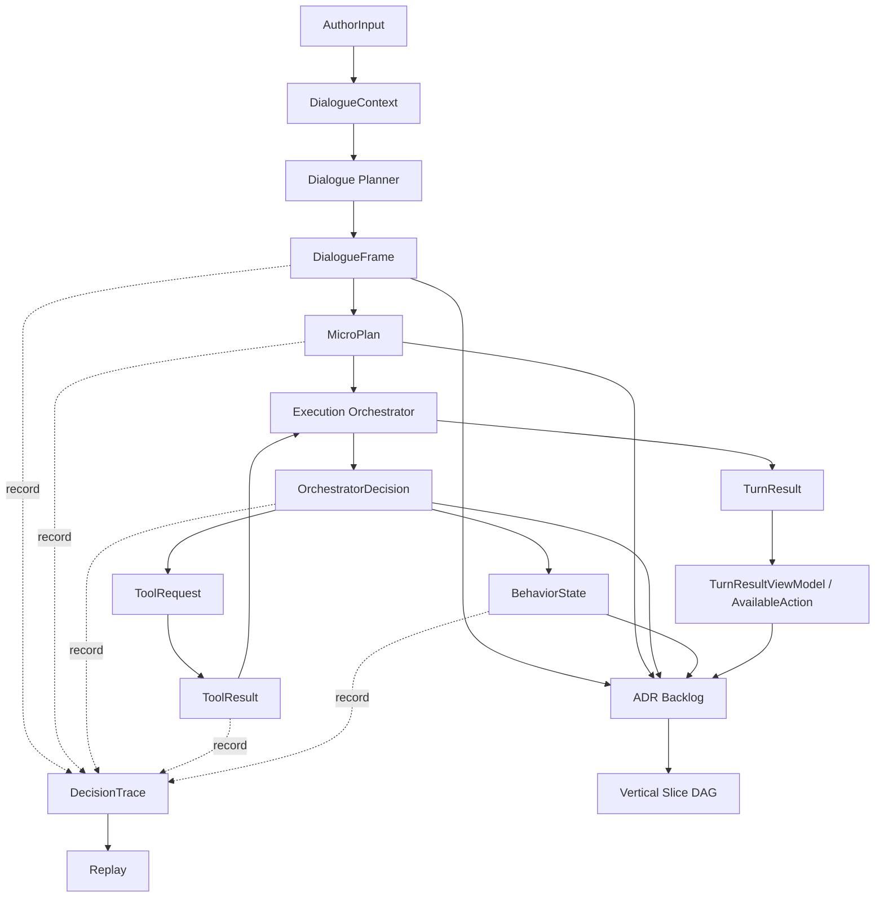

# v3 状态与 Contract Atlas 草案

> 状态：草案（2026-05-02）
>
> 角色：把 `00b` / `00d` / `02` / `03` / `04` / `05` / `06` / `07` 中出现的状态、contract、ADR 候选和垂直切面入口汇总成一张索引图。本文是 v3 从 Direction / Architecture 进入 Contract / ADR 的桥，不是最终 schema、不是 implementation plan。
>
> 相关文档：
>
> - `00-vision-and-engineering-roadmap.md` — v3 愿景、阶段门槛和工程推进方式
> - `00a-reading-map.md` — v3 阅读路径
> - `00b-end-to-end-dialogue-flow.md` — 一次 turn 的动态主链
> - `00d-runtime-architecture.md` — v3 运行时架构视图
> - `01-user-llm-workbench-interaction-model.md` — 用户、LLM、工作台交互模型
> - `02-dialogue-frame-and-micro-plan.md` — DialogueFrame / MicroPlan 协议草案
> - `03-capability-toolbox-contract.md` — Capability Toolbox 协议草案
> - `04-execution-orchestrator.md` — Execution Orchestrator 协议草案
> - `05-turn-behavior-and-state-model.md` — Turn Behavior 与状态模型草案
> - `06-memory-context-and-trace.md` — Memory、Context、Trace 与 Replay 草案
> - `07-workbench-ui-contract.md` — Workbench UI 消费契约草案
>
> 本文不做：
>
> - 不冻结最终字段名、枚举全集、JSON Schema 或数据库 schema
> - 不创建 Accepted ADR
> - 不拆 implementation plan
> - 不决定具体 umbrella app 的最终模块归属
> - 不定义 UI 视觉稿、组件结构或前端技术方案

---

## 1. 定位

`00c` 是一篇回填的总索引文档。

它写在 `07` 之后，不是因为它在体系上排在 `07` 后面，而是因为它必须等 `02-07` 形成足够材料后，才能准确索引：

```text
状态对象
→ contract 草案
→ ADR 候选
→ 第一批垂直切面入口
→ 后续证明方式
```

如果过早写 `00c`，它只能是空表或猜测。现在 `02-07` 已经分别定义了 Frame/Plan、Toolbox、Orchestrator、Behavior、Trace、UI 消费边界，`00c` 才能承担 atlas 的作用。

一句话：

```text
00c 不产生新的子系统；00c 把 v3 已经出现的关键对象纳入同一张可治理地图。
```

---

## 2. 使用规则

### 2.1 本文是索引，不是冻结

本文中的对象、字段、状态、ADR 主题和 slice 入口均处于草案层级。

不能因为某个名字出现在本文，就认为它已经可以直接进入代码实现。进入实现前至少还需要：

1. 对应 ADR 或 schema 草案明确。
2. 垂直切面文档回答 Contract / Invariant / Boundary / Consumer / Proof。
3. 代码改动范围与 umbrella 边界一致。
4. 测试与静态扫描路径明确。

### 2.2 Contract 成熟度

v3 contract 使用以下成熟度标记。

| 层级 | 名称 | 含义 | 是否允许直接实现 |
|---|---|---|---:|
| C0 | Concept | 只有概念和用途 | 否 |
| C1 | Draft Contract | 有候选字段、生命周期、不变量和消费者 | 否 |
| C2 | ADR Proposed | 已进入 ADR 草案，有替代方案和决策理由 | 否；只可作为 DAG planning input |
| C3 | ADR Accepted / Schema Draft | 决策已冻结，schema 或测试约束明确 | 可作为 implementation slice 输入 |
| C4 | Slice Proven | 已被垂直切面实现和验证 | 是 |

当前 `02-07` 大多处于 C1。`00c` 的责任是把 C1 对象整理成 C2 的入口。

### 2.3 Atlas 更新规则

新增或修改 v3 关键对象时，必须同步回答：

| 问题 | 含义 |
|---|---|
| Source | 最早在哪篇设计文档定义 |
| Owner | 哪个系统层负责生成或推进 |
| Consumer | 第一个真实消费者是谁 |
| Invariant | 它保护哪个系统不变量 |
| ADR | 是否需要冻结为 ADR |
| Slice | 第一条可证明它的垂直切面是什么 |

---

## 3. 总览图



这张图表达 contract 依赖，不表达最终模块调用路径。

关键读法：

1. `DialogueFrame` 是每 turn 的认知锚点。
2. `MicroPlan` 只是建议，不是执行授权。
3. `OrchestratorDecision` 是执行权、状态推进和降级的裁决记录。
4. `BehaviorState` 表示 durable 等待，不表示所有对话探索。
5. `TurnResult` 是 UI 与外部入口的 canonical 输出。
6. `DecisionTrace` 让系统能解释“为什么这样做或为什么没做”。
7. ADR 必须在垂直切面 DAG 之前完成最小冻结。

---

## 4. 主链对象索引

| 对象 | 来源文档 | 生成者 | 消费者 | 关键不变量 | ADR 候选 |
|---|---|---|---|---|---|
| `AuthorInput` | `00b`, `07` | UI / Channel / future batch entry | Dialogue Gateway / Planner | 作者输入只是输入，不直接改事实 | AuthorInput Envelope v3 |
| `DialogueContext` | `00b`, `06` | Context Assembler | Dialogue Planner / trace | 上下文必须可解释 omission | DialogueContext v3 |
| `DialogueFrame` | `02` | Dialogue Planner | MicroPlan / TurnResult / Trace | 每 turn 必有 frame | DialogueFrame v3 Schema |
| `MicroPlan` | `02` | Dialogue Planner | Execution Orchestrator | Planner 不能批准自己的 plan | MicroPlan v3 Schema |
| `CapabilityRegistryEntry` | `03` | Toolbox registry | Planner / Orchestrator / trace | disabled/deprecated 工具不能被正常引用 | Toolbox Registry v3 |
| `ToolRequest` | `03`, `04` | Execution Orchestrator | Toolbox / Trace | 工具调用必须有 provenance | ToolRequest v3 |
| `ToolResult` | `03`, `04`, `06` | Toolbox | Orchestrator / Planner / Trace | ToolResult 不直接等于生产事实 | ToolResult v3 |
| `TentativeArtifactSet` | `03`, `04`, VS-02A contract pack | Toolbox / Application | TurnResult / candidate card / Trace | AI 产物默认待采纳，不直接成为作品事实 | State Adoption Boundary v3 |
| `OrchestratorDecision` | `04` | Execution Orchestrator | Behavior / TurnResult / Trace | 执行权不属于 Planner | OrchestratorDecision v3 |
| `TurnPhase` / `TurnStatus` | `05` | Application / Orchestrator | UI / tests / replay | phase/status 必须兼容 behavior lifecycle | TurnPhase / TurnStatus v3 |
| `NextAction` | `05`, `07` | Orchestrator / TurnResult Builder | UI / ActionInput | UI 只能提交系统给出的 action | NextAction / AvailableAction v3 |
| `BehaviorState` | `05` | Orchestrator / Application | TurnResult / UI / Trace | durable behavior 必须 open / close / resolution | BehaviorState v3 |
| `DecisionTrace` | `06` | Trace Writer | replay / audit / UI summary | trace 必须能解释执行或不执行 | DecisionTrace v3 |
| `ReplayReport` | `06` | Replay service | developer / audit | 默认不重新调用 LLM | Replay v3 |
| `TurnResult` | `00b`, `04`, `05`, `06`, `07` | TurnResult Builder | UI / Channel / replay | 对外唯一稳定出口 | TurnResult Truthfulness v3 |
| `TurnResultViewModel` | `07` | API boundary / serializer | Workbench UI | UI 主渲染只消费 view model | TurnResultViewModel v3 |
| `ProjectionHint` | `07` | TurnResult Builder | UI read model refresh | refresh 不授权写入 | Projection Hint UI v3 |

---

## 5. 状态族索引

### 5.1 Turn 可见状态

| 状态族 | 来源 | 负责推进 | 消费者 | 必须冻结的问题 |
|---|---|---|---|---|
| `TurnPhase` | `05` | Application / Orchestrator | UI / tests | 阶段枚举、兼容矩阵、终态 |
| `TurnStatus` | `05` | Application / Orchestrator | UI / replay | waiting / executing / completed / failed 等语义 |
| `NextAction` | `05`, `07` | Orchestrator / TurnResult Builder | UI | action_type、target_ref、source_turn、幂等键 |
| `AvailableAction` | `07` | TurnResult Builder | UI | UI 可提交动作集合和 stale action 处理 |

核心判断：

```text
UI 可以呈现状态；
UI 不拥有状态；
UI 事件必须回到主链重新裁决。
```

### 5.2 Behavior 生命周期状态

| 状态族 | 来源 | 负责推进 | 消费者 | 必须冻结的问题 |
|---|---|---|---|---|
| `BehaviorState` | `05` | Orchestrator / Application | TurnResult / UI / trace | envelope、type、phase、status、resolution |
| `ClarificationBehavior` | `05`, `07` | Orchestrator | UI | 何时 durable、何时只自然追问 |
| `ConfirmationBehavior` | `04`, `05`, `07` | Orchestrator | UI / Tool dispatch | confirmation target、answer、重新 gate |
| `CancellationBehavior` | `05` | Orchestrator | UI / trace | cancel 对 pending action / tentative state 的影响 |
| `RecoveryBehavior` | `04`, `05`, `07` | Orchestrator | UI / replay | retry、narrow scope、terminal failure |

核心判断：

```text
不是所有不确定性都是 durable behavior。
只有阻塞下一步安全推进、需要跨 turn 等待、或会影响执行权时，才进入 BehaviorState。
```

### 5.3 执行裁决状态

| 状态族 | 来源 | 负责推进 | 消费者 | 必须冻结的问题 |
|---|---|---|---|---|
| `OrchestratorDecision` | `04` | Execution Orchestrator | TurnResult / trace | decision_type、status、reason_code |
| Gate result | `04` | Execution Orchestrator | DecisionTrace | gate 顺序、硬失败、软降级 |
| Idempotency state | `04`, `07` | Application / Orchestrator | UI / trace | 重复确认、重复 retry、并发冲突 |
| State adoption boundary | `04`, `05` | Orchestrator / domain boundary | persistence / projection | tentative 到 production 的条件 |

核心判断：

```text
MicroPlan 可以建议；
Orchestrator 才能裁决；
ToolResult 仍需 adoption / confirmation / policy 后才能成为生产事实。
```

### 5.4 Trace / Replay 状态

| 状态族 | 来源 | 负责推进 | 消费者 | 必须冻结的问题 |
|---|---|---|---|---|
| `ContextTrace` | `06` | Context Assembler / Trace Writer | replay / audit | context packet、omission reason |
| `FrameTrace` | `02`, `06` | Planner / Trace Writer | replay | frame 与 turn 的绑定 |
| `PlanTrace` | `02`, `06` | Planner / Trace Writer | replay | plan 与 decision 的绑定 |
| `ToolTrace` | `03`, `06` | Toolbox / Trace Writer | replay / audit | request/result/provenance |
| `BehaviorTrace` | `05`, `06` | Orchestrator / Trace Writer | replay | lifecycle open/close/resolution |
| `TraceSummary` | `06`, `07` | API boundary / redaction | UI | 可见性、脱敏层级、author/debug 区分 |
| `ReplayReport` | `06` | Replay service | developer / audit | 不调用 LLM的回放等级和差异报告 |

核心判断：

```text
Trace 是解释事实，不是 raw prompt dump。
UI 消费 trace summary，不直接消费内部 trace schema。
```

---

## 6. Contract Registry

### 6.1 Dialogue contracts

| Contract | 定义位置 | 首个消费者 | 必须证明 |
|---|---|---|---|
| `DialogueFrame` | `02` | TurnResult Builder / Trace Writer | 每个 turn 都能产生 frame |
| `frame_type` | `02` | Planner / tests | execution_candidate、clarification、confirmation 等语义不互相覆盖 |
| `MicroPlan` | `02` | Execution Orchestrator | plan 不包含批准权 |
| `stop_after_next_action` | `02`, `04` | Orchestrator | 默认只放行下一步 |
| `frame_trace_ref` | `02`, `06` | TurnResult / replay | TurnResult 能引用结构化认知依据 |

### 6.2 Toolbox contracts

| Contract | 定义位置 | 首个消费者 | 必须证明 |
|---|---|---|---|
| `CapabilityRegistryEntry` | `03` | Planner / Orchestrator | 工具能力可发现、可禁用、可版本化 |
| `ToolRequest` | `03`, `04` | Toolbox | 每次工具调用有 provenance 和 idempotency |
| `ToolResult` | `03` | Orchestrator / Planner | 工具结果不会绕过 TurnResult 和 trace |
| `TentativeArtifactSet` | VS-02A contract pack | TurnResult / Workbench candidate card | AI 生成内容是草稿或候选，不是正式作品事实 |
| `write_scope` | `03`, `04` | Orchestrator | 写入风险被 gate 拦截 |
| `budget_profile` | `03`, `04` | Orchestrator | 长跑或高成本动作不会悄悄执行 |

### 6.3 Execution contracts

| Contract | 定义位置 | 首个消费者 | 必须证明 |
|---|---|---|---|
| `OrchestratorDecision` | `04` | TurnResult Builder | allow/reject/downgrade/confirm 的结果可解释 |
| gate order | `04` | Orchestrator tests | 权限、预算、policy、scope 顺序稳定 |
| dispatch boundary | `04` | Toolbox | 未经批准的 ToolRequest 不会执行 |
| state adoption boundary | `04`, `05` | persistence / projection | tentative-first 不被绕过 |
| decision trace link | `04`, `06` | replay | 每个执行或拒绝都有 reason |

### 6.4 Behavior contracts

| Contract | 定义位置 | 首个消费者 | 必须证明 |
|---|---|---|---|
| `TurnPhase` | `05` | UI / replay | phase 与 status 不矛盾 |
| `TurnStatus` | `05` | UI / tests | waiting / terminal 状态闭环 |
| `NextAction` | `05`, `07` | UI | action 只能来自系统输出 |
| `BehaviorState` | `05` | TurnResult / UI | behavior 必须 durable open/close |
| `ConfirmationBinding` | `05`, `07` | Orchestrator | confirmation answer 绑定目标并重新 gate |
| `CancellationSemantics` | `05` | Orchestrator / trace | cancel 后 pending state 明确关闭 |

### 6.5 Memory / trace / replay contracts

| Contract | 定义位置 | 首个消费者 | 必须证明 |
|---|---|---|---|
| `MemoryItem` | `06` | Context Assembler | memory provenance 和稳定性可追踪 |
| `DialogueContext` | `06` | Planner | context 是最小可解释包 |
| `DecisionTrace` | `06` | replay / audit | 能解释为什么执行或没有执行 |
| `TraceRedaction` | `06`, `07` | UI / audit | author/debug/replay 可见性不同 |
| `ReplayReport` | `06` | developer / audit | replay 默认不重新调用 LLM |

### 6.6 UI contracts

| Contract | 定义位置 | 首个消费者 | 必须证明 |
|---|---|---|---|
| `TurnResultViewModel` | `07` | Workbench UI | UI 主渲染不读取内部对象 |
| `ui_card` | `07` | Workbench UI | card 只表达系统已裁决状态 |
| `AvailableAction` | `07` | Workbench UI | UI 不能发明 action |
| `AuthorActionInput` | `07` | Dialogue Gateway | action 回传必须重新进入主链 |
| `TraceSummaryView` | `07` | Workbench UI | trace summary 不泄露 raw prompt |
| `ProjectionHint` | `07` | frontend read model | projection refresh 不授权写入 |

---

## 7. 全局不变量总账

| # | 不变量 | 来源文档 | 首个证明方向 |
|---:|---|---|---|
| 1 | 每个 turn 必有 `DialogueFrame` | `00b`, `02` | reply-only turn contract test |
| 2 | `MicroPlan` 只是建议，不是授权 | `02`, `04` | Planner 输出不含 approved/ready_to_execute |
| 3 | Execution Orchestrator 是执行权唯一门禁 | `04` | 未经 decision 的 ToolRequest 不 dispatch |
| 4 | 默认只放行下一步安全动作 | `02`, `04`, `05` | multi-step plan 被 downgrade 或切断 |
| 5 | 工具调用必须有 `ToolRequest` / `ToolResult` / trace | `03`, `06` | tool trace completeness test |
| 6 | 写入默认 tentative，不直接 production write | `03`, `04`, `05`, VS-02A contract pack | adoption boundary test / artifact contract test |
| 7 | durable behavior 必须 open / close / resolution | `05`, `06` | behavior lifecycle trace test |
| 8 | 缺 slot 不自动等于 UI 字段表单 | `01`, `05`, `07` | clarification rendering contract test |
| 9 | `TurnResult` 是 UI 与外部入口 canonical 输出 | `00b`, `04`, `07` | UI 不读取内部 frame / trace schema |
| 10 | UI 只能提交 available actions 中的动作 | `07` | stale / invented action rejection test |
| 11 | candidate selection 不等于 adoption | `05`, `07` | selection 后不产生 production fact |
| 12 | confirmation answer 必须重新经过 gate | `04`, `05`, `07` | confirmation replay/idempotency test |
| 13 | trace summary 必须脱敏 | `06`, `07` | redaction visibility test |
| 14 | replay 默认不重新调用 LLM | `06` | replay no-provider-call test |
| 15 | projection hints 只触发刷新，不授权写入 | `07` | projection refresh no-write test |

这些不变量是后续 ADR 和垂直切面的主轴。任何实现计划如果不能指向其中至少一个不变量，就很可能不是承重垂直切面。

---

## 8. ADR Backlog

### 8.1 Batch A：主链与执行权

第一批 ADR 应先冻结会影响所有 slice 的主链对象。

| ADR 候选 | 状态 | 来源 | 为什么优先 | 阻塞内容 |
|---|---|---|---|---|
| DialogueFrame v3 Schema | Accepted：`adr/ADR-0001-dialogue-frame-v3.md`；VS-00 contract pack：`contracts/VS-00-reply-only-contract-pack.md` | `02` | 每 turn 必有，是 trace 和 replay 的根 | 所有 turn slice |
| MicroPlan v3 语义与最小 Contract | Accepted：`adr/ADR-0002-micro-plan-v3.md`；VS-01 contract pack：`contracts/VS-01-execution-authority-contract-pack.md` | `02`, `04` | Planner 到 Orchestrator 的协议必须稳定 | tool / behavior / confirmation slice |
| Planner Authority Boundary | Accepted：`adr/ADR-0003-planner-authority-boundary.md`；VS-01 contract pack：`contracts/VS-01-execution-authority-contract-pack.md` | `02`, `04` | 防止 Planner 批准自己的执行 | 所有执行 slice |
| OrchestratorDecision v3 | Accepted：`adr/ADR-0004-orchestrator-decision-v3.md`；VS-01 contract pack：`contracts/VS-01-execution-authority-contract-pack.md` | `04` | 执行裁决要能解释和测试 | ToolRequest / TurnResult / trace slice |
| Execution Gate Order v3 | Accepted：`adr/ADR-0005-execution-gate-order-v3.md`；VS-01 contract pack：`contracts/VS-01-execution-authority-contract-pack.md` | `04` | 权限、预算、policy 顺序必须稳定 | 高风险动作和 adoption slice |

### 8.2 Batch B：状态、行为与写入边界

| ADR 候选 | 状态 | 来源 | 为什么优先 | 阻塞内容 |
|---|---|---|---|---|
| TurnPhase / TurnStatus v3 | Accepted：`adr/ADR-0006-turn-phase-status-v3.md`；VS-03 contract pack：`contracts/VS-03-behavior-lifecycle-contract-pack.md` | `05` | UI 和 replay 都要消费 | UI action / behavior slice |
| NextAction / AvailableAction v3 | Accepted：`adr/ADR-0007-next-action-available-action-v3.md`；VS-03 contract pack：`contracts/VS-03-behavior-lifecycle-contract-pack.md` | `05`, `07` | 前后端动作回传必须稳定 | UI roundtrip slice |
| BehaviorState v3 | Accepted：`adr/ADR-0008-behavior-state-v3.md`；VS-03 contract pack：`contracts/VS-03-behavior-lifecycle-contract-pack.md` | `05` | durable 等待态是跨 turn 核心 | clarification / confirmation slice |
| Confirmation Binding v3 | Accepted：`adr/ADR-0009-confirmation-binding-v3.md`；VS-03 contract pack：`contracts/VS-03-behavior-lifecycle-contract-pack.md` | `04`, `05`, `07` | confirmation 不能只是前端 modal | confirmation execution slice |
| State Adoption Boundary v3 | Accepted：`adr/ADR-0010-state-adoption-boundary-v3.md`；VS-04 contract pack：`contracts/VS-04-adoption-boundary-contract-pack.md` | `03`, `04`, `05`, `07` | ToolResult 到生产事实的门禁 | candidate adoption slice |

### 8.3 Batch C：工具、trace、UI 消费

| ADR 候选 | 状态 | 来源 | 为什么优先 | 阻塞内容 |
|---|---|---|---|---|
| Toolbox Registry v3 | Accepted：`adr/ADR-0011-toolbox-registry-v3.md`；VS-02 contract pack：`contracts/VS-02-tool-provenance-contract-pack.md` | `03` | tool 可发现、可禁用、可版本化 | capability invocation slice |
| ToolRequest / ToolResult v3 | Accepted：`adr/ADR-0012-tool-request-result-v3.md`；VS-02 contract pack：`contracts/VS-02-tool-provenance-contract-pack.md` | `03`, `04`, `06` | 工具调用必须可回放 | tool trace slice |
| DecisionTrace v3 | Accepted：`adr/ADR-0013-decision-trace-v3.md`；VS-02 contract pack：`contracts/VS-02-tool-provenance-contract-pack.md` | `06` | 所有执行和不执行都要解释 | replay / audit slice |
| Trace Redaction v3 | Accepted：`adr/ADR-0014-trace-redaction-v3.md`；VS-05 contract pack：`contracts/VS-05-ui-roundtrip-contract-pack.md` | `06`, `07` | UI 不能展示内部敏感 trace | UI trace summary slice |
| TurnResultViewModel v3 | Accepted：`adr/ADR-0015-turn-result-view-model-v3.md`；VS-05 contract pack：`contracts/VS-05-ui-roundtrip-contract-pack.md` | `07` | UI 主消费 envelope 要稳定 | Workbench UI slice |
| Projection Hint UI v3 | Accepted：`adr/ADR-0016-projection-hint-ui-v3.md`；VS-04 contract pack：`contracts/VS-04-adoption-boundary-contract-pack.md` | `07` | refresh 和 write 边界要分清 | projection refresh slice |
| ReplayReport v3 | Accepted：`adr/ADR-0017-replay-report-v3.md`；VS-06 contract pack：`contracts/VS-06-replay-surface-contract-pack.md` | `06` | replay 默认不调用 provider | replay explanation slice |

### 8.4 ADR 编号与状态建议

v3 ADR 目录建议独立于 v2：

```text
docs/design-v3/adr/
  README.md
  ADR-0001-dialogue-frame-v3.md
  ADR-0002-micro-plan-v3.md
  ADR-0003-planner-authority-boundary.md
  ADR-0004-orchestrator-decision-v3.md
  ADR-0005-execution-gate-order-v3.md
```

ADR 状态建议先使用：

| 状态 | 含义 |
|---|---|
| Proposed | 已成文，等待评审 |
| Accepted | 已冻结，后续实现必须遵守 |
| Superseded | 被新 ADR 替代 |
| Deferred | 需要实现反馈或更多探索后再决定 |

---

## 9. 垂直切面入口候选

本节不是 slice DAG，也不是 implementation plan。它只给出后续 `tasks/slices/v3/DAG.md` 可以排序的候选入口。

### 9.1 VS-00：Reply-only DialogueFrame + TurnResult + Trace

| 问题 | 回答 |
|---|---|
| Contract | `AuthorInput`、`DialogueContext`、`DialogueFrame`、`TurnResult`、`DecisionTrace` |
| Invariant | 每 turn 必有 frame；reply-only 也必须可回放 |
| Boundary | 切过 web/application/agent trace 边界；不碰 persistence production write |
| Consumer | Application test 或 Channel response |
| Proof | 输入普通创作讨论，输出 TurnResult，trace 可解释未调用工具 |

价值：这是最小主链，不引入工具和写入，适合证明 v3 不再 Router-first。

### 9.2 VS-00A：模糊创作想法的自然探索闭环

| 问题 | 回答 |
|---|---|
| Contract | `AuthorInput`、`DialogueContext`、`DialogueFrame.frame_type=exploration`、`ExplorationPolicy`、`CandidateDirectionSet`、`TurnResult`、`DecisionTrace` |
| Invariant | 每 turn 必有 frame；缺 slot 不自动等于 UI 表单；TurnResult 是 canonical 输出；reply / exploration 也必须可回放 |
| Boundary | 切过 web / application / agent planner draft / TurnResult / trace；不碰 tool dispatch、durable behavior、production write 或 adoption |
| Consumer | Application contract test 或 Channel response |
| Proof | 输入“我想写一个赛博修仙，但还没想好”，输出自然探索回应和 2-3 个候选方向；不得打开机械字段表单 |

价值：证明 v3 第一体验是 AI 陪作者展开想法，而不是工作台要求作者补字段。

### 9.3 VS-00B：带着当前小说上下文回应

| 问题 | 回答 |
|---|---|
| Contract | `DialogueContext`、`CurrentWorkSnapshot`、`MemoryContextSummary`、`ContextSourceRef`、`DialogueFrame`、`TurnResult`、`DecisionTrace.context_refs` |
| Invariant | Planner 不直接读全量数据库；上下文组装可 trace；缺上下文时不编造作品事实 |
| Boundary | 切过 application context assembly / persistence read model 或测试 stub / agent planner input / TurnResult / trace；不让 agent 直接访问 Repo；不写 production state |
| Consumer | Application context assembly test 或 planner contract test |
| Proof | 同一句“把主角动机改得更狠一点”，有当前作品上下文时引用真实设定；无上下文时诚实说明缺上下文 |

价值：证明 v3 是小说工作台，不只是可追踪聊天器。

### 9.4 VS-01：MicroPlan 被 Orchestrator 降级或要求确认

| 问题 | 回答 |
|---|---|
| Contract | `MicroPlan`、`OrchestratorDecision`、`NextAction`、`BehaviorState` |
| Invariant | Planner 不能批准执行；Orchestrator 默认只放行下一步 |
| Boundary | 切过 application/agent/toolbox decision 边界；不执行真实写入工具 |
| Consumer | Orchestrator contract test / TurnResult Builder |
| Proof | 给出多步或高风险 plan，系统产生 downgrade 或 confirmation TurnResult |

价值：这是执行权结构的第一条承重证明。

### 9.5 VS-02：ToolRequest / ToolResult / ToolTrace 闭环

| 问题 | 回答 |
|---|---|
| Contract | `CapabilityRegistryEntry`、`ToolRequest`、`ToolResult`、`ToolTrace`、`DecisionTrace` |
| Invariant | 未经 decision 的 ToolRequest 不 dispatch；每次工具调用都有 trace；ToolResult 不直接等于 production fact；replay 默认不调用 provider |
| Boundary | 切过 application approving decision / agent toolbox runtime / trace coordination；不写 domain production state；不让 web 或 frontend 直接调用 toolbox |
| Consumer | Replay / audit test |
| Proof | 一个 read-only 或 validation tool 调用能从 decision 到 request/result/trace 完整 replay |

价值：证明 toolbox 是后台能力层，不是 UI 工具按钮集合。

### 9.6 VS-02A：AI 创作草稿与待采纳产物

| 问题 | 回答 |
|---|---|
| Contract | `DialogueContext`、`MicroPlan`、`ToolRequest`、`ToolResult`、`TentativeArtifactSet`、`TurnResult`、`DecisionTrace` |
| Invariant | Orchestrator 是唯一门禁；工具调用有 trace；AI 产物默认 tentative；candidate selection 不等于 adoption；replay 默认不调用 provider |
| Boundary | 切过 application decision / agent creative tool runtime / TurnResult / trace；不写 production state；不让 ToolResult 直接变成 adopted state |
| Consumer | Application artifact contract test 或 Workbench candidate card |
| Proof | 生成角色设定或章节片段时只产生待采纳草稿；TurnResult 明确这是草案；未经过选择和 adoption 不写入权威作品事实 |

价值：证明 v3 不只是能聊天和解释，而是能真正产出小说创作材料；同时保护作者的正式作品不被 AI 自动改写。

### 9.7 VS-03：Clarification / Confirmation Behavior 生命周期

| 问题 | 回答 |
|---|---|
| Contract | `BehaviorState`、`TurnPhase`、`TurnStatus`、`AvailableAction` |
| Invariant | durable behavior 必须 open / close / resolution；缺 slot 不自动展示字段表 |
| Boundary | 切过 application state / TurnResult / UI action ingestion；不碰最终 UI 视觉 |
| Consumer | Workbench action roundtrip 或 application behavior test |
| Proof | 用户回答 clarification 或 confirmation 后，behavior 关闭并留下 trace |

价值：证明等待态不是一次性前端状态，而是可审计主链状态。

### 9.8 VS-04：Candidate selection 与 adoption 边界

| 问题 | 回答 |
|---|---|
| Contract | `CandidateSet`、`AuthorActionInput.choose_candidate`、`AvailableAction`、`AdoptionDecision`、`AdoptionBoundary`、`ProjectionHint`、`DecisionTrace`、`StateTrace` |
| Invariant | candidate selection 不等于 adoption；ToolResult 不直接等于 adopted state；projection hint 不授权写入 |
| Boundary | 切过 UI action / application adoption boundary / domain pure validation / projection read model / trace；不让 frontend 直接写 production；不让 agent ToolResult 直接变 canon |
| Consumer | Workbench candidate card / projection refresh test |
| Proof | 选择候选后只产生 adoption evaluation、confirmation 或 adopted state trace，未授权不写生产事实 |

价值：保护“LLM 创作伙伴给方向”与“系统正式采纳事实”的边界。

### 9.9 VS-05：UI AvailableAction roundtrip

| 问题 | 回答 |
|---|---|
| Contract | `TurnResultViewModel`、`AvailableAction`、`AuthorActionInput` |
| Invariant | UI 只能提交系统给出的 action；stale action 必须重新校验 |
| Boundary | 切过 web/API boundary/frontend contract；不要求最终视觉系统 |
| Consumer | Workbench UI smoke test 或 API contract test |
| Proof | invented/stale action 被拒绝，合法 action 回到主链并产生新 TurnResult |

价值：证明 UI 是 contract consumer，不是状态机发明者。

### 9.10 VS-06：Trace summary 与 replay explanation

| 问题 | 回答 |
|---|---|
| Contract | `DecisionTrace`、`TraceSummaryView`、`ReplayReport` |
| Invariant | trace summary 脱敏；replay 默认不调用 LLM |
| Boundary | 切过 trace store/replay/API redaction；不暴露 raw prompt 给作者主流程 |
| Consumer | Replay console / UI trace summary |
| Proof | 同一个 turn 可生成 author-safe summary 和 developer replay report |

价值：证明 v3 的审计不是日志堆积，而是可解释、可分层可见的系统能力。

---

## 10. Umbrella 边界索引

本文不冻结最终模块归属，但后续 slice 必须尊重当前 umbrella 依赖方向。

| App | 可以承接的 v3 对象 | 禁止方向 |
|---|---|---|
| `novel_foundation` | Result/Error、ID、纯工具类型 | 业务概念、GenServer、Ecto、Provider |
| `novel_domain` | 纯领域 struct、领域规则、领域事件 | LLM、Repo、Phoenix、Agent runtime |
| `novel_agent` | Provider Gateway、agent runtime、tool execution runtime | 引用 `NovelDomain` / `NovelApplication` |
| `novel_application` | Dialogue orchestration、context assembly、TurnResult assembly、contract adapter | 引用 `NovelWeb` |
| `novel_persistence` | Repo、schema、migration、repository | 引用 `NovelWeb` / `NovelApplication` / `NovelAgent` |
| `novel_web` | API / Channel / serialization / UI event ingestion | 直接调用 Repo、直接写 Ecto.Query、直接调用 `novel_agent` |
| `frontend` | Workbench UI、TurnResultViewModel consumer、AuthorActionInput producer | 发明 intent、直接写 BehaviorState、直接调用 toolbox |

关键规则：

```text
如果一个 slice 说不清对象穿过哪些 app 边界，它还不是合格的垂直切面。
```

---

## 11. Truth Boundary

v3 需要区分“谁说了算”。

| 事实类型 | Source of truth | UI 能做什么 | UI 不能做什么 |
|---|---|---|---|
| 作者输入 | AuthorInput log / turn entry | 展示和提交 | 改写历史输入 |
| 系统认知 | DialogueFrame | 展示摘要或引用 | 自行重算 intent / frame |
| 执行建议 | MicroPlan | 不直接展示或只展示解释后结果 | 当成执行批准 |
| 执行裁决 | OrchestratorDecision | 展示可见结果和 reason summary | 本地覆盖裁决 |
| 等待态 | BehaviorState | 展示等待内容和 action | 本地 open/close behavior |
| 工具结果 | ToolResult | 展示摘要或候选 | 当成 production fact |
| 作品事实 | adopted state / domain event | 展示投影 | 绕过 adoption 写入 |
| 审计解释 | DecisionTrace / TraceSummary | 分层展示 | 展示 raw sensitive trace |
| 投影刷新 | ProjectionHint | 刷新 read model | 发起写入 capability |

---

## 12. 从 Atlas 到 ADR 的推进门槛

某个 contract 可以进入 ADR 草案，需要满足：

1. 至少有一个来源设计文档。
2. 至少有一个真实消费者。
3. 至少保护一个全局不变量。
4. 至少有一个反例或替代方案需要记录。
5. 字段或状态改变会影响后续实现。

某个 ADR 可以进入 Accepted，需要满足：

1. 明确冻结范围。
2. 明确非目标。
3. 明确替代方案与放弃理由。
4. 明确对 umbrella 边界的影响。
5. 明确后续 slice 如何证明。

某个 slice 可以进入 `tasks/slices/v3/DAG.md`，需要满足：

1. Contract 来自 C2 或 C3。
2. Invariant 指向本文 §7。
3. Boundary 能列出真实 app 边界。
4. Consumer 是真实入口，不是未来假设。
5. Proof 能写成测试或可运行命令。

---

## 13. 风险清单

| 风险 | 触发信号 | 处置方式 |
|---|---|---|
| 提前冻结字段名 | 在 ADR 前争论最终 enum | 保持 C1，先冻结语义和不变量 |
| UI 反向发明 contract | 前端根据缺字段打开表单或 action | 回到 `07`，要求 action 来自 TurnResult |
| Orchestrator 变成新 Router | Orchestrator 开始解释意图和创作引导 | 回到 `02/04`，Planner 认知，Orchestrator 裁决 |
| Trace 变成日志堆 | 只记录 prompt 和 provider response | 回到 `06`，记录 frame/plan/decision/tool/behavior |
| Slice 过宽 | 第一条 slice 同时改 UI、tool、DB、provider | 回到 §9，拆成可证明小闭环 |
| 跳过 ADR | 直接把 C1 草案写进代码 | 回到 §12，至少形成 Proposed ADR |
| 把 demo 当完成 | 只有 happy path，没有拒绝、降级、取消、trace | 要求 Proof 覆盖不变量 |

---

## 14. 维护规则

后续维护 `00c` 时遵循：

1. 新增 contract 时，必须补到 §4 或 §6。
2. 新增状态时，必须补到 §5。
3. 新增核心不变量时，必须补到 §7，并说明来源文档。
4. 新增 ADR 草案时，必须补到 §8 或标注已 Accepted。
5. 新增 slice 时，必须能映射到 §9 的入口或说明为什么新入口必要。
6. 如果实现反馈推翻草案，先更新来源文档，再更新本文索引。

---

## 15. 当前完成度

截至本文，v3 设计体系已经具备：

- 顶层愿景和工程路线。
- 按角色阅读地图。
- 端到端动态主链。
- 运行时架构视图。
- DialogueFrame / MicroPlan 草案。
- Capability Toolbox 草案。
- Execution Orchestrator 草案。
- Turn Behavior 与状态草案。
- Memory / Context / Trace / Replay 草案。
- Workbench UI 消费契约草案。
- 状态、contract、ADR 候选、slice 入口总索引。
- v3 ADR 编号、状态、模板和首批承重 ADR 顺序。
- `ADR-0001-dialogue-frame-v3.md` Accepted 决策。
- `ADR-0002-micro-plan-v3.md` Accepted 决策。
- `ADR-0003-planner-authority-boundary.md` Accepted 决策。
- `ADR-0004-orchestrator-decision-v3.md` Accepted 决策。
- `ADR-0005-execution-gate-order-v3.md` Accepted 决策。
- `ADR-0006-turn-phase-status-v3.md` Accepted 决策。
- `ADR-0007-next-action-available-action-v3.md` Accepted 决策。
- `ADR-0008-behavior-state-v3.md` Accepted 决策。
- `ADR-0009-confirmation-binding-v3.md` Accepted 决策。
- `ADR-0010-state-adoption-boundary-v3.md` Accepted 决策。
- `ADR-0011-toolbox-registry-v3.md` Accepted 决策。
- `ADR-0012-tool-request-result-v3.md` Accepted 决策。
- `ADR-0013-decision-trace-v3.md` Accepted 决策。
- `ADR-0014-trace-redaction-v3.md` Accepted 决策。
- `ADR-0015-turn-result-view-model-v3.md` Accepted 决策。
- `ADR-0016-projection-hint-ui-v3.md` Accepted 决策。
- `ADR-0017-replay-report-v3.md` Accepted 决策。

后续仍需补齐：

- JSON Schema 或代码级 contract。
- 垂直切面 DAG：`tasks/slices/v3/DAG.md` 已创建，并已补入 VS-00A / VS-00B 创作伙伴体验切面和 VS-02A 创作草稿切面，整体推进到 VS-06 docs-ready。
- implementation plan。

---

## 16. 下一步

本文完成后，当前阶段结论：

```text
VS-00 到 VS-06（含 VS-00A、VS-00B、VS-02A）首批文档输入已 docs-ready
```

原因：

- `00c` 已经把 contract 和 ADR 候选汇总成 backlog。
- `docs/design-v3/adr/README.md` 已经定义 v3 ADR 的编号、状态、模板和第一批 ADR 的排序规则。
- `ADR-0001` 已经先把 v3 主链的第一承重点升级为 Accepted：每个 turn 必有 `DialogueFrame`。
- `ADR-0002` 已经把第二承重点升级为 Accepted：`MicroPlan` 是 Planner 到 Execution Orchestrator 的行动建议 envelope。
- `ADR-0003` 已经把第三承重点升级为 Accepted：Planner 只有建议权，没有执行批准权。
- `ADR-0004` 已经把 OrchestratorDecision 的最小裁决表达升级为 Accepted。
- `ADR-0005` 已经把 Execution Gate Order 升级为 Accepted，承接 OrchestratorDecision 形成前的 gate 顺序。
- `ADR-0006` 至 `ADR-0009` 已经把 phase/status、AvailableAction、BehaviorState 和 confirmation binding 升级为 Accepted。
- `ADR-0010` 已经把 candidate selection 与 adoption boundary 升级为 Accepted。
- `ADR-0011` 至 `ADR-0013` 已经把 Toolbox Registry、ToolRequest / ToolResult 和 DecisionTrace 最小语义升级为 Accepted。
- `ADR-0014` 和 `ADR-0015` 已经把 TraceSummaryView redaction 与 TurnResultViewModel 升级为 Accepted。
- `ADR-0016` 已经把 ProjectionHint UI 写入边界升级为 Accepted。
- `ADR-0017` 已经把 ReplayCase / ReplayReport 与 no-provider replay 升级为 Accepted。
- `VS-00A` 已经补入“模糊创作想法先自然展开”的体验证明，避免首批实现只证明安全执行。
- `VS-00B` 已经补入“带着当前小说上下文回应”的工作台证明，避免 v3 变成泛聊系统。
- `VS-02A` 已经补入“AI 生成小说草稿但默认待采纳”的产物证明，避免 v3 只证明能聊和能调用工具，却没有证明能产出创作材料。

VS-00 到 VS-06（含 VS-00A、VS-00B、VS-02A）文档 blocker 已关闭。下一步需要用户明确批准后，才可创建 implementation plan 或进入代码实现。
