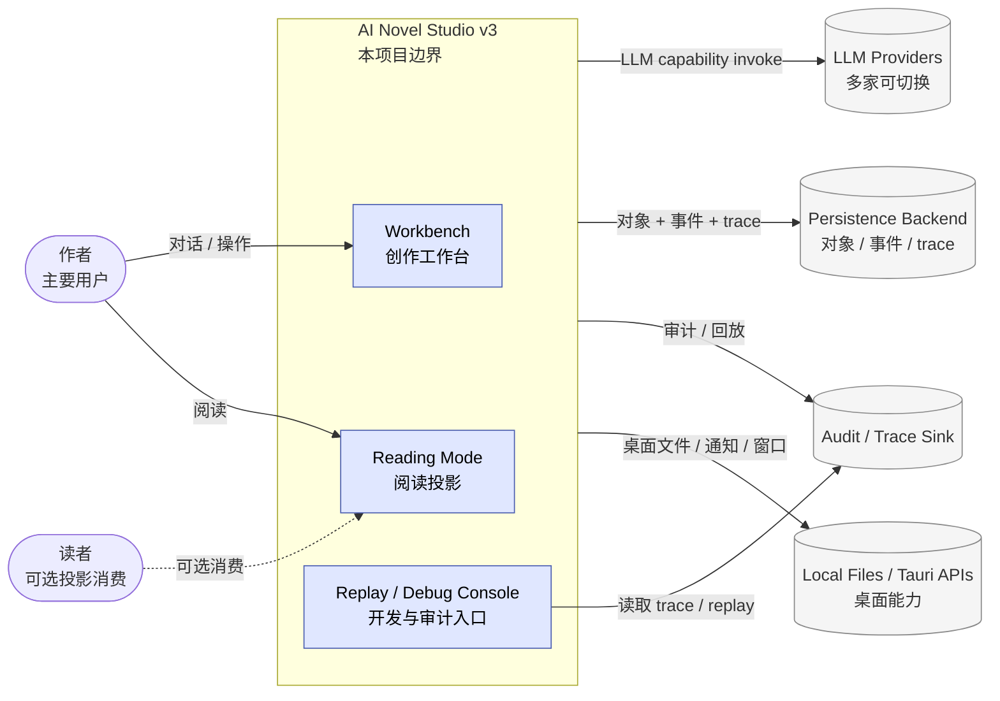
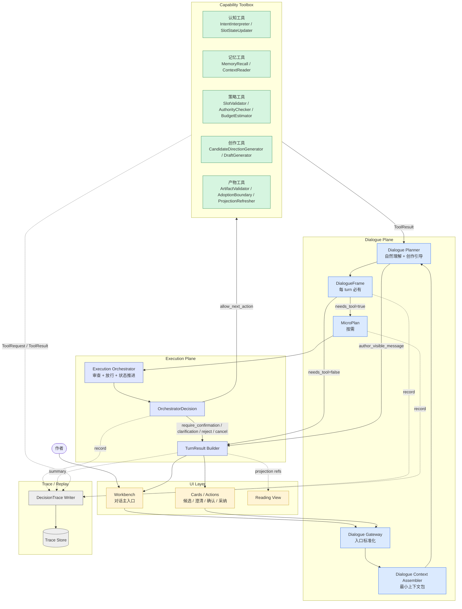
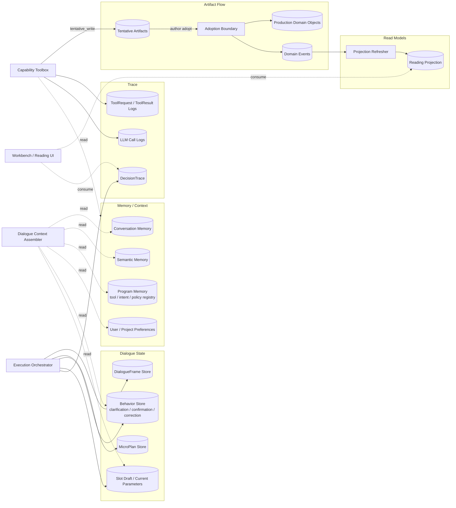
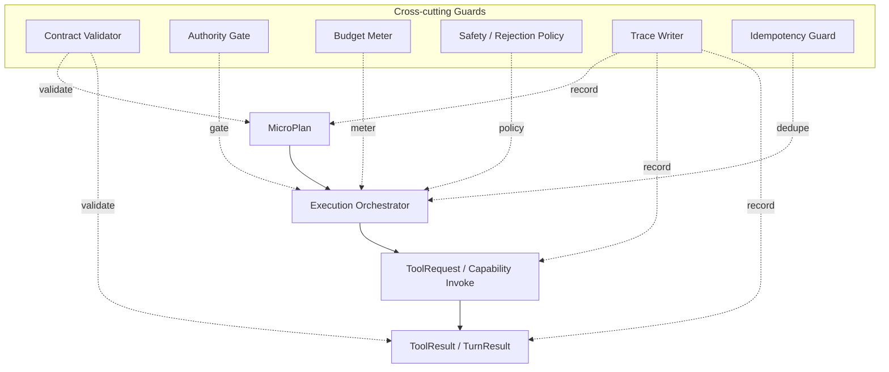

# v3 Runtime 架构图

> 状态：草案（2026-05-02）
>
> 角色：把 v3 的运行时形态讲清楚。本文回答系统在外部边界、控制面、数据面、横切层、回放视角下分别长什么样，并把 `00b` 的动态对象落到运行时组件视图。
>
> 关联文档：
> - `00-vision-and-engineering-roadmap.md` — v3 推进阶段与实现门槛
> - `00a-reading-map.md` — v3 阅读路径
> - `00b-end-to-end-dialogue-flow.md` — v3 动态主链
> - `01-user-llm-workbench-interaction-model.md` — 用户、LLM、工作台交互模型
>
> 不负责范围：
> - 不冻结 umbrella app 归属，模块落位留给承重垂直切面规划
> - 不冻结 DialogueFrame / MicroPlan 字段，留给 `02-dialogue-frame-and-micro-plan.md`
> - 不冻结 capability registry 格式，留给 `03-capability-toolbox-contract.md`
> - 不冻结 Execution Orchestrator API，留给 `04-execution-orchestrator.md`

---

## 1. 与 v2 Runtime 图的根本差异

v2 Runtime 图的核心控制面是：

```text
Workbench → Orchestrator → Router → Executor / LongRunner / Validator
```

v3 Runtime 图的核心控制面是：

```text
Workbench
→ Dialogue Gateway
→ Dialogue Planner
→ DialogueFrame
→ Execution Orchestrator
→ Toolbox / Capabilities
→ TurnResult + DecisionTrace
```

关键变化：

| 维度 | v2 | v3 |
|---|---|---|
| turn 第一认知节点 | Router | Dialogue Planner + DialogueFrame |
| Router 定位 | 顶层候选行为方向节点 | 拆成 Toolbox 内部认知工具 |
| Orchestrator 定位 | 单层调度器 | Execution Orchestrator，掌握执行权和门禁 |
| LLM 位置 | 多数在执行阶段出现 | 作者可见体验层与创作引导核心 |
| trace 粒度 | LLM call / TurnResult trace | DialogueFrame / MicroPlan / ToolRequest / DecisionTrace |
| UI 心智 | 消费 TurnResult 与 cards | 面对 LLM 创作伙伴，消费 TurnResult 与可解释 trace |

v3 不是把 `Router` 改名为 `DialoguePlanner`。v3 是把 Router-first 拓扑从目标架构中移除，把原 Router 能力拆入工具箱，并让每个 turn 先形成 DialogueFrame。

---

## 2. View 1：Context 视图（系统与外部）



外部边界只有几类：

1. 作者和可选读者。
2. LLM provider。
3. 持久化与审计后端。
4. Tauri 桌面能力。

LLM 永远通过 Provider Gateway 或等价 provider abstraction 进入，Domain / UI 不直接碰 provider。

---

## 3. View 2：控制面（Dialogue + Execution）



控制面要点：

1. **Dialogue Gateway 是入口标准化层**，不做 intent-first 路由，不直接调用能力。
2. **Dialogue Planner 是作者可见体验层**，负责理解、引导、候选方向和作者可见回应。
3. **DialogueFrame 是每 turn 必有认知帧**，用于替代 RouterResult 的入口地位。
4. **MicroPlan 是行动建议**，不是执行授权。
5. **Execution Orchestrator 是执行层硬边界**，负责状态、权限、预算、确认、ToolRequest 和 TurnResult。
6. **Toolbox 只通过 Execution Orchestrator 被调用**，工具不直接从 UI 或 Planner 获得写权限。
7. **DecisionTrace 覆盖每个关键对象**，用于解释和回放。

---

## 4. View 3：数据面（读写、tentative、projection）



数据面要点：

1. `DialogueFrame` 和 `MicroPlan` 是可追踪运行时对象，不是 prompt 内部临时文本。
2. `SlotDraft / Current Parameters` 是工作台后台状态，不是 UI 表单真相来源。
3. 写入仍走 tentative-first，production write 必须经过 Adoption Boundary 或等价写入门禁。
4. Reading Projection 是 UI 读模型，不是能力调用入口。
5. Trace 与 LLM call logs 分层：DecisionTrace 解释系统决策，LLM logs 解释 provider 调用。

---

## 5. View 4：横切层

横切层不属于某个具体工具实现，它们覆盖所有执行边界。



横切规则：

| 横切关注 | 介入点 | 失败时行为 |
|---|---|---|
| Contract Validator | DialogueFrame / MicroPlan / ToolResult / TurnResult | 阻断或降级，写 validation |
| Authority Gate | 写入、adoption、长跑、高风险 capability 前 | 触发 confirmation 或拒绝 |
| Budget Meter | 高成本 LLM / 长跑 / 批量工具前后 | 触发 confirmation / checkpoint |
| Safety / Rejection Policy | 请求不应执行或越界时 | 返回 rejection，不调用能力 |
| Trace Writer | 每个认知、计划、裁决、工具边界 | 不应阻塞主流程，但失败必须可发现 |
| Idempotency Guard | 外部入口和可重试工具调用 | 去重或返回已知结果 |

---

## 6. View 5：Replay / Debug 视图

v3 的 replay 不是重放自然语言聊天记录，而是重放结构化决策链。

```text
AuthorInput
→ DialogueContext refs
→ DialogueFrame
→ MicroPlan
→ OrchestratorDecision
→ ToolRequest / ToolResult
→ TurnResult
```

Replay Console 至少应该能回答：

| 问题 | 数据来源 |
|---|---|
| 这一轮系统如何理解作者 | DialogueFrame |
| 为什么没有执行 | OrchestratorDecision / validation |
| 为什么需要确认 | Authority / Budget / Policy trace |
| 工具实际返回什么 | ToolResult / LLM logs |
| 哪些状态被更新 | BehaviorStore / SlotDraft / Artifact state |
| UI 为什么展示这些卡片 | TurnResult / ui_cards / behavior_state |

v3 的 replay 不要求重新调用 LLM。默认重放应优先使用已记录的 frame、plan、tool result 和 decision trace。

---

## 7. 运行时组件责任表

| 组件 | 责任 | 明确不做 |
|---|---|---|
| Workbench | 接收作者输入，展示 TurnResult、cards、trace 摘要 | 不直接调用 toolbox，不写 production |
| Dialogue Gateway | 标准化 AuthorInput，绑定 workspace / behavior refs | 不做 intent-first routing |
| Dialogue Context Assembler | 组装 Planner 最小上下文 | 不暴露全量数据库给 Planner |
| Dialogue Planner | 生成 DialogueFrame、MicroPlan、作者可见回应 | 不批准执行，不直接写状态 |
| Execution Orchestrator | 审查 MicroPlan、发 ToolRequest、推进状态、组装 TurnResult | 不替作者创作主内容 |
| Capability Toolbox | 提供认知、记忆、策略、创作、产物工具 | 不绕过 Orchestrator 获得写权限 |
| Contract Validator | 校验 frame / plan / result 结构和兼容性 | 不创作、不修业务内容 |
| Authority / Budget | 控制高风险和高成本动作 | 不藏在具体工具内部 |
| DecisionTrace Writer | 记录认知、计划、裁决、工具结果 | 不作为 UI 主渲染来源 |
| Reading Projection | 给 Reading View 提供读模型 | 不触发写入 capability |

---

## 8. 与 umbrella app 的关系

本文不冻结模块归属，但给出初步边界约束，供后续 `04-execution-orchestrator.md` 和承重垂直切面规划使用。

| 运行时概念 | 可能归属 | 原因 |
|---|---|---|
| DialogueFrame schema / validator | `novel_foundation` 或 v3 schema 包 | 纯结构、无 I/O |
| Dialogue Planner runtime | `novel_agent` | LLM 参与、运行时能力 |
| Dialogue Context Assembler | `novel_application` 或 `novel_agent` 协作 | 需要编排 app 边界与上下文 |
| Execution Orchestrator | `novel_application` 与 `novel_agent` 边界由后续文档收束 | 同时涉及运行时和用例编排 |
| Capability Toolbox registry | `novel_agent` + registry contract | 运行时工具与 provider 相关 |
| Adoption Boundary | `novel_application` / persistence boundary | 写入门禁与生产状态 |
| DecisionTrace persistence | `novel_persistence` + runtime writer | 需要持久化与回放 |
| Workbench UI | `frontend` / `novel_web` | 消费 TurnResult，不直接写入 |

边界原则：

1. `novel_foundation` 仍只放纯结构、纯校验、枚举和无 I/O 工具。
2. `novel_domain` 仍不直接调用 LLM、Repo、Phoenix。
3. UI 仍不直接调用 persistence 或 toolbox。
4. provider 仍只通过 agent/runtime 抽象进入。
5. 最终归属必须由承重垂直切面证明，而不是在本文直接拍死。

---

## 9. v3 Runtime 反模式

1. 把 `Router` 改名后继续放在 turn 第一站。
2. UI 直接调用 `IntentInterpreter` 或 `SlotValidator`。
3. Dialogue Planner 直接调用写入工具。
4. ToolResult 直接拼成作者主消息，绕过 Planner 和 TurnResult。
5. Authority / Budget 藏进具体工具实现里。
6. DecisionTrace 只记录 LLM prompt，不记录 frame / plan / decision。
7. Reading View 触发写入或 projection refresh capability。
8. 把 `DialogueContext` 做成全量数据库 dump。
9. 把 `MicroPlan` 当成可自动全量执行的长计划。
10. 为了 demo 绕过 tentative / adoption。

---

## 10. 下一步

本文完成后，v3 已有：

- `00`：工程推进方式。
- `00a`：阅读入口。
- `00b`：动态主链。
- `00d`：运行时组件视图。
- `01`：交互模型与目标拓扑。
- `02`：DialogueFrame / MicroPlan 协议草案。
- `03`：Capability Toolbox 协议草案。
- `04`：Execution Orchestrator 协议草案。
- `05`：Turn Behavior 与状态模型草案。

下一步建议写：

```text
06-memory-context-and-trace.md
```

原因：

- `00b` 已经说明 frame / plan 在动态主链中的位置。
- `00d` 已经说明 frame / plan 在运行时视图中的位置。
- `02/03/04/05` 已经把 Frame/Plan、Toolbox、Orchestrator、BehaviorState 推进为 contract 草案。
- `06` 需要把运行时中的 context、trace、replay 与这些对象对齐。
