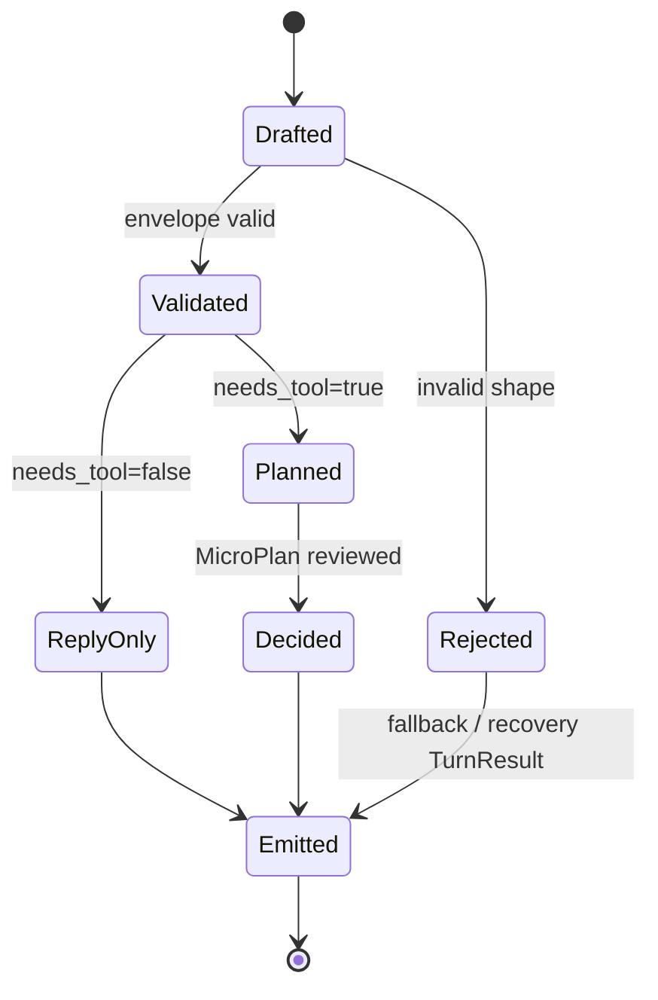
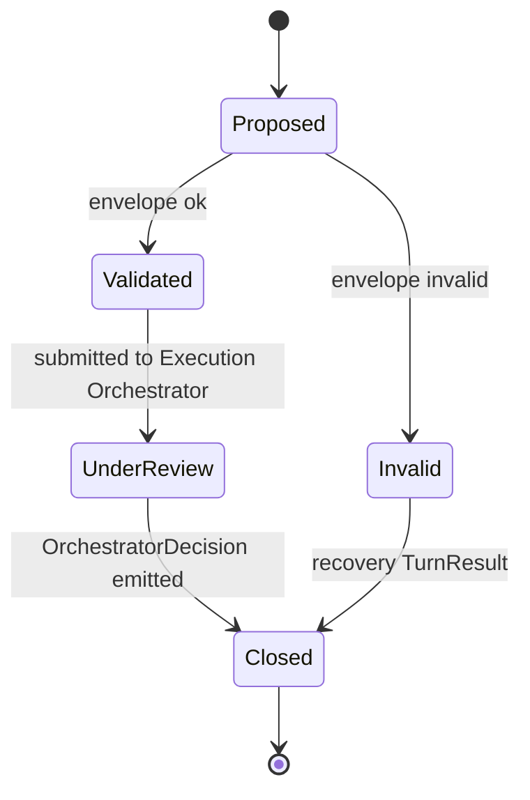

# DialogueFrame 与 MicroPlan 协议草案

> 状态：草案（2026-05-02）
>
> 角色：定义 v3 中 DialogueFrame 与 MicroPlan 的协议边界、候选字段、生命周期、校验原则和不变量。本文是 ADR 前的 contract 草案，不直接冻结最终 schema。
>
> 关联文档：
> - `00b-end-to-end-dialogue-flow.md` — v3 动态主链
> - `00d-runtime-architecture.md` — v3 运行时组件视图
> - `01-user-llm-workbench-interaction-model.md` — 用户、LLM、工作台交互模型
>
> 不负责范围：
> - 不定义 Toolbox / Capability 注册格式，留给 `03-capability-toolbox-contract.md`
> - 不定义 Execution Orchestrator API，留给 `04-execution-orchestrator.md`
> - 不定义 phase/status/next_action 最终兼容表，由 `05-turn-behavior-and-state-model.md` 收束
> - 不定义持久化 schema，留给后续承重垂直切面规划

---

## 1. 核心定位

DialogueFrame 与 MicroPlan 是 v3 替代 Router-first 主链的两个核心协议对象。

```text
DialogueFrame = 每个 turn 的结构化认知帧。
MicroPlan = 当本轮需要行动时，Planner 提交给执行层的小型行动建议。
```

它们共同解决两个问题：

1. 废弃 Router-first 后，系统仍然需要每轮可审计的结构化理解。
2. Planner 可以自然地理解和引导作者，但不能直接拥有执行权。

因此：

```text
DialogueFrame 负责“我如何理解这一轮”；
MicroPlan 负责“我建议下一步做什么”；
Execution Orchestrator 负责“是否允许做、怎么做、做完如何留痕”。
```

---

## 2. DialogueFrame

### 2.1 定义

DialogueFrame 是每个用户 turn 必须产生的结构化认知帧。

它回答：

```text
本轮作者输入，在系统看来是什么性质？
```

它不是：

- intent 分类结果的简单替代品
- 工具调用请求
- 执行授权
- UI 表单模型
- LLM 私有 chain-of-thought

它是：

- turn 主链的认知入口
- Planner 对作者输入的可审计解释
- 后续 MicroPlan / behavior / TurnResult 的依据之一
- DecisionTrace 的核心节点

### 2.2 候选字段

| 字段 | 必填 | 含义 |
|---|---:|---|
| `frame_id` | 是 | DialogueFrame 唯一 id |
| `turn_ref` | 是 | 所属 turn |
| `frame_type` | 是 | 本轮认知类型 |
| `dialogue_goal` | 是 | 本轮对话目标，用作者语义表达 |
| `intent_hypothesis` | 否 | 候选 intent，可为空或多个候选 |
| `slot_state_delta` | 是 | 本轮从作者输入中得到的 slot draft 增量，默认为空 map |
| `behavior_ref` | 否 | 若本轮关联 open clarification / confirmation / correction / cancellation |
| `needs_tool` | 是 | 是否需要 MicroPlan / 工具 / 状态推进 |
| `execution_readiness` | 是 | 本轮是否进入执行候选 |
| `author_visible_message` | 是 | Planner 建议给作者看的自然语言回应 |
| `confidence` | 否 | Planner 对 frame 判断的置信度 |
| `uncertainty_reasons` | 否 | 不确定原因列表 |
| `trace_refs` | 否 | 关联上下文、工具或历史 trace |
| `created_at` | 是 | 生成时间 |

字段原则：

1. `slot_state_delta` 只能表达本轮新增或修正的 draft，不代表最终执行参数。
2. `author_visible_message` 是草案，最终进入 TurnResult 前仍要经过 envelope / policy 校验。
3. `intent_hypothesis` 是假设，不是执行授权。
4. `frame_type` 必须能解释为什么本轮没有执行。

### 2.3 frame_type 候选枚举

| frame_type | 含义 | 常见下一步 |
|---|---|---|
| `casual_reply` | 普通回应，不推进创作状态 | reply-only TurnResult |
| `exploration` | 作者意图模糊，系统共同探索方向 | 生成候选方向或追问偏好 |
| `slot_update` | 用户补充了可合并到 slot draft 的信息 | 更新 draft，必要时校验 |
| `execution_candidate` | Planner 认为可能可以执行 | 生成 MicroPlan，由执行层校验 |
| `confirmation_answer` | 用户回答确认 | 关闭 confirmation 或继续等待 |
| `clarification_answer` | 用户回答澄清 | 合并 slot / 关闭 clarification / 继续澄清 |
| `correction` | 用户修正理解、参数、结果或状态 | 定位目标并修正 |
| `cancellation` | 用户取消等待态、任务或动作 | 关闭 behavior / cancel task |
| `rejection_candidate` | 请求可能不应执行 | policy check / rejection |
| `meta_request` | 用户询问系统能力、状态、解释 | 读取 registry / trace / 状态 |

枚举冻结前的开放点：

- `clarification_answer` 和 `slot_update` 是否合并。
- `meta_request` 是否拆成 explain / inspect / help。
- `rejection_candidate` 是否属于 frame_type，还是 policy result。

### 2.4 execution_readiness 候选枚举

| 值 | 含义 |
|---|---|
| `not_applicable` | 本轮不涉及执行 |
| `not_ready` | 还处于探索、补槽、纠错或等待状态 |
| `ready_candidate` | Planner 认为可能可以执行，但尚未通过执行层门禁 |

禁止：

- 在 DialogueFrame 中出现 `READY_TO_EXECUTE` 语义。
- 把 `ready_candidate` 当作 capability invoke 授权。
- 因为 `not_ready` 就一定创建 durable clarification。

### 2.5 DialogueFrame 生命周期



生命周期说明：

- `Drafted`：Planner 初步生成，尚未被系统校验。
- `Validated`：结构合法，可进入 reply-only 或 MicroPlan。
- `Planned`：已生成 MicroPlan。
- `Decided`：Execution Orchestrator 已裁决。
- `Emitted`：已进入 TurnResult / DecisionTrace。
- `Rejected`：frame 结构非法或不可信，系统生成恢复性 TurnResult。

---

## 3. MicroPlan

### 3.1 定义

MicroPlan 是 Planner 在本轮需要行动时提交给 Execution Orchestrator 的小型行动建议。

它回答：

```text
为了推进本轮对话或任务，Planner 建议系统下一步做什么？
```

它不是：

- 可自动全量执行的长计划
- capability 调用权限
- 状态变更事实
- long-run task plan
- tool result

它是：

- Planner 对下一步行动的结构化建议
- Execution Orchestrator 审查和裁决的输入
- DecisionTrace 中解释行动意图的节点

### 3.2 触发条件

当 DialogueFrame 满足任一条件时，必须生成 MicroPlan：

1. 需要调用工具或 capability。
2. 需要更新 slot draft / current parameters。
3. 需要校验 blocking slots。
4. 需要读取 memory / context / object。
5. 需要进入或关闭 durable behavior。
6. 需要进入 execution candidate。
7. 需要创建 tentative artifact。
8. 需要处理 correction / cancellation / rejection。

不需要 MicroPlan 的情况：

- 普通 reply-only。
- 只解释系统能力且不读 registry。
- 对作者进行轻量自然回应，不改变任何状态。

### 3.3 候选字段

| 字段 | 必填 | 含义 |
|---|---:|---|
| `plan_id` | 是 | MicroPlan 唯一 id |
| `turn_ref` | 是 | 所属 turn |
| `frame_ref` | 是 | 来源 DialogueFrame |
| `plan_goal` | 是 | 本轮行动目标 |
| `proposed_actions` | 是 | Planner 建议动作列表 |
| `state_changes_requested` | 是 | 请求更新的状态，默认为空 list |
| `required_capabilities` | 是 | 建议使用的 capability、capability class 或工具能力名称 |
| `risk_hint` | 否 | Planner 对风险、预算、写入的提示 |
| `requires_confirmation_hint` | 否 | Planner 是否认为需要确认 |
| `stop_after_next_action` | 是 | 默认 true，只建议放行下一步 |
| `fallback_strategy` | 否 | 若被拒绝或工具失败，建议如何降级 |
| `created_at` | 是 | 生成时间 |

字段原则：

1. `proposed_actions` 是建议，不是执行事实。
2. `state_changes_requested` 必须由 Execution Orchestrator 批准后才生效。
3. `required_capabilities` 必须指向 Toolbox 中已知 capability、capability class 或工具能力名称。
4. `stop_after_next_action` 默认 true，防止 MicroPlan 变成长计划。

### 3.4 proposed_actions 候选动作类型

| action_type | 含义 |
|---|---|
| `read_context` | 读取上下文或对象 |
| `recall_memory` | 检索记忆 |
| `interpret_intent` | 解释 intent 假设 |
| `update_slot_draft` | 更新 slot draft / current parameters |
| `validate_slots` | 校验 blocking slots |
| `generate_candidates` | 生成候选方向、对比方案 |
| `invoke_creative_capability` | 调用创作能力 |
| `create_tentative_artifact` | 创建 tentative artifact |
| `open_behavior` | 创建 durable behavior |
| `close_behavior` | 关闭 durable behavior |
| `request_confirmation` | 请求确认 |
| `reject_request` | 拒绝执行 |
| `cancel_task_or_behavior` | 取消任务或等待态 |

动作类型冻结前的开放点：

- `request_confirmation` 是否应由 Planner 提议，还是只由 Orchestrator 裁决产生。
- `create_tentative_artifact` 是否拆成 generate artifact + persist tentative。
- `interpret_intent` 是否只是工具动作，而不是 MicroPlan action。

### 3.5 MicroPlan 生命周期



生命周期说明：

- `Proposed`：Planner 生成，但未提交审查。
- `Validated`：plan envelope 和 frame 引用合法。
- `UnderReview`：Execution Orchestrator 正在审查。
- `Invalid`：plan 结构非法或包含越权语义。
- `Closed`：本轮 plan 已被裁决或恢复性关闭。

ADR-0002 对本文早期草案做了收缩：`allow_next_action`、`downgrade_to_dialogue`、`require_confirmation`、`require_clarification`、`reject`、`ToolRequest`、`ToolResult` 都是 OrchestratorDecision 及下游 trace 的语义，不再作为 MicroPlan 自身生命周期状态。

---

## 4. DialogueFrame 与 MicroPlan 的关系

核心关系：

```text
一个 turn 必有一个 primary DialogueFrame。
一个 DialogueFrame 可以没有 MicroPlan。
一个 DialogueFrame 最多有一个 primary MicroPlan。
一个 MicroPlan 可以产生一个或多个 ToolRequest，但默认只放行第一个安全动作。
```

关系约束：

| 约束 | 说明 |
|---|---|
| `needs_tool=false` | 不得生成 MicroPlan |
| `needs_tool=true` | 必须生成 MicroPlan |
| `execution_readiness=ready_candidate` | 必须生成 MicroPlan 并经过执行层校验 |
| `frame_type=casual_reply` | 通常不得生成 MicroPlan，除非是 meta_request |
| `frame_type=cancellation` | MicroPlan 必须声明取消目标 |
| `frame_type=correction` | MicroPlan 必须声明修正目标或解析目标动作 |
| `frame_type=confirmation_answer` | MicroPlan 必须关联 open confirmation |

允许二次 frame：

工具返回后，Planner 可以基于 ToolResult 生成“final frame”或更新 `author_visible_message`。该对象是否作为独立 DialogueFrame 记录，由 `06-memory-context-and-trace.md` 给出 trace 语义，并由后续 ADR 冻结。

---

## 5. 校验原则

### 5.1 DialogueFrame envelope 校验

至少校验：

1. 必填字段存在。
2. `frame_type` 在候选枚举内。
3. `execution_readiness` 在候选枚举内。
4. `slot_state_delta` 是 map。
5. `needs_tool` 是 boolean。
6. `author_visible_message` 非空，除非该 frame 明确只用于内部恢复。
7. 若 `needs_tool=false`，不得包含 MicroPlan 引用。
8. 若 `execution_readiness=ready_candidate`，`needs_tool` 必须为 true。

### 5.2 MicroPlan envelope 校验

至少校验：

1. 必填字段存在。
2. `frame_ref` 指向合法 DialogueFrame。
3. `proposed_actions` 非空。
4. `required_capabilities` 中的 capability 或工具能力存在于 Toolbox registry 草案。
5. `state_changes_requested` 不能直接声明已完成。
6. `stop_after_next_action` 默认 true。
7. 若包含写入或长跑动作，必须携带 `risk_hint` 或由 Orchestrator 补充风险判断。

### 5.3 语义校验

至少校验：

| 规则 | 说明 |
|---|---|
| Planner 不批准执行 | MicroPlan 不能含 `approved=true` 之类字段 |
| ready_candidate 不等于 READY_TO_EXECUTE | 执行状态只能由 Execution Orchestrator 推进 |
| slot draft 不等于执行参数 | 执行前必须经过 SlotValidator |
| author_visible_message 不等于事实来源 | 已执行/已写入等事实必须来自 ToolResult / TurnResult |
| confirmation 不能被跳过 | 高风险动作即使 Planner 未提示，也必须由执行层拦截 |

---

## 6. 示例

### 6.1 Reply-only

作者：

```text
今天有点没灵感。
```

DialogueFrame：

```json
{
  "frame_type": "casual_reply",
  "dialogue_goal": "respond_to_author_mood",
  "intent_hypothesis": null,
  "slot_state_delta": {},
  "needs_tool": false,
  "execution_readiness": "not_applicable",
  "author_visible_message": "没关系，我们可以先不用急着定剧情。你想先聊角色、氛围，还是让我给你几个轻量方向？"
}
```

MicroPlan：无。

### 6.2 Exploration

作者：

```text
我想开本新书，但没想好方向。
```

DialogueFrame：

```json
{
  "frame_type": "exploration",
  "dialogue_goal": "explore_work_seed_positioning",
  "intent_hypothesis": "intent.CREATE_WORK_SEED",
  "slot_state_delta": {},
  "needs_tool": true,
  "execution_readiness": "not_ready",
  "author_visible_message": "我们先不用急着定死。我给你几个方向看看哪种更接近。"
}
```

MicroPlan：

```json
{
  "plan_goal": "generate_candidate_work_seed_directions",
  "proposed_actions": ["generate_candidates"],
  "required_capabilities": ["capability.CandidateDirectionGenerator"],
  "state_changes_requested": [
    {"type": "record_intent_hypothesis", "intent": "intent.CREATE_WORK_SEED"}
  ],
  "risk_hint": "low",
  "requires_confirmation_hint": false,
  "stop_after_next_action": true
}
```

### 6.3 Execution candidate

作者：

```text
就按第二个方向创建。
```

DialogueFrame：

```json
{
  "frame_type": "execution_candidate",
  "dialogue_goal": "create_work_seed_from_selected_direction",
  "intent_hypothesis": "intent.CREATE_WORK_SEED",
  "slot_state_delta": {},
  "needs_tool": true,
  "execution_readiness": "ready_candidate",
  "author_visible_message": "我先确认一下这个方向是否已经满足创建条件。"
}
```

MicroPlan：

```json
{
  "plan_goal": "validate_and_create_tentative_work_seed",
  "proposed_actions": ["validate_slots", "create_tentative_artifact"],
  "required_capabilities": ["capability.SlotValidator", "capability.AuthorityChecker", "capability.AdoptionBoundary"],
  "state_changes_requested": [],
  "risk_hint": "writes_tentative_artifact",
  "requires_confirmation_hint": false,
  "stop_after_next_action": true
}
```

Execution Orchestrator 可以决定：

- 缺 blocking slot → `require_clarification`
- 风险或策略要求 → `require_confirmation`
- 低风险且满足门槛 → 只创建 tentative artifact

---

## 7. Trace 要求

每个 turn 的 DecisionTrace 至少要能串起：

```text
AuthorInput
DialogueContext refs
DialogueFrame
MicroPlan（如有）
OrchestratorDecision（如有）
ToolRequest / ToolResult（如有）
TurnResult summary
```

DialogueFrame trace 需要回答：

- 系统如何理解作者这一轮输入。
- 为什么本轮没有执行。
- 哪些 slot draft 被提议更新。
- 哪些不确定性影响了下一步。

MicroPlan trace 需要回答：

- Planner 建议了哪些动作。
- 为什么需要工具。
- Orchestrator 为什么批准、降级、确认、澄清或拒绝。
- 哪些工具返回支撑最终 TurnResult。

---

## 8. 与 TurnResult / Behavior 的关系

DialogueFrame 与 MicroPlan 不直接替代 TurnResult。

| 对象 | 责任 |
|---|---|
| DialogueFrame | 认知解释 |
| MicroPlan | 行动建议 |
| OrchestratorDecision | 执行裁决 |
| BehaviorState | durable 等待态 |
| TurnResult | 对外 canonical 输出 |
| DecisionTrace | 可回放解释 |

关系原则：

1. TurnResult 可以引用 DialogueFrame / DecisionTrace，但 UI 主渲染仍以 TurnResult 为准。
2. durable clarification / confirmation 仍通过 BehaviorState 表达。
3. DialogueFrame 的 `frame_type=exploration` 不必立即创建 clarification。
4. MicroPlan 的 `request_confirmation` 不等于已经进入 confirmation。
5. Behavior open / close 必须由 Execution Orchestrator 裁决。

---

## 9. 不变量

1. 每个 turn 必须有一个 primary DialogueFrame。
2. MicroPlan 只在 `needs_tool=true` 时出现。
3. Planner 不能批准自己的 MicroPlan。
4. MicroPlan 默认只建议下一步安全动作。
5. `ready_candidate` 不能绕过 SlotValidator / Authority / Budget。
6. `slot_state_delta` 不能直接写入生产状态。
7. `author_visible_message` 不能宣称未发生的执行事实。
8. 所有 MicroPlan 裁决必须进入 DecisionTrace。
9. ToolRequest 必须由 Execution Orchestrator 产生或批准。
10. DialogueFrame / MicroPlan schema 漂移必须在 contract test 中失败。

---

## 10. 后续 ADR 候选

本文建议后续拆出以下 ADR：

| ADR | 冻结内容 |
|---|---|
| DialogueFrame v3 Schema | 字段、枚举、生命周期、校验规则 |
| MicroPlan v3 Schema | 字段、动作类型、生命周期、校验规则 |
| DialogueFrame / TurnResult Trace Link | TurnResult 如何引用 frame / trace |
| Planner Authority Boundary | Planner 不能批准执行的硬约束 |

本文已经由以下文档继续承接：

1. `03-capability-toolbox-contract.md`
2. `04-execution-orchestrator.md`
3. `05-turn-behavior-and-state-model.md`

ADR 前置材料已经具备：

1. `00c-state-and-contract-atlas.md`

原因是 `06-memory-context-and-trace.md` 已经承接 trace / replay，`07-workbench-ui-contract.md` 已经承接 UI 消费，`00c-state-and-contract-atlas.md` 已经完成全局 contract 索引和 ADR backlog 汇总。

---

## 11. 下一步

本文完成后，v3 已具备 frame / plan 的第一版 contract 草案。

在当前 v3 设计链路中，本文已经由以下文档继续承接：

- `03-capability-toolbox-contract.md`：定义 MicroPlan 如何引用工具与 ToolRequest。
- `04-execution-orchestrator.md`：定义 MicroPlan 如何被裁决、降级、确认或执行。
- `05-turn-behavior-and-state-model.md`：定义 MicroPlan 裁决后如何形成 durable behavior。
- `06-memory-context-and-trace.md`：定义 frame / plan / decision / behavior 如何进入 trace 与 replay。
- `07-workbench-ui-contract.md`：定义 UI 如何消费 frame / trace 的摘要引用。
- `00c-state-and-contract-atlas.md`：定义 DialogueFrame / MicroPlan 在全局 contract 与 ADR backlog 中的位置。

下一步建议写：

```text
docs/design-v3/adr/ADR-0003-planner-authority-boundary.md
```

原因：

- `03/04/05/06/07` 已经分别补上 Toolbox、Orchestrator、BehaviorState、trace/replay 和 UI 消费边界。
- `00c` 已经把 DialogueFrame / MicroPlan 与其他状态、contract、ADR 候选放到同一张索引图中。
- `adr/README.md` 已经建立 v3 ADR 编号、状态、模板和首批 Proposed ADR 顺序。
- `ADR-0001` 已经先将 DialogueFrame 语义和最小 contract 升级为 Proposed 决策。
- 下一步需要写 `ADR-0003-planner-authority-boundary.md`，把 Planner 不能批准执行升级为明确权限边界。
