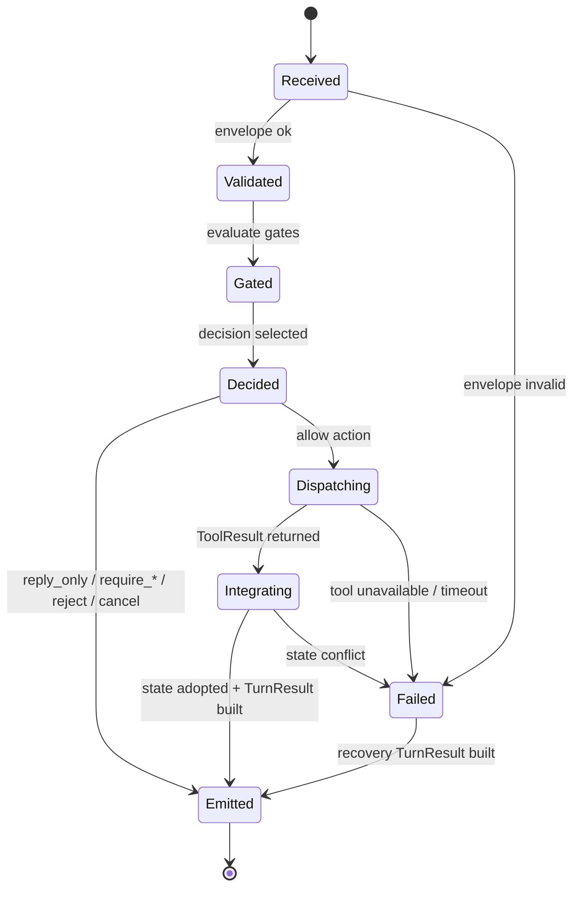

# Execution Orchestrator 协议草案

> 状态：草案（2026-05-02）
>
> 角色：定义 v3 中 Execution Orchestrator 的职责边界、输入输出、裁决模型、门禁顺序、ToolRequest dispatch、状态推进、TurnResult 组装与 DecisionTrace 规则。本文是 ADR 前的 contract 草案，不直接冻结最终 schema。
>
> 相关文档：
>
> - `00-vision-and-engineering-roadmap.md` — v3 愿景与工程推进方式
> - `00b-end-to-end-dialogue-flow.md` — 一次 turn 的动态主链
> - `00d-runtime-architecture.md` — v3 运行时架构视图
> - `01-user-llm-workbench-interaction-model.md` — 用户、LLM、工作台交互模型
> - `02-dialogue-frame-and-micro-plan.md` — DialogueFrame / MicroPlan 协议草案
> - `03-capability-toolbox-contract.md` — Capability Toolbox 协议草案
>
> 本文不做：
>
> - 不重新定义 DialogueFrame / MicroPlan 字段全集
> - 不重新定义 Capability Toolbox registry 字段全集
> - phase/status/next_action 兼容表由 `05-turn-behavior-and-state-model.md` 收束
> - DecisionTrace 存储语义由 `06-memory-context-and-trace.md` 收束
> - Workbench UI 消费契约由 `07-workbench-ui-contract.md` 收束；视觉呈现仍不在本文冻结
> - 不直接决定具体 umbrella app 模块归属，归属需要由后续承重垂直切面和 ADR 证明

---

## 1. 定位

Execution Orchestrator 是 v3 主链中的执行裁决层。

它回答的问题是：

```text
在这一轮对话中，系统是否允许做某个动作；
如果允许，只允许做哪一步；
做之前是否需要澄清、确认、权限、预算或策略门禁；
做完以后哪些状态可以被采纳；
最后如何形成 TurnResult 与 DecisionTrace。
```

它位于 Dialogue Planner 与 Toolbox / 状态写入 / TurnResult 出口之间：

```text
AuthorInput
→ Dialogue Planner
→ DialogueFrame
→ MicroPlan（按需）
→ Execution Orchestrator
→ ToolRequest / StateTransition / TurnResult / DecisionTrace
```

Execution Orchestrator 不是：

- 不是新的 Router。
- 不是 Dialogue Planner 的改名。
- 不是巨型 TurnService。
- 不是创作内容生成器。
- 不是具体工具实现。
- 不是 UI 状态管理器。
- 不是把所有 policy 藏起来的万能 service。

Execution Orchestrator 是：

- MicroPlan 的裁决者。
- ToolRequest 的唯一批准者。
- 状态推进的门禁。
- confirmation / clarification / cancellation 等 durable behavior 的开关者。
- TurnResult 的最终一致性出口。
- DecisionTrace 的核心事实来源。

一句话：

```text
Planner 负责理解和建议；
Orchestrator 负责允许、拒绝、降级、确认、派发、采纳和留痕。
```

---

## 2. 为什么必须单独定义

v3 的目标不是让系统“能回答”，而是让系统以 LLM 创作伙伴的方式自然协作，同时保持可审计、可回放、可控制的执行边界。

如果没有 Execution Orchestrator，系统很容易滑回以下形态：

| 问题 | 后果 |
|---|---|
| Planner 自己批准自己的 MicroPlan | LLM 的建议变成事实执行，权限边界消失 |
| 工具直接写生产状态 | tentative / adoption / audit 被绕过 |
| UI 直接调用工具 | Workbench 反向定义主链 |
| confirmation 分散在多个模块 | 等待态无法回放，也无法稳定恢复 |
| ToolResult 直接拼成用户消息 | 作者看到的事实可能与真实状态不一致 |
| Budget / Authority 藏进工具实现 | 系统无法解释为什么执行或不执行 |
| TurnResult 由多个层拼装 | UI canonical 出口失去一致性 |

Execution Orchestrator 的存在是为了把下面两件事硬拆开：

```text
理解这一轮作者想什么
≠
系统现在可以安全地做什么
```

这也是 v3 不推荐继续把 `Router` 放在 turn 第一站的关键工程原因：入口认知可以是 DialogueFrame，但执行权必须在独立的裁决层。

---

## 3. 核心原则

### 3.1 四方权责

| 对象 | 可以做 | 不可以做 |
|---|---|---|
| Dialogue Planner | 生成 DialogueFrame、提出 MicroPlan、生成作者可见回应草稿 | 批准执行、直接写状态、绕过确认 |
| Execution Orchestrator | 审查 MicroPlan、裁决动作、生成 ToolRequest、采纳状态变化、组装 TurnResult | 替作者创作主内容、发明新的业务目标 |
| Capability Toolbox | 执行被批准的工具请求，返回 ToolResult | 自行决定是否执行、自行写生产状态 |
| Workbench UI | 呈现 TurnResult、收集作者选择或确认 | 直接调用工具、直接推进业务状态 |

### 3.2 默认只放行下一步

MicroPlan 可以表达“为了推进这一轮，Planner 建议下一步做什么”。

Execution Orchestrator 默认只允许一个安全的下一步动作。

```text
MicroPlan 可以看见方向；
Orchestrator 只放行当前边界内的一步。
```

例外情况必须非常窄：

- 一组只读工具调用，且共享同一权限、预算和 trace 边界。
- 一组原子校验动作，且不会产生生产写入。
- 一个明确受限的批处理动作，且未来 ADR 已冻结 batch policy。

在 ADR 之前，v3 默认不允许 MicroPlan 变成长计划执行器。

### 3.3 工具结果不是状态事实

ToolResult 是工具执行结果。

ToolResult 可以包含 `state_delta` 或 `suggested_update`，但这些只是候选变化。

只有 Execution Orchestrator 采纳后，它们才成为本轮可记录、可输出、可被 UI 消费的状态事实。

### 3.4 TurnResult 必须说真话

TurnResult 是 UI 与外部入口的 canonical 输出。

因此：

- 如果动作没有执行，TurnResult 不能写成“已完成”。
- 如果只生成 tentative 产物，TurnResult 不能写成“已写入生产正文”。
- 如果需要作者确认，TurnResult 必须暴露确认动作，而不是假装系统已经理解并执行。
- 如果工具失败，TurnResult 必须给出可恢复状态，而不是把失败吞掉。

### 3.5 Trace 不是附属日志

DecisionTrace 是执行裁决的一部分，不是事后日志。

每个 OrchestratorDecision 必须能回答：

```text
系统看见了哪个 DialogueFrame；
审查了哪个 MicroPlan；
经过了哪些门禁；
批准、拒绝、降级或等待的原因是什么；
调用了哪些工具；
采纳了哪些状态变化；
最终为什么给出这个 TurnResult。
```

---

## 4. 输入协议草案

Execution Orchestrator 的输入称为 `OrchestratorInput`。

它不是最终 schema，只是用于明确边界的候选 envelope。

| 字段 | 必须 | 含义 |
|---|---|---|
| `turn_id` | 是 | 当前 turn 唯一标识 |
| `author_session_ref` | 是 | 作者会话或工作区引用 |
| `frame` | 是 | 已校验的 DialogueFrame |
| `micro_plan` | 否 | Planner 生成的 MicroPlan；reply-only turn 可以没有 |
| `dialogue_context_ref` | 是 | 本轮可用上下文引用，不应是全量 dump |
| `open_behavior_refs` | 是 | 当前打开的 clarification / confirmation / correction 等等待态 |
| `toolbox_registry_ref` | 是 | 本轮使用的 Capability Toolbox registry 版本 |
| `authority_context_ref` | 是 | 权限、写入范围、当前用户能力 |
| `budget_context_ref` | 是 | token、时间、成本、并发和工具预算 |
| `state_snapshot_ref` | 是 | Orchestrator 审查所需的状态快照引用 |
| `idempotency_key` | 是 | 防止重复执行同一动作 |
| `trace_context_ref` | 是 | 本轮 DecisionTrace 的父级或关联上下文 |

设计约束：

1. `frame` 必须存在。
2. `micro_plan` 只能在 `frame.needs_tool=true` 或行为推进需要动作时出现。
3. `toolbox_registry_ref` 必须能追溯版本，避免 replay 时工具含义漂移。
4. `state_snapshot_ref` 是审查快照，不是允许 Planner 或 Toolbox 直接写状态。
5. `idempotency_key` 必须覆盖 turn、plan、action 和目标对象，不能只覆盖 HTTP request。

---

## 5. 输出协议草案

Execution Orchestrator 的核心输出称为 `OrchestratorDecision`。

### 5.1 OrchestratorDecision envelope

| 字段 | 必须 | 含义 |
|---|---|---|
| `decision_id` | 是 | 裁决唯一标识 |
| `turn_id` | 是 | 当前 turn |
| `frame_ref` | 是 | 来源 DialogueFrame |
| `plan_ref` | 否 | 来源 MicroPlan |
| `decision_type` | 是 | 裁决类型 |
| `decision_status` | 是 | 裁决生命周期状态 |
| `approved_actions` | 是 | 被允许的动作列表，默认最多一项写入动作 |
| `rejected_actions` | 是 | 被拒绝的动作及原因 |
| `required_author_action` | 否 | 需要作者澄清、确认、选择或取消 |
| `tool_requests` | 是 | 被批准派发的 ToolRequest 列表 |
| `state_transitions` | 是 | 本轮采纳的状态变化 |
| `turn_result_policy` | 是 | TurnResult 组装策略 |
| `decision_trace_ref` | 是 | DecisionTrace 引用 |
| `reason_codes` | 是 | 机器可读原因码 |
| `author_visible_reason` | 否 | 可对作者展示的简短原因 |

### 5.2 decision_type 候选

| 类型 | 含义 | 常见输出 |
|---|---|---|
| `reply_only` | 本轮只需要自然回复，不需要工具或状态推进 | TurnResult + trace |
| `allow_next_action` | 允许一个下一步动作或工具调用 | ToolRequest + 后续 TurnResult |
| `allow_bounded_read_batch` | 允许一组只读、同门禁、低风险工具调用 | 多个 read ToolRequest |
| `require_clarification` | 需要作者补充意图、范围或关键 slot | BehaviorState open + TurnResult |
| `require_confirmation` | 行动可执行但必须先得到作者明确确认 | Confirmation open + TurnResult action |
| `downgrade_to_dialogue` | MicroPlan 不安全或过度，但可以继续对话 | TurnResult + reason |
| `reject` | 请求违反权限、策略或不可恢复约束 | Rejection TurnResult + trace |
| `cancel_or_close` | 关闭 open behavior、取消计划或终止等待态 | State transition + TurnResult |
| `fail_with_recovery` | 工具、schema、并发或预算失败，需要恢复路径 | Error TurnResult + retry / revise action |

说明：

- `allow_bounded_read_batch` 不是默认 MVP 要求，只是为后续只读并行工具保留语义。
- 写入、长跑、高风险、预算敏感动作不应使用 batch。
- `reject` 面向系统硬约束；`downgrade_to_dialogue` 面向“还能继续聊，但不能执行”的情况。

### 5.3 decision_status 候选

| 状态 | 含义 |
|---|---|
| `received` | Orchestrator 已收到输入 |
| `validated` | envelope 和引用关系合法 |
| `gated` | 门禁检查已完成 |
| `decided` | 已形成裁决 |
| `dispatching` | 已开始派发 ToolRequest |
| `integrating` | 正在采纳 ToolResult 和状态变化 |
| `emitted` | TurnResult 已形成 |
| `failed` | 失败并已产生恢复路径或错误 trace |

状态不是 UI phase/status 的最终定义；UI 可见状态由 `05-turn-behavior-and-state-model.md` 收束。

---

## 6. 门禁顺序

Execution Orchestrator 必须按可解释顺序审查 MicroPlan 和动作。

推荐顺序如下：

| 顺序 | Gate | 目的 | 失败时常见 decision |
|---:|---|---|---|
| 0 | Correlation / idempotency | 防重复执行、确认 turn/plan/action 关联 | `fail_with_recovery` / replay existing decision |
| 1 | Envelope validation | 校验 DialogueFrame、MicroPlan、引用关系 | `fail_with_recovery` |
| 2 | Behavior compatibility | 检查 open behavior 是否匹配本轮输入 | `require_clarification` / `cancel_or_close` |
| 3 | Action scope | 确认 MicroPlan 没有越过下一步边界 | `downgrade_to_dialogue` |
| 4 | Slot / contract validation | 检查关键 slot、schema、目标对象合法性 | `require_clarification` |
| 5 | Authority | 检查作者、工作区、写入范围、工具权限 | `require_confirmation` / `reject` |
| 6 | Policy / safety | 检查内容策略、风险等级、禁止操作 | `reject` / `downgrade_to_dialogue` |
| 7 | Budget | 检查 token、时间、成本、并发、工具调用预算 | `require_confirmation` / `fail_with_recovery` |
| 8 | Toolbox availability | 检查工具是否存在、启用、版本兼容 | `fail_with_recovery` |
| 9 | Write / adoption boundary | 确认 tentative / production / adoption 路径 | `require_confirmation` / `allow_next_action` |
| 10 | Trace readiness | 确认本轮可以被记录和回放 | `fail_with_recovery` |
| 11 | TurnResult compatibility | 确认输出不会宣称未发生事实 | `reply_only` / `fail_with_recovery` |

门禁原则：

1. 先校验 envelope，再判断业务含义。
2. 先处理当前 open behavior，再开启新的 behavior。
3. 先判断能否做，再 dispatch 工具。
4. 先采纳状态，再组装声称状态变化的 TurnResult。
5. 任何硬门禁失败都必须进入 DecisionTrace。

---

## 7. 生命周期



生命周期约束：

1. `Received` 之前，Planner 只能提出 MicroPlan，不能声明执行结果。
2. `Validated` 只代表输入形状合法，不代表允许执行。
3. `Gated` 必须记录每个关键 gate 的结果。
4. `Decided` 之后才能产生 ToolRequest。
5. `Dispatching` 不能直接跳过 `Integrating` 宣称状态已更新。
6. `Emitted` 必须对应一个 TurnResult 或明确的内部错误恢复记录。

---

## 8. 与 DialogueFrame / MicroPlan 的关系

### 8.1 DialogueFrame 是必有输入

每个 turn 必须有一个 primary DialogueFrame。

没有 DialogueFrame，Execution Orchestrator 不应该尝试推断作者意图或直接执行工具。

### 8.2 MicroPlan 是建议，不是授权

MicroPlan 可以包含：

- `proposed_actions`
- `required_tools`
- `state_changes_requested`
- `confirmation_policy`
- `stop_after_next_action`
- `risk_notes`

这些字段都只是建议。

Execution Orchestrator 可以：

| Orchestrator 行为 | 条件 |
|---|---|
| 完整批准下一步动作 | 所有门禁通过，动作边界足够小 |
| 批准子集动作 | MicroPlan 有多个动作，但只有一个动作安全 |
| 降级为对话 | 动作过宽、slot 不稳、目标不清 |
| 要求 clarification | 缺少关键上下文或对象 |
| 要求 confirmation | 可以执行，但需要作者明确同意 |
| 拒绝 | 违反权限、策略或不可恢复约束 |
| 取消或关闭 | 本轮是 cancellation / correction / confirmation resolution |

### 8.3 Orchestrator 不重写 MicroPlan 的语义

如果 MicroPlan 的目标本身不清楚或不安全，Execution Orchestrator 不应该偷偷改成另一个目标并执行。

允许的调整：

- 只批准 MicroPlan 中的一个安全子动作。
- 把写入动作降级为只读校验。
- 把执行动作降级为 confirmation。
- 把不安全动作降级为自然对话解释。

不允许的调整：

- 把“讨论设定方向”改成“创建生产设定”。
- 把“生成候选”改成“采用候选”。
- 把“作者问能不能做”改成“立即执行”。
- 把“取消上一步”改成“重试上一步”。

---

## 9. 与 Capability Toolbox 的关系

Toolbox 是能力注册和执行边界。

Execution Orchestrator 是调用批准边界。

```text
MicroPlan.required_tools
→ Orchestrator gate
→ ToolRequest
→ Capability Toolbox dispatch
→ ToolResult
→ Orchestrator integrate
→ TurnResult
```

### 9.1 ToolRequest 只能由 Orchestrator 产生或批准

Planner、UI、工具自身都不能直接生成可执行 ToolRequest。

Planner 可以说：

```text
required_tools = ["slot_validator", "concept_expander"]
```

但只有 Orchestrator 可以形成：

```text
ToolRequest {
  tool_name: "slot_validator",
  input: ...,
  write_scope: "none",
  budget_limit: ...,
  trace_ref: ...
}
```

### 9.2 ToolResult 需要集成

ToolResult 返回后，Execution Orchestrator 必须决定：

| 问题 | 处理 |
|---|---|
| 工具是否成功 | 失败要进入 recovery path |
| 结果是否可信 | 校验 result schema 与 tool version |
| 是否产生状态候选变化 | 先作为 proposal，再决定采纳 |
| 是否需要 Planner 生成作者可见回应 | 需要时交回 Planner 或使用已批准回应草稿 |
| 是否可以组装 TurnResult | 检查输出事实与状态事实一致 |

### 9.3 工具不隐藏门禁

工具可以做局部校验，但不能替代 Orchestrator 的门禁。

例如：

- `authority_checker` 可以作为工具返回权限事实。
- 但“是否允许写入”仍由 Orchestrator 裁决。
- `budget_estimator` 可以返回成本估算。
- 但“是否继续执行”仍由 Orchestrator 裁决。

---

## 10. 状态推进

Execution Orchestrator 负责把候选变化变成被采纳的状态变化。

候选变化来源包括：

- MicroPlan 的 `state_changes_requested`
- ToolResult 的 `state_delta`
- 作者 confirmation / cancellation / selection
- policy / authority / budget gate 的结果
- behavior lifecycle 的 open / close / resolution

### 10.1 状态变化分层

| 状态层 | 示例 | Orchestrator 责任 |
|---|---|---|
| Dialogue state | frame / plan / decision refs | 关联本轮对象 |
| Behavior state | clarification / confirmation / correction / cancellation | open / close / resolve |
| Tool state | ToolRequest / ToolResult | 记录调用事实 |
| Artifact state | tentative draft / adopted content | 决定 tentative 或 production |
| Projection state | UI projection refresh hints | 只发出 hint，不由 UI 反写 |
| Audit state | DecisionTrace / reason codes | 确保可回放 |

### 10.2 tentative-first

默认写入策略：

```text
工具生成内容
→ tentative artifact / candidate
→ 作者选择或确认
→ adoption
→ production state
```

Execution Orchestrator 不能因为工具成功就自动 production write。

production write 需要同时满足：

1. 目标对象明确。
2. 作者权限明确。
3. 写入范围明确。
4. confirmation / adoption 策略满足。
5. trace 可以解释。
6. TurnResult 能准确呈现。

### 10.3 Behavior open / close

Execution Orchestrator 是 durable behavior 的开关者。

| 行为 | 何时 open | 何时 close |
|---|---|---|
| clarification | 关键 slot、目标或范围不足 | 作者补足后被采纳，或作者取消 |
| confirmation | 动作可执行但需要明确同意 | 作者确认、拒绝或超时策略触发 |
| correction | 作者要求修正已有输出或状态 | 修正采纳，或目标不可解析 |
| cancellation | 作者要求取消等待态、任务或候选动作 | 目标关闭并记录结果 |

行为状态的最终字段和 phase/status 映射由 `05-turn-behavior-and-state-model.md` 收束。

---

## 11. TurnResult 组装职责

Execution Orchestrator 是 TurnResult 的一致性出口，但不等于所有文本都由它生成。

### 11.1 允许的内容来源

| TurnResult 内容 | 来源 |
|---|---|
| `assistant_message` | Planner 生成，经 Orchestrator 校验事实一致性 |
| `ui_cards` | Orchestrator 根据 decision / ToolResult / behavior state 选择 |
| `actions` | Orchestrator 根据 required_author_action 暴露 |
| `phase/status/next_action` | Orchestrator 根据 behavior 和 decision 映射 |
| `trace_refs` | Orchestrator 绑定 DecisionTrace |
| `projection_hints` | Orchestrator 根据已采纳状态变化生成 |

### 11.2 事实一致性校验

TurnResult 发出前必须检查：

1. 文案是否宣称未执行动作。
2. 卡片是否展示未采纳状态为已采纳。
3. action 是否能被当前 open behavior 接受。
4. phase/status 是否与 OrchestratorDecision 一致。
5. trace refs 是否足以解释本轮决策。

### 11.3 UI 不能成为第二出口

Workbench UI 只能消费 TurnResult。

UI 可以触发新的作者输入或选择，但不能绕过 TurnResult 直接改变：

- behavior state
- artifact adoption
- tool dispatch
- authority decision
- budget decision
- projection refresh source of truth

---

## 12. DecisionTrace

DecisionTrace 必须围绕 OrchestratorDecision 组织。

候选结构：

| 字段 | 含义 |
|---|---|
| `trace_id` | trace 唯一标识 |
| `turn_id` | 当前 turn |
| `frame_ref` | 来源 DialogueFrame |
| `plan_ref` | 来源 MicroPlan |
| `decision_ref` | OrchestratorDecision |
| `gate_results` | 关键门禁结果 |
| `tool_request_refs` | 被批准工具调用 |
| `tool_result_refs` | 工具返回事实 |
| `state_transition_refs` | 被采纳状态变化 |
| `reason_codes` | 机器可读原因 |
| `author_visible_summary` | 可展示摘要 |
| `replay_notes` | replay 所需版本引用 |

Trace 设计原则：

1. 记录事实，不记录不必要的敏感上下文全文。
2. 记录引用和版本，避免 replay 时含义漂移。
3. 记录未执行原因，不能只记录已执行路径。
4. 记录降级原因，防止“为什么只是聊天没执行”不可解释。
5. 记录 ToolRequest / ToolResult 对应关系。

---

## 13. 错误与恢复

Execution Orchestrator 不应把错误简单抛给 UI。

错误必须转成可恢复的 OrchestratorDecision 或明确的内部失败记录。

| 场景 | 推荐 decision | 恢复方向 |
|---|---|---|
| DialogueFrame schema invalid | `fail_with_recovery` | 要求 Planner 重建 frame 或返回安全回复 |
| MicroPlan 引用错误 frame | `fail_with_recovery` | 丢弃 plan，要求重新规划 |
| open confirmation 不匹配 | `require_clarification` | 询问作者确认对象 |
| slot 缺失 | `require_clarification` | 打开 clarification behavior |
| 权限不足 | `reject` | 给出可见原因和可选替代 |
| 需要高风险写入确认 | `require_confirmation` | 打开 confirmation behavior |
| 工具不可用 | `fail_with_recovery` | 降级、重试或换工具 |
| 工具超时 | `fail_with_recovery` | 暴露 retry 或稍后继续 |
| 预算不足 | `require_confirmation` / `fail_with_recovery` | 请求作者授权或缩小范围 |
| 状态快照过期 | `fail_with_recovery` | 重新读取并重放 gate |
| 幂等冲突 | replay existing decision | 返回已存在结果或拒绝重复写 |

恢复原则：

1. 如果作者可以补充信息，优先 clarification。
2. 如果作者必须承担选择，使用 confirmation 或 candidate selection。
3. 如果系统内部状态冲突，不要让 UI 猜测，先恢复 trace 和 state snapshot。
4. 如果策略硬拒绝，给出简洁原因，不生成误导性替代执行结果。

---

## 14. 幂等与并发

v3 的工作台可能会出现重试、网络重复、后台工具延迟、作者连续输入等情况。

Execution Orchestrator 必须把幂等当成 contract 的一部分。

### 14.1 幂等键

`idempotency_key` 至少应覆盖：

```text
turn_id
frame_id
plan_id（如有）
proposed_action_id
target_ref
author_action_ref（如 confirmation answer）
```

同一幂等键重复进入时：

- 如果已有完成 decision，返回已有 decision / TurnResult。
- 如果正在 dispatch，返回 pending / in_progress 状态。
- 如果上次失败可重试，必须沿用 trace lineage。
- 如果输入内容不一致，必须拒绝或要求恢复。

### 14.2 并发冲突

常见冲突：

| 冲突 | 处理 |
|---|---|
| 作者在 confirmation 打开后又发起新目标 | 先解析是否取消、修正或并行探索 |
| 同一 artifact 同时被两个动作修改 | 只允许一个 adoption path，另一个进入 conflict recovery |
| 工具返回时 state_snapshot 已过期 | 重新 gate，不直接采纳 |
| cancellation 与 tool completion 交错 | cancellation 优先关闭等待态，ToolResult 作为历史事实记录 |

并发策略最终需要在 `05` 与 `06` 中落到 behavior lifecycle 和 trace replay。

---

## 15. 示例

### 15.1 纯探索回复

作者输入：

```text
我还没想好主角背景，想先聊聊。
```

DialogueFrame：

```text
frame_type = exploration
needs_tool = false
execution_readiness = not_ready
```

MicroPlan：无。

OrchestratorDecision：

```text
decision_type = reply_only
approved_actions = []
tool_requests = []
```

TurnResult：

```text
assistant_message = 自然引导作者探索主角背景
status = conversational
next_action = continue_dialogue
```

关键点：没有工具、没有 durable clarification，也没有假装进入执行。

### 15.2 候选方向生成

作者输入：

```text
给我三个不同风格的女主开局方向。
```

DialogueFrame：

```text
frame_type = exploration
needs_tool = true
execution_readiness = not_ready
```

MicroPlan：

```text
proposed_actions = [generate_candidate_directions]
required_tools = [concept_expander]
stop_after_next_action = true
```

OrchestratorDecision：

```text
decision_type = allow_next_action
tool_requests = [concept_expander]
state_transitions = [record_tentative_candidates]
```

TurnResult：

```text
assistant_message = 展示三个候选方向
ui_cards = candidate_direction_cards
actions = [choose, revise, ask_more]
```

关键点：生成候选不等于采纳候选。

### 15.3 创建可保存设定前需要确认

作者输入：

```text
就用第二个方向，帮我写进项目设定里。
```

DialogueFrame：

```text
frame_type = execution_candidate
needs_tool = true
execution_readiness = ready_candidate
```

MicroPlan：

```text
proposed_actions = [adopt_candidate_to_project_setting]
state_changes_requested = [write_world_or_character_setting]
confirmation_policy = required
```

OrchestratorDecision：

```text
decision_type = require_confirmation
required_author_action = confirm_adoption
tool_requests = []
state_transitions = [open_confirmation]
```

TurnResult：

```text
assistant_message = 说明将采用的内容和影响范围
actions = [confirm, cancel, edit_before_confirm]
status = needs_confirmation
```

关键点：`ready_candidate` 不是 `READY_TO_EXECUTE`。

### 15.4 作者确认后执行 adoption

作者输入：

```text
确认。
```

DialogueFrame：

```text
frame_type = confirmation_answer
needs_tool = true
```

MicroPlan：

```text
proposed_actions = [resolve_confirmation, adopt_candidate_to_project_setting]
references = [open_confirmation_ref]
```

OrchestratorDecision：

```text
decision_type = allow_next_action
tool_requests = [artifact_adoption_writer]
state_transitions = [close_confirmation, adopt_artifact]
```

TurnResult：

```text
assistant_message = 明确说明已采纳的内容
status = completed
trace_refs = [...]
```

关键点：确认答案必须绑定 open confirmation，不能凭“确认”两个字执行最近任意动作。

### 15.5 取消等待态

作者输入：

```text
算了，刚才那个不要了。
```

DialogueFrame：

```text
frame_type = cancellation
needs_tool = true
```

MicroPlan：

```text
proposed_actions = [cancel_open_confirmation]
references = [open_confirmation_ref]
```

OrchestratorDecision：

```text
decision_type = cancel_or_close
state_transitions = [close_confirmation_as_cancelled]
tool_requests = []
```

TurnResult：

```text
assistant_message = 确认已取消等待中的采用动作，并继续自然对话
status = cancelled
```

关键点：取消是状态推进，不是简单忽略上一轮。

---

## 16. Umbrella 边界影响

本文不冻结模块归属，但可以提前排除明显错误方向。

### 16.1 不应落位的地方

| 位置 | 原因 |
|---|---|
| `novel_web` | Web / Channel / Controller 不应掌握执行权或状态机 |
| `novel_persistence` | Ecto / Repo 层不应决定业务执行是否允许 |
| `novel_domain` | domain 应保持纯 struct + 纯函数，不承载工具 dispatch 和 I/O |
| `novel_foundation` | foundation 不应有 GenServer / Supervisor / 业务 orchestration |

### 16.2 倾向性拆分

后续 slice / ADR 可验证以下拆分：

| 责任 | 倾向位置 | 原因 |
|---|---|---|
| OrchestratorDecision 纯结构 / Result 类型 | `novel_foundation` 或 v3 schema 包 | 纯结构、无 I/O、可被多层引用 |
| 门禁策略的纯规则 | `novel_domain` 或 `novel_application` 的纯模块 | 取决于是否属于领域规则还是用例规则 |
| Execution Orchestrator 用例编排 | `novel_application` | 需要协调 planner、agent、domain、state ports |
| Capability Toolbox runtime / provider gateway | `novel_agent` | 运行时工具、LLM provider、监督树相关 |
| 持久化实现 | `novel_persistence` 经边界接口被调用 | Repo 不反向决定业务语义 |
| HTTP / Channel 出口 | `novel_web` | 只消费 TurnResult，不直接调用工具 |

### 16.3 归属冻结原则

最终模块归属必须由承重垂直切面证明：

1. 能通过现有 umbrella 依赖方向编译。
2. 不让 `novel_agent` 依赖 `novel_application` 或 `novel_domain`。
3. 不让 `novel_web` 直接调用 Repo 或 Agent。
4. 不让 persistence 层承载 OrchestratorDecision。
5. 不为方便实现牺牲 v3 主链边界。

---

## 17. 后续测试与证明方向

本文仍是设计阶段，不进入代码实现。

后续进入 slice 前，至少需要把以下 proof 写进 slice 设计：

| Proof | 证明什么 |
|---|---|
| envelope contract test | 无 DialogueFrame 不能进入 Orchestrator |
| MicroPlan authority test | Planner 不能通过字段声明已批准 |
| gate order test | slot / authority / budget / policy 失败路径可解释 |
| ToolRequest provenance test | ToolRequest 必须引用 decision / frame / plan |
| ToolResult integration test | ToolResult state_delta 不能直接变生产状态 |
| confirmation lifecycle test | confirmation open / answer / close 可回放 |
| cancellation race test | 取消与工具返回交错时状态一致 |
| TurnResult truthfulness test | 输出不能宣称未执行事实 |
| DecisionTrace replay test | decision 能用 trace 解释 |
| architecture check | umbrella app 依赖方向不被破坏 |

这些 proof 是未来承重垂直切面的准入条件，不是当前文档要立即实现的测试。

---

## 18. 不变量

Execution Orchestrator 必须保护以下不变量：

1. 每个 OrchestratorDecision 必须引用一个 DialogueFrame。
2. Planner 不能批准自己的 MicroPlan。
3. ToolRequest 必须由 OrchestratorDecision 产生或批准。
4. `ready_candidate` 不等于 `READY_TO_EXECUTE`。
5. MicroPlan 默认只允许下一步安全动作。
6. ToolResult 的 `state_delta` 不能直接写生产状态。
7. confirmation answer 必须绑定 open confirmation。
8. cancellation 必须明确目标或进入 clarification。
9. 高风险、长跑、预算敏感和写入动作必须经过门禁。
10. TurnResult 不能宣称未发生的执行事实。
11. DecisionTrace 必须记录执行与不执行的原因。
12. UI 不能绕过 TurnResult 和 Orchestrator 改变系统状态。
13. 工具 registry 版本必须能被 trace 追溯。
14. 幂等重复不能造成重复写入。
15. Orchestrator 不能用“为了体验顺滑”绕过 authority / budget / policy。

---

## 19. 反模式

v3 禁止以下设计和实现方向：

1. 把 Execution Orchestrator 写成新的 Router。
2. 把 MicroPlan 当成可自动全量执行的长计划。
3. 让 Planner 输出 `approved=true` 或 `ready_to_execute=true`。
4. 让工具自己决定是否可以写生产状态。
5. 让 ToolResult 直接变成作者主消息。
6. 把 authority / budget / policy 分散藏进具体工具。
7. 让 UI 直接调用 capability 或直接写 behavior state。
8. 为了 demo 跳过 confirmation。
9. 出现错误时只返回 generic failed，不留下可回放原因。
10. 在没有 DecisionTrace 的情况下执行写入。
11. 把 Orchestrator 设计成一次 turn 内无限循环的 autonomous agent。
12. 为了复用 v2 代码，把 `Router` 顶层职责挪进 Orchestrator。

---

## 20. 后续 ADR 候选

本文建议后续拆出以下 ADR：

| ADR | 冻结内容 |
|---|---|
| OrchestratorDecision v3 | decision_type、decision_status、字段和生命周期 |
| Execution Gate Order v3 | 门禁顺序、硬失败和软降级规则 |
| ToolRequest Provenance v3 | ToolRequest 必须如何引用 frame / plan / decision |
| State Adoption Boundary v3 | ToolResult / MicroPlan state_delta 如何被采纳 |
| TurnResult Truthfulness v3 | TurnResult 与执行事实一致性规则 |
| Orchestrator Idempotency v3 | 幂等键、重试、重复确认、并发冲突 |

ADR 前置材料已经具备：

1. `00c-state-and-contract-atlas.md`

原因是 `05-turn-behavior-and-state-model.md` 已经承接 BehaviorState，`06-memory-context-and-trace.md` 已经承接 DecisionTrace，`07-workbench-ui-contract.md` 已经承接 TurnResult UI 消费，`00c-state-and-contract-atlas.md` 已经完成全局 contract 索引和 ADR backlog 汇总。

---

## 21. 下一步

本文完成后，v3 已具备：

- `00b`：动态主链。
- `00d`：运行时架构视图。
- `02`：DialogueFrame / MicroPlan 协议草案。
- `03`：Capability Toolbox 协议草案。
- `04`：Execution Orchestrator 执行裁决边界。
- `05`：Turn Behavior 与状态模型草案。
- `06`：Memory、Context、Trace 与 Replay 草案。
- `07`：Workbench UI 消费契约草案。
- `00c`：状态、contract、ADR 候选和 slice 入口总索引。

下一步建议写：

```text
docs/design-v3/adr/ADR-0002-micro-plan-v3.md
```

原因：

- `04` 已经定义 Orchestrator 如何要求 clarification、confirmation、cancellation 和 recovery。
- `05` 已经把这些行为变成可持续的 phase/status/next_action 与 behavior lifecycle。
- `06` 已经证明 OrchestratorDecision、BehaviorState、ToolResult 和 TurnResult 都可以进入 DecisionTrace 并被 replay。
- `07` 已经定义 UI 如何消费 Orchestrator 输出，而不是绕过 Orchestrator 直接推进状态。
- `00c` 已经汇总 OrchestratorDecision、BehaviorState、TurnResult 和 UI action 的 contract 索引。
- `adr/README.md` 已经建立 v3 ADR 编号、状态、模板和首批 Proposed ADR 顺序。
- `ADR-0001` 已经将 Orchestrator 裁决所依赖的 frame 语义升级为 Proposed 决策。
- 下一步需要写 `ADR-0002-micro-plan-v3.md`，冻结 Orchestrator 将要审查的计划输入。

在 Batch A 前 3 条 ADR 至少进入 Proposed 并完成评审之前，不建议创建 implementation plan。
