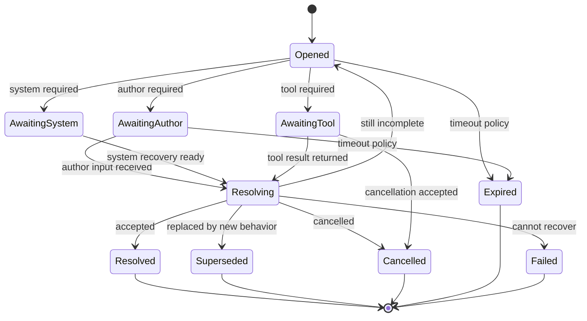

# Turn Behavior 与状态模型草案

> 状态：草案（2026-05-02）
>
> 角色：定义 v3 中 turn 可见状态、durable behavior、phase/status/next_action 候选模型，以及它们如何承接 DialogueFrame、MicroPlan、OrchestratorDecision、ToolResult 与 TurnResult。本文是 ADR 前的 contract 草案，不直接冻结最终 schema。
>
> 相关文档：
>
> - `00-vision-and-engineering-roadmap.md` — v3 愿景与工程推进方式
> - `00b-end-to-end-dialogue-flow.md` — 一次 turn 的动态主链
> - `00d-runtime-architecture.md` — v3 运行时架构视图
> - `01-user-llm-workbench-interaction-model.md` — 用户、LLM、工作台交互模型
> - `02-dialogue-frame-and-micro-plan.md` — DialogueFrame / MicroPlan 协议草案
> - `03-capability-toolbox-contract.md` — Capability Toolbox 协议草案
> - `04-execution-orchestrator.md` — Execution Orchestrator 协议草案
>
> 本文不做：
>
> - 不重新定义 DialogueFrame / MicroPlan 字段全集
> - 不重新定义 OrchestratorDecision 字段全集
> - trace 存储语义由 `06-memory-context-and-trace.md` 收束
> - 不定义 Workbench UI 组件形态，留给 `07-workbench-ui-contract.md`
> - 不定义数据库 schema、migration 或具体代码模块

---

## 1. 定位

Turn Behavior 是 v3 中“这一轮正在等待什么、由谁推进、如何关闭”的 durable 状态模型。

它回答的问题是：

```text
这一轮对话现在处于什么阶段；
系统是否正在等待作者、工具、后台任务或自身恢复；
等待的对象是什么；
作者下一步可以做什么；
行为何时算解决、取消、失败或被取代；
TurnResult 如何把这些状态稳定暴露给 UI。
```

它位于 Execution Orchestrator 和 TurnResult 之间：

```text
DialogueFrame
→ MicroPlan（按需）
→ OrchestratorDecision
→ BehaviorState / TurnState
→ TurnResult
→ Workbench UI
```

Turn Behavior 不是：

- 不是 intent。
- 不是 slot schema。
- 不是 UI 表单状态。
- 不是工具运行状态的简单转发。
- 不是把所有不确定都变成 clarification。
- 不是让前端决定系统该执行什么。

Turn Behavior 是：

- OrchestratorDecision 的可持续外显状态。
- 作者下一步动作的 contract。
- clarification / confirmation / correction / cancellation / recovery 的生命周期。
- TurnResult phase/status/next_action 的依据。
- 后续 trace / replay / UI contract 的输入。

一句话：

```text
DialogueFrame 解释这一轮；
MicroPlan 建议下一步；
OrchestratorDecision 决定系统允许什么；
Turn Behavior 记录接下来谁要做什么以及何时闭合。
```

---

## 2. 为什么必须单独定义

v2 的一个核心问题是：缺 slot、等待确认、用户修正、取消任务、工具失败，这些行为容易散落在 Router、TurnService、UI 和工具实现里。

这样会造成：

| 问题 | 后果 |
|---|---|
| 缺 slot 直接变成字段表单 | 作者感觉自己在填系统表格 |
| confirmation 只是 UI 按钮 | 刷新、重试或跨 turn 后无法可靠恢复 |
| correction 被当成新 intent | 系统覆盖上下文或修错对象 |
| cancellation 只是忽略上一轮 | pending action、工具任务和 trace 没有闭合 |
| 工具失败直接返回 failed | 作者不知道能重试、缩小范围还是继续聊 |
| phase/status 由多层拼装 | UI 无法稳定判断该展示什么 |

v3 需要把这些行为提升为 contract。

核心原则是：

```text
不确定可以先自然对话；
只有当系统进入可追踪等待、确认、修正、取消或恢复时，才打开 durable behavior。
```

这条原则保护 v3 最终愿景：作者面对的是 LLM 创作伙伴，不是一个不断暴露内部字段缺口的工作台。

---

## 3. 分层模型

本文把 turn 状态拆成四层，避免一个字段承载全部含义。

| 层 | 名称 | 作用 | 面向谁 |
|---|---|---|---|
| 1 | `TurnPhase` | 粗粒度阶段：对话、等待、执行、完成等 | 系统 / UI |
| 2 | `TurnStatus` | 更具体的当前状态：需要确认、工具执行中、已取消等 | 系统 / UI |
| 3 | `NextAction` | 下一步动作契约：作者、系统或工具应做什么 | UI / Orchestrator |
| 4 | `BehaviorState` | durable 行为对象：clarification、confirmation、recovery 等 | 系统 / trace / UI |

分层原因：

1. `phase` 用于宏观归类，不能表达所有细节。
2. `status` 用于 UI 和 trace 解释当前状态。
3. `next_action` 是可操作 contract，不等于按钮文案。
4. `BehaviorState` 记录生命周期和关联对象，不应被 UI 自行制造。

示例：

```text
phase = awaiting_author
status = needs_confirmation
next_action = confirm_before_execute
behavior_state.active.type = confirmation
```

---

## 4. TurnPhase 候选

`TurnPhase` 是粗粒度阶段。它不替代详细状态。

| phase | 含义 | 常见来源 |
|---|---|---|
| `dialogue` | 自然对话、探索、解释、候选生成后的继续交流 | `reply_only` / `downgrade_to_dialogue` |
| `planning` | Planner / Orchestrator 正在形成或审查行动建议 | 内部状态，通常不长时间暴露 |
| `awaiting_author` | 系统等待作者补充、选择、确认、取消或修正 | `require_clarification` / `require_confirmation` |
| `executing` | 已放行工具或后台动作，正在等待结果 | `allow_next_action` / dispatch |
| `integrating` | 工具结果已返回，系统正在采纳状态并组装 TurnResult | ToolResult integration |
| `completed` | 本轮已闭合，且没有必须继续的等待态 | normal completion |
| `cancelled` | 本轮或关联行为被明确取消 | `cancel_or_close` |
| `failed` | 本轮失败，可能有 recovery path | `fail_with_recovery` |

约束：

1. `dialogue` 不代表“无状态”，它只代表没有打开 author-blocking durable behavior。
2. `awaiting_author` 必须有 `NextAction` 和可追踪 `BehaviorState`。
3. `executing` 必须有 ToolRequest、task 或 state transition 引用。
4. `completed` 不能掩盖仍然打开的 confirmation。
5. `failed` 必须说明是否 recoverable。

---

## 5. TurnStatus 候选

`TurnStatus` 是 UI 和 trace 可理解的状态标签。

候选值：

| status | phase | 含义 |
|---|---|---|
| `conversational` | `dialogue` | 正在自然交流，无强制等待态 |
| `candidate_presented` | `dialogue` / `awaiting_author` | 已展示候选，是否 durable 由 BehaviorState 决定 |
| `needs_clarification` | `awaiting_author` | 等待作者补充关键信息 |
| `needs_confirmation` | `awaiting_author` | 等待作者确认一个具体动作 |
| `needs_selection` | `awaiting_author` | 等待作者从候选中选择 |
| `needs_revision_target` | `awaiting_author` | correction 目标不清，需要作者定位 |
| `awaiting_tool` | `executing` | 已派发工具，等待结果 |
| `integrating_result` | `integrating` | 工具结果正在被采纳或降级 |
| `completed` | `completed` | 本轮已完成 |
| `cancelled` | `cancelled` | 本轮或等待态已取消 |
| `rejected` | `completed` / `failed` | 请求被策略、权限或边界拒绝 |
| `failed_recoverable` | `failed` | 失败但可重试、缩小范围或继续对话 |
| `failed_terminal` | `failed` | 失败且本轮无法恢复 |

设计注意：

1. `candidate_presented` 可以只是 `dialogue` 状态，不一定打开 durable selection。
2. `needs_selection` 只在系统必须等待作者选择才能推进具体 pending action 时使用。
3. `rejected` 不一定是系统错误；它可能是权限或 policy 的正常裁决。
4. `failed_recoverable` 必须有 recovery action 或恢复说明。

---

## 6. NextAction 候选

`NextAction` 是“下一步谁该做什么”的机器可读契约。

| next_action | actor | 含义 |
|---|---|---|
| `continue_dialogue` | author | 作者可以继续自然输入 |
| `answer_clarification` | author | 作者需要补充一个具体问题 |
| `confirm_before_execute` | author | 作者需要确认一个明确动作 |
| `reject_or_cancel_confirmation` | author | 作者可以拒绝或取消待确认动作 |
| `choose_candidate` | author | 作者需要从候选中选择 |
| `revise_candidate` | author | 作者可以要求改写候选 |
| `identify_revision_target` | author | 作者需要说明要修正哪个对象 |
| `confirm_revision` | author | 作者需要确认修正会影响的范围 |
| `cancel_pending_behavior` | author | 作者可以取消当前等待态 |
| `wait_for_tool` | system/tool | 系统或工具正在执行，作者可等待或取消 |
| `retry_action` | author/system | 可重试失败动作，重试方由 policy 决定 |
| `narrow_scope` | author | 作者需要缩小范围、降低预算或风险 |
| `no_further_action` | none | 本轮没有必须动作 |

约束：

1. `NextAction` 不是按钮文案，UI 文案由 `07-workbench-ui-contract.md` 定义。
2. 同一 TurnResult 可以暴露多个 available actions，但必须有一个 primary next action。
3. author-blocking `NextAction` 必须有 BehaviorState 引用。
4. `wait_for_tool` 必须有 ToolRequest 或 background task 引用。
5. `no_further_action` 不能和 open author-blocking behavior 同时出现。

---

## 7. BehaviorState envelope 草案

BehaviorState 是 durable 行为对象。

候选字段：

| 字段 | 必须 | 含义 |
|---|---|---|
| `behavior_id` | 是 | 行为唯一标识 |
| `behavior_type` | 是 | clarification / confirmation / selection / correction / cancellation / recovery 等 |
| `lifecycle_status` | 是 | open / resolving / resolved / cancelled / expired / failed / superseded |
| `blocking_actor` | 是 | author / system / tool / none |
| `opened_at_turn_ref` | 是 | 打开该行为的 turn |
| `opened_by_decision_ref` | 是 | 打开该行为的 OrchestratorDecision |
| `frame_ref` | 是 | 关联 DialogueFrame |
| `plan_ref` | 否 | 关联 MicroPlan |
| `target_ref` | 否 | 被澄清、确认、修正、取消或恢复的目标 |
| `required_next_action` | 是 | primary NextAction |
| `available_actions` | 是 | 可选动作集合 |
| `prompt_contract` | 否 | 需要作者理解的问题、影响范围或选择说明 |
| `candidate_refs` | 否 | 候选内容引用 |
| `constraints` | 是 | 权限、预算、时间、风险、写入范围等约束摘要 |
| `resolution` | 否 | resolved / cancelled / rejected 等结果 |
| `closed_at_turn_ref` | 否 | 关闭该行为的 turn |
| `trace_ref` | 是 | DecisionTrace 引用 |
| `version` | 是 | behavior contract 版本 |

字段原则：

1. `prompt_contract` 是语义 contract，不是最终 UI 文案。
2. `candidate_refs` 引用候选，不内嵌大量内容。
3. `constraints` 用于解释为什么必须确认、缩小范围或拒绝。
4. `resolution` 必须说明行为如何闭合。
5. `BehaviorState` 由 Execution Orchestrator 创建、更新和关闭。

---

## 8. Behavior 类型

### 8.1 `clarification`

用于系统需要作者补充关键信息。

打开条件：

- intent、目标对象或关键 slot 不足，且已经阻塞下一步安全推进。
- correction / cancellation / confirmation answer 无法绑定目标。
- 作者输入过于模糊，无法安全降级为普通探索。

不应打开的情况：

- 作者只是早期探索。
- 系统可以给候选方向继续引导。
- 缺的是非 blocking detail。
- 只是内部工具可以推断的信息。

常见状态：

```text
phase = awaiting_author
status = needs_clarification
next_action = answer_clarification
```

关闭条件：

- 作者回答被采纳。
- 作者取消。
- 作者改成新的目标，原 clarification 被 superseded。
- 多轮仍无法解析，转为 recovery 或 conversational fallback。

### 8.2 `confirmation`

用于信息足够，但执行前必须得到作者明确同意。

打开条件：

- production write。
- adoption。
- 高风险动作。
- 长跑任务。
- 明显预算消耗。
- 会覆盖、删除或发布内容。
- policy / authority 要求显式确认。

不应打开的情况：

- 只是生成 tentative 候选。
- 只是只读检索。
- 作者仍在探索，尚未要求执行。
- 系统无法明确说明确认对象和影响范围。

常见状态：

```text
phase = awaiting_author
status = needs_confirmation
next_action = confirm_before_execute
```

关闭条件：

- 作者确认，Orchestrator 重新 gate 后执行。
- 作者拒绝。
- 作者编辑确认范围，进入 correction 或 clarification。
- 作者取消。
- 过期策略触发 cancellation 或 recovery。

关键约束：

1. 确认必须绑定具体 target。
2. “确认”不能绑定最近任意动作。
3. 确认后仍要重新检查权限、预算、状态快照和幂等键。
4. confirmation 不能由 UI 自行关闭并写生产状态。

### 8.3 `selection`

用于系统必须等待作者从候选中选择才能推进具体 pending action。

打开条件：

- 候选之间互斥。
- 后续动作依赖作者选择。
- selection 结果会进入 adoption、写入、长跑或明确项目状态。

不应打开的情况：

- 只是给作者灵感。
- 作者可以继续自由讨论。
- 候选只是普通 assistant_message 的一部分。

常见状态：

```text
phase = awaiting_author
status = needs_selection
next_action = choose_candidate
```

关闭条件：

- 作者选择某个 candidate。
- 作者要求改写候选。
- 作者取消候选集。
- 作者切换目标，selection 被 superseded。

关键约束：

1. candidate card 不等于 durable selection。
2. 只有 pending action 依赖选择时才打开 selection。
3. 被选择 candidate 默认仍是 tentative，是否 adoption 由 Orchestrator 决定。

### 8.4 `correction`

用于作者要求修正前文理解、参数、候选、结果或已采纳状态。

correction 可以是一次输入，也可以打开 durable behavior。

打开 durable correction 的条件：

- 修正目标不明确。
- 修正会影响已采纳内容。
- 修正需要作者确认影响范围。
- 修正与当前 open behavior 冲突。

常见状态：

```text
phase = awaiting_author
status = needs_revision_target
next_action = identify_revision_target
```

关闭条件：

- 修正目标解析成功并采纳。
- 修正需要 confirmation，转入 confirmation。
- 作者取消修正。
- 系统无法解析，转入 recovery 或 conversational fallback。

关键约束：

1. correction 不能被粗暴当作新 intent 覆盖上下文。
2. correction 必须明确修正对象。
3. 已采纳内容的修正必须走 adoption / revision / confirmation 边界。

### 8.5 `cancellation`

用于作者取消当前等待态、pending action、长跑任务或候选目标。

cancellation 多数情况下是关闭动作，不一定长期 open。

打开 durable cancellation 的条件：

- 取消目标不明确。
- 正在取消长跑任务，需要等待工具或后台任务响应。
- cancellation 与 ToolResult、confirmation answer 或 adoption 并发交错。

常见状态：

```text
phase = cancelled
status = cancelled
next_action = continue_dialogue
```

或长跑取消中：

```text
phase = executing
status = awaiting_tool
next_action = wait_for_tool
behavior_state.active.type = cancellation
```

关闭条件：

- 目标已关闭。
- 工具任务已确认取消。
- 取消目标不存在，降级为自然说明。
- 取消与已完成动作冲突，进入 recovery。

关键约束：

1. cancellation 必须有明确目标或要求 clarification。
2. cancellation 优先关闭 author-blocking behavior。
3. 已完成的生产写入不能被“取消”伪装成未发生，只能进入 revision / compensation。

### 8.6 `recovery`

用于系统失败、工具失败、状态冲突、预算不足或 replay 不一致后恢复。

打开条件：

- ToolRequest 失败但可重试。
- 状态快照过期，需要重新 gate。
- 预算不足，需要作者缩小范围或授权。
- schema / contract 校验失败，需要系统重建 frame 或 plan。
- 幂等冲突需要返回已有结果或提示恢复。

常见状态：

```text
phase = failed
status = failed_recoverable
next_action = retry_action
```

或：

```text
phase = awaiting_author
status = failed_recoverable
next_action = narrow_scope
```

关闭条件：

- 重试成功。
- 作者缩小范围后重新执行。
- 系统降级为自然对话。
- 错误不可恢复，转为 `failed_terminal`。

关键约束：

1. recovery 不能只暴露 generic failed。
2. recovery 必须说明可由谁推进。
3. recovery 必须进入 DecisionTrace。

---

## 9. OrchestratorDecision 到状态映射

| OrchestratorDecision | phase | status | next_action | BehaviorState |
|---|---|---|---|---|
| `reply_only` | `dialogue` | `conversational` | `continue_dialogue` 或 `no_further_action` | 无 |
| `allow_next_action` | `executing` 或 `completed` | `awaiting_tool` / `completed` | `wait_for_tool` / `no_further_action` | 可选，通常无 author-blocking behavior |
| `allow_bounded_read_batch` | `executing` | `awaiting_tool` | `wait_for_tool` | 可选 |
| `require_clarification` | `awaiting_author` | `needs_clarification` | `answer_clarification` | `clarification` open |
| `require_confirmation` | `awaiting_author` | `needs_confirmation` | `confirm_before_execute` | `confirmation` open |
| `downgrade_to_dialogue` | `dialogue` | `conversational` | `continue_dialogue` | 通常无 |
| `reject` | `completed` / `failed` | `rejected` | `continue_dialogue` / `no_further_action` | 通常无 |
| `cancel_or_close` | `cancelled` / `completed` | `cancelled` / `completed` | `continue_dialogue` | 关闭目标 behavior |
| `fail_with_recovery` | `failed` / `awaiting_author` | `failed_recoverable` / `failed_terminal` | `retry_action` / `narrow_scope` / `no_further_action` | `recovery` 可选 open |

映射规则：

1. `require_*` 必须打开或复用对应 BehaviorState。
2. `cancel_or_close` 必须引用被关闭的 behavior 或说明没有可关闭目标。
3. `allow_next_action` 不应自动打开 confirmation。
4. `failed_recoverable` 必须提供 recovery path。
5. `completed` 必须没有未解决的 author-blocking behavior。

---

## 10. Behavior lifecycle



生命周期候选：

| lifecycle_status | 含义 |
|---|---|
| `open` | 行为已打开，正在等待推进 |
| `awaiting_author` | 等待作者输入、选择或确认 |
| `awaiting_system` | 等待系统恢复、重新规划或重新 gate |
| `awaiting_tool` | 等待工具或后台任务 |
| `resolving` | 已收到推进信号，正在校验和采纳 |
| `resolved` | 行为已成功闭合 |
| `cancelled` | 作者或系统取消行为 |
| `expired` | 超时策略关闭行为 |
| `superseded` | 被新行为替代 |
| `failed` | 行为无法恢复 |

约束：

1. `resolved` 必须有 resolution。
2. `cancelled` 必须有取消目标和 close reason。
3. `superseded` 必须引用替代 behavior。
4. `expired` 必须说明超时策略。
5. `failed` 必须说明是否打开 recovery。

---

## 11. Open behavior 规则

### 11.1 author-blocking behavior

author-blocking behavior 是指系统必须等待作者动作才能继续当前 pending path。

同一 workstream 默认最多只能有一个 active author-blocking behavior。

本文中的 workstream 指同一作者会话里围绕一个 pending path 连续推进的行为链，例如一次候选采用、一次确认写入或一次长跑任务；它不是全局项目，也不是数据库事务。workstream 的最终字段和索引关系由 `00c-state-and-contract-atlas.md` 与后续 ADR 收束。

原因：

- UI 需要明确主动作。
- 作者不应同时被要求补 slot、确认写入、选择候选和修正目标。
- Orchestrator 必须能解释当前等待对象。

例外：

- 后台工具等待与作者对话可以并存，但它们不能都声明同一个 primary next action。
- 多 workstream 并行需要显式 workstream id，不能隐式混在同一个 turn 状态里。

### 11.2 新输入遇到 open behavior

当作者在 open behavior 期间输入，Orchestrator 必须先判断它和 open behavior 的关系。

| 关系 | 处理 |
|---|---|
| answer | 尝试 resolve 当前 behavior |
| correction | 定位修正目标，可能打开 correction |
| cancellation | 关闭当前 behavior 或取消目标 |
| new_goal | 关闭、supersede 或分叉，不能静默覆盖 |
| unrelated_chat | 可以 reply_only，但不能丢失 open behavior |

### 11.3 behavior stack

v3 初期不推荐做通用 behavior stack。

原因：

- 会让 UI 和 trace 复杂度过早上升。
- 容易隐藏“到底等谁”的问题。
- 第一批承重垂直切面只需要证明主链闭环。

允许保留的结构：

```text
active_behavior_ref
related_behavior_refs
superseded_behavior_refs
background_behavior_refs
```

这比任意 stack 更适合早期设计阶段。

---

## 12. TurnResult 视角

TurnResult 必须把 BehaviorState 以稳定 contract 暴露给 UI。

候选字段：

| 字段 | 含义 |
|---|---|
| `turn_phase` | TurnPhase |
| `turn_status` | TurnStatus |
| `primary_next_action` | NextAction |
| `available_actions` | 可选动作集合 |
| `active_behavior_ref` | 当前 active behavior |
| `behavior_summary` | UI 可理解的行为摘要 |
| `ui_cards` | 可展示卡片，由后续 UI contract 定义 |
| `trace_refs` | frame / plan / decision / behavior trace |
| `projection_hints` | 已采纳状态后的 UI 刷新提示 |

约束：

1. TurnResult 可以引用 BehaviorState，但 UI 不直接修改 BehaviorState。
2. `available_actions` 必须被 Orchestrator 接受，不能由 UI 自行发明。
3. `behavior_summary` 不能包含未执行事实。
4. `ui_cards` 必须和 `primary_next_action` 一致。
5. `projection_hints` 只能来自已采纳状态变化。

---

## 13. UI 可见性原则

Workbench UI 是状态消费者，不是状态作者。

UI 应该呈现：

- 当前 assistant message。
- 候选方向。
- clarification 问题。
- confirmation 影响范围。
- selection 选项。
- recovery 动作。
- trace 摘要入口。

UI 不应该：

- 根据字段缺失自行打开 clarification。
- 根据按钮点击直接关闭 confirmation 并写状态。
- 把 candidate card 选择直接变成 production write。
- 把 failed 状态改写成 completed。
- 自行决定 retry 是否安全。

关键分界：

```text
UI event = 作者输入或选择
Behavior transition = Orchestrator 裁决后发生
```

---

## 14. 示例

### 14.1 探索不打开 clarification

作者输入：

```text
我想写一个新故事，但还没想好类型。
```

DialogueFrame：

```text
frame_type = exploration
needs_tool = false
execution_readiness = not_ready
```

OrchestratorDecision：

```text
decision_type = reply_only
```

Turn state：

```text
phase = dialogue
status = conversational
next_action = continue_dialogue
active_behavior = none
```

关键点：没有 blocking slot，因此不打开 durable clarification。

### 14.2 缺 blocking slot 才打开 clarification

作者输入：

```text
把这个设定写进项目里。
```

但上下文里有多个候选设定，目标不明确。

OrchestratorDecision：

```text
decision_type = require_clarification
reason = ambiguous_target
```

BehaviorState：

```text
behavior_type = clarification
lifecycle_status = awaiting_author
target_ref = candidate_setting_collection
required_next_action = answer_clarification
```

Turn state：

```text
phase = awaiting_author
status = needs_clarification
next_action = answer_clarification
```

关键点：clarification 是因为写入目标不明确，而不是因为系统想让作者填完整表。

### 14.3 confirmation 保护 adoption

作者输入：

```text
采用第二个方向。
```

OrchestratorDecision：

```text
decision_type = require_confirmation
reason = production_adoption
```

BehaviorState：

```text
behavior_type = confirmation
target_ref = candidate_direction_2
required_next_action = confirm_before_execute
available_actions = [confirm_before_execute, reject_or_cancel_confirmation, revise_candidate]
```

Turn state：

```text
phase = awaiting_author
status = needs_confirmation
next_action = confirm_before_execute
```

关键点：作者选择 candidate 不等于已经写入项目设定。

### 14.4 candidate card 不一定是 durable selection

作者输入：

```text
给我三个女主开局方向。
```

系统只是提供灵感：

```text
phase = dialogue
status = candidate_presented
next_action = continue_dialogue
active_behavior = none
```

如果后续系统必须等待作者选择才能执行写入：

```text
phase = awaiting_author
status = needs_selection
next_action = choose_candidate
active_behavior.type = selection
```

关键点：候选展示是创作协作；selection 是有 pending action 时才打开的 durable behavior。

### 14.5 correction 需要定位目标

作者输入：

```text
不是这个，改成更冷一点。
```

如果上下文无法判断“这个”指代哪个候选或已采纳内容：

```text
phase = awaiting_author
status = needs_revision_target
next_action = identify_revision_target
active_behavior.type = correction
```

如果目标明确且只影响 tentative candidate：

```text
phase = dialogue
status = candidate_presented
next_action = continue_dialogue
active_behavior = none
```

关键点：correction 是否 durable，取决于是否需要等待作者或保护已采纳状态。

### 14.6 cancellation 关闭等待态

当前 open confirmation：

```text
behavior_type = confirmation
target_ref = adopt_candidate_direction_2
```

作者输入：

```text
算了，不采用了。
```

Turn state：

```text
phase = cancelled
status = cancelled
next_action = continue_dialogue
closed_behavior_ref = confirmation
resolution = cancelled_by_author
```

关键点：取消必须关闭具体 behavior，不能只是生成一句“好的”。

### 14.7 recovery 暴露可恢复路径

工具超时：

```text
decision_type = fail_with_recovery
reason = tool_timeout
```

Turn state：

```text
phase = failed
status = failed_recoverable
next_action = retry_action
active_behavior.type = recovery
available_actions = [retry_action, narrow_scope, continue_dialogue]
```

关键点：失败不是终点，除非 contract 明确没有恢复路径。

---

## 15. 与 trace / replay 的关系

本文不定义 trace 存储结构，但规定 BehaviorState 必须可回放。

每个 BehaviorState 至少需要能追溯：

- 哪个 DialogueFrame 导致它打开。
- 哪个 MicroPlan 建议了相关动作。
- 哪个 OrchestratorDecision 打开、更新或关闭它。
- 作者哪次输入推进了它。
- 哪些 ToolRequest / ToolResult 影响了它。
- 它最终如何 resolved / cancelled / failed / superseded。
- TurnResult 如何展示它。

这部分由 `06-memory-context-and-trace.md` 承接。

---

## 16. 与 umbrella 边界的关系

本文不冻结模块归属，但给出边界约束。

| 责任 | 倾向位置 | 原因 |
|---|---|---|
| TurnPhase / TurnStatus / NextAction 候选结构 | v3 schema / foundation 纯结构 | 无 I/O，可跨层引用 |
| BehaviorState 纯结构与校验 | domain 或 foundation 纯模块 | 取决于是否承载领域规则 |
| Behavior lifecycle 裁决 | application 编排层 | 需要结合 OrchestratorDecision 和上下文 |
| Tool wait / cancellation runtime | agent runtime + application 边界 | 涉及工具执行和用例推进 |
| 持久化 | persistence 经 repository port | 只保存事实，不决定业务语义 |
| UI 呈现 | web/frontend | 只消费 TurnResult 和可用动作 |

禁止方向：

1. `novel_web` 直接打开或关闭 BehaviorState。
2. `novel_persistence` 根据字段直接决定 `needs_confirmation`。
3. `novel_agent` 绕过 application 直接推进 author-facing behavior。
4. `novel_domain` 承载工具 I/O 或后台任务等待。
5. `novel_foundation` 引入 GenServer、Repo 或业务编排。

最终归属仍必须由承重垂直切面证明。

---

## 17. 后续测试与证明方向

本文仍是设计阶段，不进入代码实现。

后续进入 slice 前，至少需要把以下 proof 写入 slice 设计：

| Proof | 证明什么 |
|---|---|
| exploration no clarification test | 早期探索不会打开 durable clarification |
| blocking slot clarification test | blocking slot 才打开 clarification |
| confirmation binding test | confirmation answer 必须绑定 open confirmation |
| candidate non-adoption test | candidate selection 不等于 production write |
| correction target test | correction 必须定位目标或进入 clarification |
| cancellation close test | cancellation 必须关闭具体 behavior |
| recovery action test | recoverable failure 必须暴露可恢复动作 |
| no UI mutation test | UI 事件不能直接改 BehaviorState |
| single active author-blocking test | 同一 workstream 只有一个 primary author-blocking behavior |
| TurnResult consistency test | phase/status/next_action 与 BehaviorState 一致 |
| replay behavior lifecycle test | behavior open / resolve / close 可回放 |

---

## 18. 不变量

Turn Behavior 必须保护以下不变量：

1. 不是所有 exploration 都打开 clarification。
2. author-blocking `NextAction` 必须有 active BehaviorState。
3. 同一 workstream 默认最多一个 primary author-blocking behavior。
4. confirmation 必须绑定明确 target。
5. confirmation answer 必须重新经过 Orchestrator gate。
6. candidate 展示不等于 candidate adoption。
7. selection 只有在 pending action 依赖选择时才 durable。
8. correction 必须明确修正对象或进入 clarification。
9. cancellation 必须明确关闭对象或进入 clarification。
10. recovery 必须说明 actor 和可恢复路径。
11. `completed` 不能掩盖仍打开的 author-blocking behavior。
12. `no_further_action` 不能和 active author-blocking behavior 同时出现。
13. UI 只能提交作者输入或选择，不能直接改 BehaviorState。
14. BehaviorState open / update / close 必须进入 DecisionTrace。
15. phase/status/next_action 必须和 OrchestratorDecision 一致。

---

## 19. 反模式

v3 禁止以下设计和实现方向：

1. 缺任意 slot 就打开 clarification。
2. 把 clarification 渲染成主流程字段表单。
3. 把 confirmation 做成前端临时弹窗状态。
4. 把“确认”绑定到最近一次动作而非明确 open confirmation。
5. 把 candidate 选择直接写入 production state。
6. correction 不定位目标，直接覆盖当前上下文。
7. cancellation 只回复“好的”，不关闭 pending behavior。
8. 工具失败只返回 failed，不提供 recovery path。
9. 多个 author-blocking behavior 同时争抢 primary next action。
10. UI 自行推导 next_action。
11. phase/status 由多个层随意拼装。
12. BehaviorState 无 trace，无法 replay。

---

## 20. 后续 ADR 候选

本文建议后续拆出以下 ADR：

| ADR | 冻结内容 |
|---|---|
| TurnPhase / TurnStatus v3 | phase/status 候选值与兼容矩阵 |
| NextAction v3 | primary next action、available actions 与 UI 事件映射 |
| BehaviorState v3 | behavior envelope、lifecycle、resolution |
| Confirmation Binding v3 | confirmation target、answer、重新 gate、幂等 |
| Cancellation Semantics v3 | cancellation 与 pending action / tool result / adopted state 的关系 |
| Recovery Behavior v3 | failed_recoverable、retry、narrow scope、terminal failure |

ADR 前还需要完成：

1. `07-workbench-ui-contract.md`
2. `00c-state-and-contract-atlas.md`

原因是 `06-memory-context-and-trace.md` 已经承接 trace/replay，后续还需要 UI 消费动作和全局 contract 索引互相校验。

---

## 21. 下一步

本文完成后，v3 已具备：

- `02`：DialogueFrame / MicroPlan 协议草案。
- `03`：Capability Toolbox 协议草案。
- `04`：Execution Orchestrator 执行裁决边界。
- `05`：Turn Behavior 与 phase/status/next_action 草案。
- `06`：Memory、Context、Trace 与 Replay 草案。

下一步建议写：

```text
07-workbench-ui-contract.md
```

原因：

- `05` 已经定义哪些行为必须 durable。
- `06` 已经定义 DialogueContext、DecisionTrace、BehaviorTrace 和 replay 如何支撑这些行为。
- `07` 需要定义 UI 如何消费这些行为状态与 trace 摘要，而不是直接修改 BehaviorState。

在 `07` 之前，不建议创建 implementation plan。
