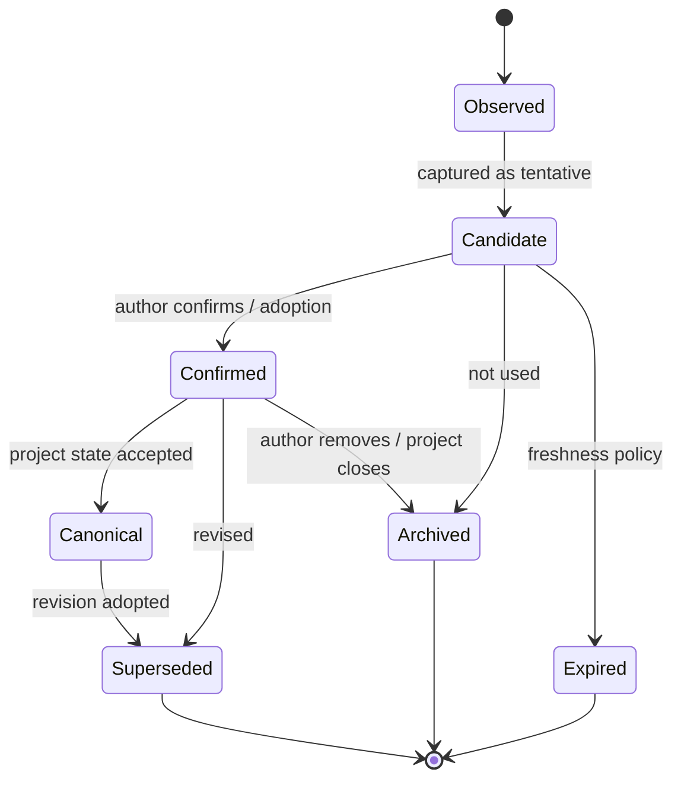

# Memory、Context 与 Trace 草案

> 状态：草案（2026-05-02）
>
> 角色：定义 v3 中 memory、DialogueContext、ContextPacket、DecisionTrace、BehaviorTrace、ToolTrace 与 replay 的职责边界、候选结构和不变量。本文是 ADR 前的 contract 草案，不直接冻结最终 schema。
>
> 相关文档：
>
> - `00-vision-and-engineering-roadmap.md` — v3 愿景与工程推进方式
> - `00b-end-to-end-dialogue-flow.md` — 一次 turn 的动态主链
> - `00d-runtime-architecture.md` — v3 运行时架构视图
> - `01-user-llm-workbench-interaction-model.md` — 用户、LLM、工作台交互模型
> - `02-dialogue-frame-and-micro-plan.md` — DialogueFrame / MicroPlan 协议草案
> - `03-capability-toolbox-contract.md` — Capability Toolbox 协议草案
> - `04-execution-orchestrator.md` — Execution Orchestrator 协议草案
> - `05-turn-behavior-and-state-model.md` — Turn Behavior 与状态模型草案
>
> 本文不做：
>
> - 不定义数据库表、migration 或索引细节
> - trace summary 的 UI 消费契约由 `07-workbench-ui-contract.md` 收束；前端面板视觉仍不在本文冻结
> - 不定义全局 contract 索引，留给 `00c-state-and-contract-atlas.md`
> - 不定义具体 embedding、向量检索或 provider 实现
> - 不要求 replay 重新调用 LLM

---

## 1. 定位

v3 中，memory、context、trace、replay 是四个不同概念。

```text
Memory = 系统可长期或中期引用的事实、偏好、作品状态、候选和历史摘要。
Context = 本轮给某个消费者使用的受控上下文包。
Trace = 本轮认知、建议、裁决、工具、行为和输出的结构化事实链。
Replay = 基于 trace 与版本引用重建“为什么发生”的能力。
```

它们位于 v3 主链的横切层：

```text
AuthorInput
→ DialogueContext assembly
→ Dialogue Planner
→ DialogueFrame
→ MicroPlan
→ Execution Orchestrator
→ ToolRequest / ToolResult
→ BehaviorState
→ TurnResult
→ DecisionTrace / Memory update / Replay
```

本文的目标不是“把所有信息都喂给 LLM”。

本文的目标是：

1. 让 Planner 拿到足够但不过量的上下文。
2. 让 Orchestrator 能审查 context provenance、权限、预算和状态快照。
3. 让 ToolRequest / ToolResult 可追踪。
4. 让 BehaviorState open / update / close 可回放。
5. 让 TurnResult 说出的每个执行事实都有 trace 支撑。
6. 让后续 UI 可以展示解释摘要，而不是暴露内部日志。

一句话：

```text
Context 让 LLM 看见该看的；
Trace 让系统解释已经做过的；
Replay 让工程能复盘为什么这样做；
Memory 让长期协作不会每轮失忆。
```

---

## 2. 为什么必须单独定义

没有独立的 memory/context/trace/replay 设计，v3 会出现三种失控：

| 失控方式 | 典型表现 | 后果 |
|---|---|---|
| Prompt dump | 把会话、作品、工具结果、数据库对象全塞进 prompt | 成本高、隐私不清、输出不稳定 |
| Log dump | 把 provider logs 当成 DecisionTrace | 无法解释系统裁决，无法验证状态采纳 |
| Memory drift | LLM 一句话就变成长期记忆 | 错误事实长期污染创作上下文 |

v3 的关键不是“记住更多”，而是“知道为什么记、给谁看、什么时候忘、怎么回放”。

设计原则：

1. Memory 需要 provenance，不是 prompt 片段。
2. Context 是按消费者和目的组装的，不是全局对象 dump。
3. Trace 是系统事实链，不是自然语言日志。
4. Replay 默认不重新调用 LLM。
5. UI 消费 trace 摘要，不直接消费原始内部 trace。
6. 写入 memory 必须经过 Orchestrator 或明确 adoption / confirmation 边界。

---

## 3. 四层模型

| 层 | 对象 | 主要问题 | 主要消费者 |
|---|---|---|---|
| Memory Layer | `MemoryItem`, `MemorySet` | 系统长期或中期应该记住什么 | Context assembler, Planner, tools |
| Context Layer | `DialogueContext`, `ContextPacket` | 本轮给谁看哪些上下文 | Planner, Orchestrator, tools |
| Trace Layer | `DecisionTrace`, `BehaviorTrace`, `ToolTrace` | 本轮做了什么、为什么做或不做 | Replay, audit, debug, UI summary |
| Replay Layer | `ReplayCase`, `ReplayView` | 如何不靠猜测重建决策链 | tests, debug, regression review |

关键分界：

```text
Memory 可以被未来 context 引用；
Context 是本轮输入快照；
Trace 是本轮发生事实；
Replay 是读取 trace 后的解释和校验能力。
```

---

## 4. Memory Layer

### 4.1 Memory 不是 prompt

MemoryItem 是带来源、作用域、置信、生命周期和权限的结构化对象。

它不是：

- 原始聊天记录的全文堆积。
- LLM 自己生成后自动永久保存的“事实”。
- 为了省事塞进下一轮 prompt 的字符串。
- UI 可以随意修改的本地状态。

它是：

- 可被 context assembler 引用的事实或摘要。
- 有 provenance 的作品状态、作者偏好或会话结论。
- 可过期、可替代、可撤销、可降权的对象。

### 4.2 Memory 分类

| 类型 | 含义 | 示例 | 写入边界 |
|---|---|---|---|
| `author_preference` | 作者长期偏好 | 喜欢慢热、偏现实主义 | 作者确认或多轮稳定信号 |
| `project_canon` | 已采纳的作品事实 | 主角姓名、世界观规则 | adoption / confirmation 后 |
| `session_summary` | 当前会话摘要 | 最近讨论了三个女主方向 | Orchestrator 采纳的摘要 |
| `candidate_memory` | tentative 候选 | 三个开局方向 | 工具或 Planner 生成，经 trace 记录 |
| `behavior_memory` | open / closed behavior 摘要 | 等待确认第二个方向 | BehaviorState lifecycle |
| `tool_observation` | 工具返回事实 | 检索、校验、预算估计 | ToolResult 集成后 |
| `system_capability` | 系统能力说明 | 当前可用工具、限制 | registry / config |
| `debug_memory` | debug / replay 辅助 | 失败原因、重试 lineage | trace / replay 工具 |

约束：

1. `project_canon` 必须来自 adoption / confirmation / explicit write。
2. `candidate_memory` 不能被当成 canon。
3. `author_preference` 不应由一次随口输入永久写入。
4. `debug_memory` 不能进入普通创作 prompt，除非明确 debug context。

### 4.3 MemoryItem envelope 草案

| 字段 | 必须 | 含义 |
|---|---|---|
| `memory_id` | 是 | MemoryItem 唯一标识 |
| `memory_type` | 是 | 类型，如 author_preference / project_canon |
| `scope` | 是 | author / project / session / workstream / system |
| `content_ref` | 是 | 内容引用或摘要引用 |
| `content_summary` | 是 | 可用于 context 组装的简短摘要 |
| `provenance_refs` | 是 | 来源 turn / frame / decision / behavior / tool |
| `confidence` | 是 | high / medium / low |
| `stability` | 是 | tentative / confirmed / canonical / archived |
| `sensitivity` | 是 | public / private / sensitive / debug_only |
| `write_policy` | 是 | 谁可以创建、更新、归档 |
| `read_policy` | 是 | 哪些消费者可以读取 |
| `freshness` | 是 | 是否新鲜、可能过期或被替代 |
| `supersedes_ref` | 否 | 替代的旧 memory |
| `expires_at` | 否 | 过期时间或策略引用 |
| `trace_ref` | 是 | 创建或更新它的 trace |
| `version` | 是 | memory contract 版本 |

### 4.4 Memory lifecycle



生命周期约束：

1. `Observed` 不能直接成为 `Canonical`。
2. `Candidate` 可以进入 context，但必须标记 tentative。
3. `Confirmed` 仍可能被后续 revision 替代。
4. `Canonical` 的撤销必须走 revision / compensation，而不是删除 trace。
5. 每次状态变化必须留下 MemoryTrace 或 DecisionTrace 引用。

---

## 5. Context Layer

### 5.1 DialogueContext

DialogueContext 是一次 turn 的上下文总包。

它面向本轮主链，回答：

```text
Planner、Orchestrator 和 tools 在这一轮分别应该看见什么；
这些上下文来自哪里；
哪些内容被省略了；
省略是否会影响执行安全；
这些上下文对应哪个版本和预算。
```

DialogueContext 不是全量数据库快照。

它是可审查、可回放、可裁剪的 context assembly 结果。

### 5.2 ContextPacket

ContextPacket 是给具体消费者的上下文子包。

| packet | 消费者 | 内容倾向 | 禁止 |
|---|---|---|---|
| `planner_context` | Dialogue Planner | 创作目标、近期对话、候选、open behavior、相关 memory | 全量权限细节、隐藏 policy |
| `orchestrator_context` | Execution Orchestrator | state snapshot、authority、budget、open behavior、trace lineage | 未标注 provenance 的 LLM 摘要 |
| `tool_context` | Capability tool | 工具所需最小输入、权限、预算、trace policy | 无关会话、敏感 memory |
| `ui_trace_context` | Workbench UI | 可展示解释摘要、trace refs、行为摘要 | provider raw logs、敏感内部 prompt |
| `replay_context` | Replay/debug | 结构化对象引用、版本、hash、omission reasons | 依赖实时 LLM 状态 |

### 5.3 DialogueContext envelope 草案

| 字段 | 必须 | 含义 |
|---|---|---|
| `context_id` | 是 | DialogueContext 唯一标识 |
| `turn_id` | 是 | 当前 turn |
| `author_session_ref` | 是 | 作者会话或工作区 |
| `workstream_ref` | 否 | 当前 pending path |
| `context_purpose` | 是 | plan / orchestrate / tool / replay / ui_summary |
| `packet_refs` | 是 | 子 ContextPacket 列表 |
| `included_memory_refs` | 是 | 被纳入的 MemoryItem |
| `included_artifact_refs` | 是 | 被纳入的作品、候选、产物引用 |
| `open_behavior_refs` | 是 | 当前 open BehaviorState |
| `recent_turn_refs` | 是 | 近期对话或摘要引用 |
| `state_snapshot_refs` | 是 | 需要审查的状态快照 |
| `authority_context_ref` | 是 | 权限上下文 |
| `budget_context_ref` | 是 | 成本与预算上下文 |
| `omission_notes` | 是 | 哪些内容被省略以及原因 |
| `assembly_policy_ref` | 是 | 使用的上下文组装策略版本 |
| `token_budget` | 是 | context token 或大小预算 |
| `sensitivity_summary` | 是 | 敏感信息摘要 |
| `trace_ref` | 是 | ContextTrace 引用 |
| `version` | 是 | context contract 版本 |

### 5.4 Context 组装策略

Context assembly 必须显式记录策略。

候选策略维度：

| 维度 | 说明 |
|---|---|
| relevance | 与当前 frame / workstream / target 的相关性 |
| recency | 最近对话、最近修改、最近候选 |
| authority | 消费者是否有权限读取 |
| stability | candidate / confirmed / canonical 是否需要区分 |
| sensitivity | 是否允许进入 LLM prompt 或 UI 摘要 |
| budget | token、成本、工具调用预算 |
| risk | 高风险写入时是否需要更多 provenance |
| omission | 被裁剪内容是否影响安全判断 |

约束：

1. Planner context 可以含创作素材，但不能把 tentative 伪装成 canonical。
2. Orchestrator context 必须足以审查 state、authority、budget 和 open behavior。
3. Tool context 必须最小化，只给工具完成任务所需内容。
4. UI trace context 必须可读，但不能泄露敏感内部 prompt。
5. Context assembly 失败必须进入 recovery 或 fail trace，不能继续假装上下文完整。

### 5.5 Context omission

被省略内容也需要记录。

`omission_notes` 不是为了保存全文，而是为了回答：

```text
哪些内容没有进入本轮 context；
为什么没有进入；
省略是否可能影响安全或输出质量；
如果需要恢复，应该如何重新组装。
```

常见原因：

| reason | 含义 |
|---|---|
| `irrelevant` | 与本轮目标无关 |
| `budget_limited` | 超出 token / 成本预算 |
| `sensitive` | 当前消费者无权读取 |
| `stale` | 已过期或被 superseded |
| `debug_only` | 只能用于 debug/replay |
| `requires_confirmation` | 需要作者确认后才可纳入 |

---

## 6. Trace Layer

Trace 是结构化事实链，不是日志文本。

它必须回答：

```text
系统看见了什么上下文；
Planner 如何理解；
MicroPlan 建议了什么；
Orchestrator 为什么允许、拒绝、降级、确认或恢复；
调用了哪些工具；
工具返回了什么；
哪些状态被采纳；
哪些 behavior 被打开或关闭；
TurnResult 为什么这样呈现。
```

### 6.1 Trace 类型

| 类型 | 记录对象 | 作用 |
|---|---|---|
| `InputTrace` | AuthorInput / UI event | 原始输入和入口信息 |
| `ContextTrace` | DialogueContext / ContextPacket | 上下文组装、包含和省略 |
| `FrameTrace` | DialogueFrame | Planner 的结构化理解 |
| `PlanTrace` | MicroPlan | Planner 的行动建议 |
| `GateTrace` | Orchestrator gates | slot / authority / policy / budget 等门禁 |
| `ToolTrace` | ToolRequest / ToolResult | 工具调用和结果 |
| `BehaviorTrace` | BehaviorState lifecycle | durable behavior open / update / close |
| `StateTrace` | state transition / adoption | 状态采纳、tentative、production |
| `MemoryTrace` | MemoryItem lifecycle | memory 创建、更新、归档、替代 |
| `TurnResultTrace` | TurnResult | 对外输出和可见状态 |
| `ReplayTrace` | replay attempt | 回放校验和差异 |

### 6.2 DecisionTrace envelope 草案

DecisionTrace 是一次 turn 的主 trace。

| 字段 | 必须 | 含义 |
|---|---|---|
| `trace_id` | 是 | 主 trace id |
| `turn_id` | 是 | 当前 turn |
| `trace_version` | 是 | trace contract 版本 |
| `input_trace_ref` | 是 | 输入 trace |
| `context_trace_refs` | 是 | context 组装 trace |
| `frame_trace_ref` | 是 | DialogueFrame trace |
| `plan_trace_ref` | 否 | MicroPlan trace |
| `gate_trace_refs` | 是 | Orchestrator gate trace |
| `tool_trace_refs` | 是 | ToolRequest / ToolResult trace |
| `behavior_trace_refs` | 是 | BehaviorState trace |
| `state_trace_refs` | 是 | state / adoption trace |
| `memory_trace_refs` | 是 | memory 更新 trace |
| `turn_result_trace_ref` | 是 | TurnResult trace |
| `reason_codes` | 是 | 机器可读原因码 |
| `author_visible_summary` | 否 | 可给 UI 展示的摘要 |
| `redaction_policy_ref` | 是 | 脱敏策略 |
| `replay_policy_ref` | 是 | replay 策略 |
| `lineage_refs` | 是 | 前序 trace / retry / idempotency 关系 |

约束：

1. 每个 turn 必须有 DecisionTrace。
2. DecisionTrace 必须能解释执行与不执行。
3. 原始 provider logs 不能替代 DecisionTrace。
4. author_visible_summary 不能泄露敏感内部信息。
5. trace id 必须可被 TurnResult 引用。

---

## 7. ContextTrace

ContextTrace 记录上下文组装。

候选字段：

| 字段 | 含义 |
|---|---|
| `context_trace_id` | ContextTrace 唯一标识 |
| `context_id` | DialogueContext |
| `consumer` | planner / orchestrator / tool / ui / replay |
| `assembly_policy_ref` | 使用的策略版本 |
| `included_refs` | 被纳入的 memory/artifact/turn/behavior refs |
| `omitted_refs_summary` | 被省略内容摘要 |
| `omission_reasons` | 省略原因 |
| `token_budget_used` | 使用预算 |
| `sensitivity_summary` | 敏感级别摘要 |
| `state_snapshot_refs` | 相关状态快照 |
| `hash_refs` | 用于 replay 的内容 hash 或版本引用 |

ContextTrace 必须能解释：

1. 为什么 Planner 看到了这些素材。
2. 为什么 Orchestrator 拥有足够信息审查。
3. 为什么某些 memory 没有进入 prompt。
4. 如果 replay 时 context 不一致，差异来自哪里。

---

## 8. BehaviorTrace

BehaviorTrace 承接 `05-turn-behavior-and-state-model.md`。

它记录 BehaviorState 的生命周期，不记录 UI 本地状态。

候选字段：

| 字段 | 含义 |
|---|---|
| `behavior_trace_id` | BehaviorTrace 唯一标识 |
| `behavior_ref` | BehaviorState |
| `event_type` | open / update / resolve / cancel / expire / supersede / fail |
| `event_turn_ref` | 触发事件的 turn |
| `decision_ref` | 触发事件的 OrchestratorDecision |
| `actor` | author / system / tool |
| `previous_status` | 变化前状态 |
| `next_status` | 变化后状态 |
| `target_ref` | 目标对象 |
| `resolution` | 解决方式 |
| `reason_codes` | 原因码 |

不变量：

1. author-blocking behavior open 必须有 BehaviorTrace。
2. confirmation answer 必须能追到 open confirmation。
3. cancellation 必须能追到被关闭对象。
4. recovery 必须说明 actor 与可恢复路径。
5. `completed` TurnResult 不得引用未关闭的 primary author-blocking behavior。

---

## 9. ToolTrace

ToolTrace 记录工具调用事实。

它不要求保存所有原始敏感内容，但必须保存足以解释和回放的引用、版本和摘要。

候选字段：

| 字段 | 含义 |
|---|---|
| `tool_trace_id` | ToolTrace 唯一标识 |
| `tool_request_ref` | ToolRequest |
| `tool_result_ref` | ToolResult |
| `tool_registry_version` | 工具 registry 版本 |
| `decision_ref` | 批准调用的 OrchestratorDecision |
| `input_summary` | 输入摘要或引用 |
| `output_summary` | 输出摘要或引用 |
| `input_hash_ref` | 输入 hash 或版本引用 |
| `output_hash_ref` | 输出 hash 或版本引用 |
| `write_scope` | 写入范围 |
| `budget_used` | 消耗预算 |
| `duration_ms` | 耗时 |
| `error_ref` | 错误引用 |
| `state_delta_refs` | 工具建议的状态变化 |
| `adopted_state_refs` | Orchestrator 采纳后的状态变化 |

约束：

1. ToolRequest 必须进入 ToolTrace。
2. ToolResult 必须进入 ToolTrace。
3. ToolResult 的 `state_delta` 不能直接成为 adopted state。
4. debug/replay 工具不能参与普通生产写入。
5. ToolTrace 必须关联 registry version，避免工具含义漂移。

---

## 10. StateTrace 与 MemoryTrace

### 10.1 StateTrace

StateTrace 记录状态变化。

| 状态变化 | 必须记录 |
|---|---|
| tentative artifact created | 来源 tool / plan / decision |
| candidate adopted | candidate、author action、confirmation |
| production state written | write scope、authority、decision |
| projection hint emitted | 被刷新对象、原因 |
| behavior state changed | BehaviorTrace ref |
| recovery path opened | failure reason、actor |

原则：

1. 写入生产状态必须有 StateTrace。
2. tentative 与 production 必须区分。
3. projection hint 不是 production write。
4. StateTrace 不直接暴露给 UI 主渲染。

### 10.2 MemoryTrace

MemoryTrace 记录 MemoryItem 生命周期。

| 事件 | 含义 |
|---|---|
| `memory_observed` | 观察到可记忆信息 |
| `memory_candidate_created` | 创建 tentative memory |
| `memory_confirmed` | 作者确认或 adoption |
| `memory_canonicalized` | 进入 project canon |
| `memory_superseded` | 被新 memory 替代 |
| `memory_archived` | 归档 |
| `memory_expired` | 过期 |

约束：

1. LLM 输出不能自动成为 canonical memory。
2. MemoryTrace 必须能连接来源 turn / decision / behavior。
3. 被 superseded 的 memory 不能消失，必须保留 lineage。
4. 敏感 memory 的 trace summary 必须可脱敏。

---

## 11. Replay Layer

Replay 的目标是解释和验证，而不是重新创作。

v3 默认 replay 不重新调用 LLM。

### 11.1 Replay 等级

| 等级 | 名称 | 是否调用 LLM | 目标 |
|---|---|---|---|
| L0 | Trace inspection | 否 | 查看结构化事实链 |
| L1 | Structural replay | 否 | 按 trace 重建主链顺序 |
| L2 | Gate replay | 否 | 用记录快照重跑纯门禁规则 |
| L3 | Context replay | 否 | 重组 context 并比较 hash / refs |
| L4 | Regeneration replay | 可选 | 在明确 debug 模式下重新生成 frame/plan |

默认产品能力只要求 L0-L2。

L4 只用于 debug / evaluation，不能作为业务事实来源。

### 11.2 ReplayCase envelope 草案

| 字段 | 必须 | 含义 |
|---|---|---|
| `replay_case_id` | 是 | replay case id |
| `trace_ref` | 是 | 被 replay 的 DecisionTrace |
| `replay_level` | 是 | L0 / L1 / L2 / L3 / L4 |
| `snapshot_refs` | 是 | 使用的状态快照 |
| `contract_versions` | 是 | frame / plan / tool / behavior / trace 版本 |
| `registry_versions` | 是 | tool registry / policy registry |
| `redaction_policy_ref` | 是 | replay 可见范围 |
| `expected_chain` | 是 | 期望结构链 |
| `actual_chain` | 否 | 实际 replay 结构链 |
| `diff_summary` | 否 | 差异摘要 |
| `result` | 是 | pass / mismatch / incomplete / blocked |

Replay 必须回答：

1. 本轮为什么进入或没有进入 MicroPlan。
2. 本轮为什么要求 clarification / confirmation / recovery。
3. 本轮工具调用是否由 Orchestrator 批准。
4. 工具结果是否被采纳。
5. TurnResult 是否宣称了真实发生的状态。

---

## 12. Redaction 与可见性

Trace 必须分层可见。

| 视图 | 可见内容 | 不可见内容 |
|---|---|---|
| `author_summary` | 简短原因、可操作状态、确认范围 | provider raw prompt、敏感内部策略 |
| `developer_debug` | 结构化 refs、gate result、tool summary | 未授权敏感内容全文 |
| `audit` | 完整决策链、版本、权限、预算摘要 | 不必要的原始创作内容全文 |
| `replay` | 快照 refs、hash、版本、状态链 | 当前实时数据库替代历史快照 |

原则：

1. UI 可以展示 trace 摘要，但不能把 trace 当主渲染数据源。
2. 敏感 memory 不应进入 author_visible_summary。
3. Provider logs 与 DecisionTrace 分层保存和展示。
4. Debug 视图不能改变 production state。

---

## 13. 与 TurnResult 的关系

TurnResult 是外部 canonical 输出。

Trace 是解释 TurnResult 的依据，不替代 TurnResult。

TurnResult 应引用：

| 字段 | 含义 |
|---|---|
| `trace_ref` | 主 DecisionTrace |
| `context_trace_refs` | 本轮上下文摘要引用 |
| `behavior_trace_refs` | active / closed behavior trace |
| `tool_trace_refs` | 需要 UI 解释的工具 trace |
| `memory_trace_refs` | 本轮记忆变化摘要 |
| `author_visible_trace_summary` | 可展示解释摘要 |

约束：

1. TurnResult 不能引用不存在或未完成的 trace。
2. TurnResult 的 `assistant_message` 不能宣称 trace 中未发生的动作。
3. UI cards 的状态必须和 BehaviorTrace / StateTrace 一致。
4. projection hints 必须能追到 StateTrace。

---

## 14. 错误与恢复

Context / trace / replay 自身也会失败。

| 场景 | 处理 |
|---|---|
| Context assembly 失败 | `fail_with_recovery` 或降级为安全对话 |
| 关键 memory 缺失 | 打开 recovery 或 clarification，不假装知道 |
| trace writer 失败 | 写入动作必须阻断或进入安全降级 |
| non-critical trace summary 失败 | 主流程可继续，但必须记录可发现错误 |
| replay snapshot 缺失 | replay result = incomplete |
| trace redaction 失败 | 不展示 trace summary |
| memory canonicalization 冲突 | 进入 correction / confirmation / recovery |

关键规则：

1. 生产写入不能在关键 trace 缺失时继续。
2. 作者可见回复可以在非关键 trace summary 失败时降级。
3. replay incomplete 不能被报告成 pass。
4. context 不完整不能被静默吞掉。

---

## 15. 示例

### 15.1 探索上下文

作者输入：

```text
我想写一个偏冷感的女主，但还没想好背景。
```

ContextPacket：

```text
consumer = planner
included_memory_refs = [author_preference_recent_style]
included_artifact_refs = []
open_behavior_refs = []
omission_notes = [project_canon omitted because no active project]
```

DecisionTrace：

```text
frame_type = exploration
decision_type = reply_only
behavior_trace_refs = []
turn_status = conversational
```

关键点：没有 blocking path，不打开 clarification；trace 仍记录为什么只是自然引导。

### 15.2 confirmation replay

作者要求采用候选设定：

```text
采用第二个方向。
```

Trace chain：

```text
InputTrace
→ ContextTrace(candidate_direction_2, project_state_snapshot)
→ FrameTrace(execution_candidate)
→ PlanTrace(adopt_candidate_to_project_setting)
→ GateTrace(write_scope requires confirmation)
→ BehaviorTrace(open confirmation)
→ TurnResultTrace(needs_confirmation)
```

Replay 应能回答：

```text
为什么没有立即写入？
因为 GateTrace 中 adoption/write_scope 触发 confirmation policy。
```

### 15.3 ToolResult 不等于 adopted state

工具生成候选：

```text
ToolTrace(output_summary = three candidate openings)
StateTrace(tentative_artifact created)
MemoryTrace(candidate_memory_created)
TurnResultTrace(candidate_presented)
```

关键点：候选进入 memory，但 stability = tentative；不能在后续 context 中当成 project canon。

### 15.4 recovery trace

工具超时：

```text
ToolTrace(error_ref = timeout)
GateTrace(retry allowed within budget)
BehaviorTrace(open recovery)
TurnResultTrace(failed_recoverable, next_action=retry_action)
```

Replay 应能回答：

```text
为什么 UI 显示可重试？
因为 GateTrace 判断预算仍允许一次 retry，BehaviorTrace 打开 recovery。
```

---

## 16. 与 umbrella 边界的关系

本文不冻结模块归属，但给出边界约束。

| 责任 | 倾向位置 | 原因 |
|---|---|---|
| MemoryItem / ContextPacket / Trace envelope 纯结构 | v3 schema / foundation 纯结构 | 无 I/O，可跨层引用 |
| Context assembly use case | `novel_application` | 需要协调 domain、persistence、agent 输入 |
| Memory write decision | `novel_application` + domain 纯规则 | 需要结合 adoption / confirmation |
| ToolTrace runtime capture | `novel_agent` + application 边界 | 工具执行在 agent，采纳在 application |
| Trace persistence | `novel_persistence` 经 repository port | 只保存事实，不决定业务语义 |
| Replay / debug read model | application 或 debug tooling | 读取 trace，不写 production |
| UI trace summary | `novel_web` / frontend | 只消费 TurnResult 和可见摘要 |

禁止方向：

1. `novel_web` 直接写 MemoryItem 或 DecisionTrace。
2. `novel_agent` 把 ToolResult state_delta 直接写成 memory canon。
3. `novel_persistence` 根据 trace 字段反向决定业务裁决。
4. `novel_foundation` 引入 Repo、GenServer 或业务编排。
5. Context assembler 直接读取全量数据库拼 prompt。

最终归属仍必须由承重垂直切面证明。

---

## 17. 后续测试与证明方向

本文仍是设计阶段，不进入代码实现。

后续进入 slice 前，至少需要把以下 proof 写入 slice 设计：

| Proof | 证明什么 |
|---|---|
| context minimality test | Planner context 不包含无关或敏感对象 |
| context provenance test | 每个 context ref 都能追到来源 |
| omission trace test | 被省略内容有 reason |
| memory stability test | candidate memory 不能当成 canonical |
| memory canonicalization test | project canon 必须来自 adoption / confirmation |
| decision trace chain test | frame / plan / decision / tool / behavior / TurnResult 可串起 |
| tool trace adoption test | ToolResult state_delta 不能直接变 adopted state |
| behavior replay test | BehaviorState open / update / close 可回放 |
| replay no LLM test | 默认 replay 不调用 LLM |
| redaction test | author summary 不泄露内部 prompt 或敏感 memory |
| trace writer gate test | 关键 trace 缺失时阻断生产写入 |

---

## 18. 不变量

Memory、Context、Trace 与 Replay 必须保护以下不变量：

1. Context 不是全量数据库 dump。
2. Memory 不是 prompt 文本堆积。
3. Candidate memory 不能被当成 project canon。
4. Canonical memory 必须来自 adoption、confirmation 或明确采纳。
5. 每个 DialogueContext 必须有 ContextTrace。
6. 每个 turn 必须有 DecisionTrace。
7. 每个 ToolRequest / ToolResult 必须进入 ToolTrace。
8. BehaviorState open / update / close 必须进入 BehaviorTrace。
9. Production write 必须有 StateTrace。
10. TurnResult 不能宣称 trace 中未发生的事实。
11. Replay 默认不重新调用 LLM。
12. Trace summary 必须经过 redaction policy。
13. Provider logs 不能替代 DecisionTrace。
14. Trace failure 不能在关键写入路径中被静默忽略。
15. Debug / replay 工具不能写 production state。

---

## 19. 反模式

v3 禁止以下设计和实现方向：

1. 把 DialogueContext 做成全量数据库 dump。
2. 把 memory 做成“下一轮 prompt 追加文本”。
3. LLM 输出自动写成长期记忆。
4. candidate 与 canon 不区分。
5. 只保存 provider raw logs，不保存 DecisionTrace。
6. ToolResult 直接变成 adopted state 或 canonical memory。
7. trace 只记录成功路径，不记录拒绝、降级、等待和恢复。
8. replay 默认重新调用 LLM。
9. UI 直接读取内部 trace 作为主渲染数据。
10. trace redaction 失败时仍展示 debug 信息。
11. 关键 trace 写入失败后继续 production write。
12. Context assembly 省略内容但不记录 reason。

---

## 20. 后续 ADR 候选

本文建议后续拆出以下 ADR：

| ADR | 冻结内容 |
|---|---|
| MemoryItem v3 | memory 类型、稳定性、provenance、读写策略 |
| DialogueContext v3 | context envelope、packet、组装策略和 omission |
| DecisionTrace v3 | trace envelope、trace 类型、reason code |
| BehaviorTrace v3 | BehaviorState lifecycle trace |
| ToolTrace v3 | ToolRequest / ToolResult trace 和 registry version |
| Replay v3 | replay 等级、默认不调用 LLM、差异报告 |
| Trace Redaction v3 | author / developer / audit / replay 可见性 |

ADR 前置材料已经具备：

1. `00c-state-and-contract-atlas.md`

原因是 `07-workbench-ui-contract.md` 已经承接 trace 摘要如何给 UI 消费，`00c-state-and-contract-atlas.md` 已经完成 memory/context/trace 进入全局 contract 索引和 ADR backlog 的汇总。

---

## 21. 下一步

本文完成后，v3 已具备：

- `02`：DialogueFrame / MicroPlan 协议草案。
- `03`：Capability Toolbox 协议草案。
- `04`：Execution Orchestrator 执行裁决边界。
- `05`：Turn Behavior 与 phase/status/next_action 草案。
- `06`：Memory、Context、Trace 与 Replay 草案。
- `07`：Workbench UI 消费契约草案。
- `00c`：状态、contract、ADR 候选和 slice 入口总索引。

下一步建议写：

```text
docs/design-v3/adr/ADR-0002-micro-plan-v3.md
```

原因：

- `02` 到 `06` 已经定义系统内部如何理解、建议、裁决、等待、记录和回放。
- `07` 已经定义 Workbench UI 如何消费 TurnResult、BehaviorState、available actions、trace summary 和 projection hints。
- `00c` 已经把 memory/context/trace 与其他 contract、ADR 候选、slice 入口统一索引。
- `adr/README.md` 已经建立 v3 ADR 编号、状态、模板和首批 Proposed ADR 顺序。
- `ADR-0001` 已经将 trace/replay 需要引用的 frame 语义升级为 Proposed 决策。
- 下一步需要写 `ADR-0002-micro-plan-v3.md`，冻结 trace/replay 需要连接的 plan 语义。

在 Batch A 前 3 条 ADR 至少进入 Proposed 并完成评审之前，不建议创建 implementation plan。
