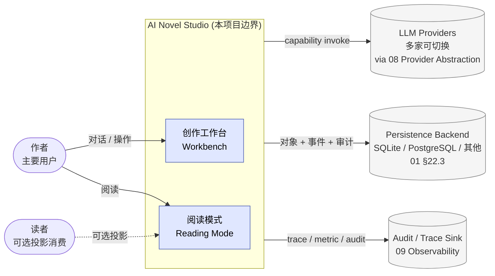
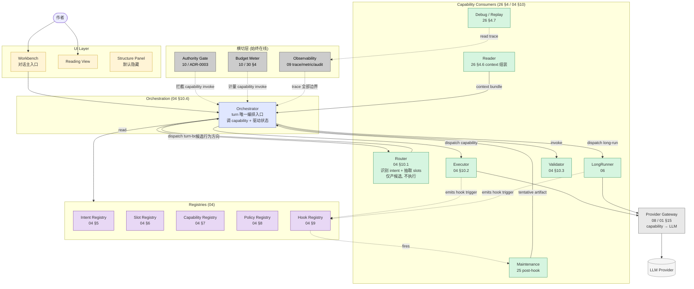
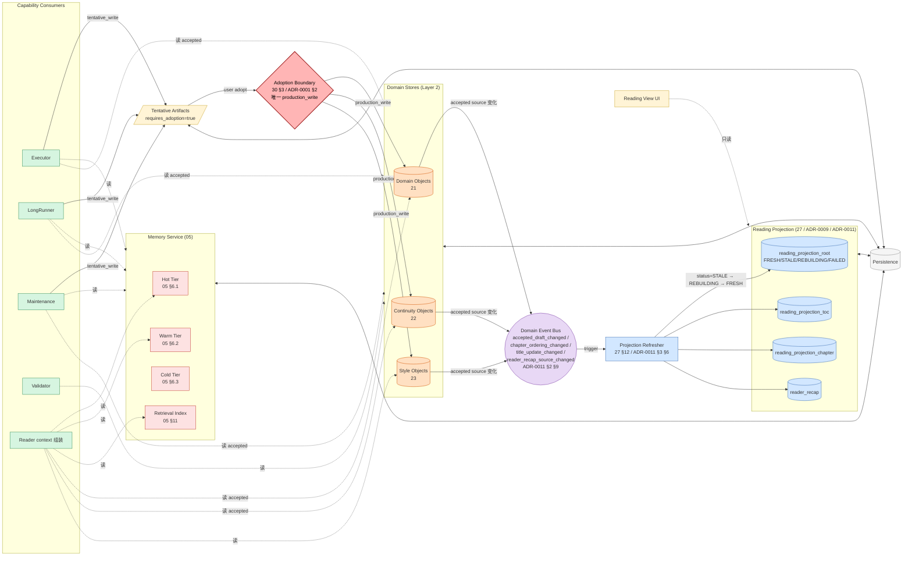
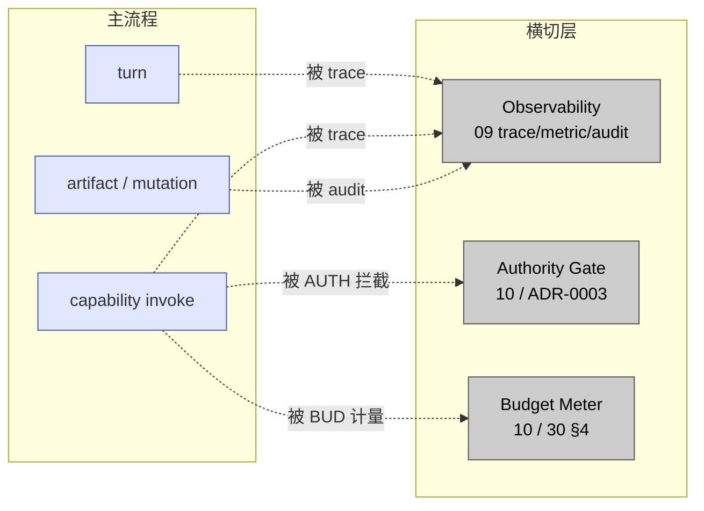
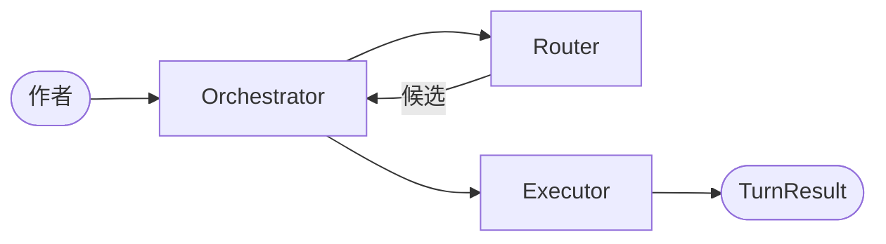
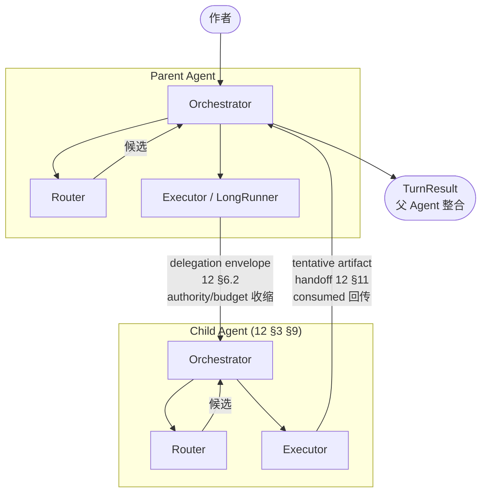

# 完整架构图

> 状态：**部分 superseded** · v3 体系领域层（横切/历史参照）。归 v3 治理、服从 v3 原则（见 `docs/design/README.md`「整合原则」）；标题/历史中的 v2 仅为来源标记。
>
> ⚠️ v3 supersession：本文含 **Router-first 架构**（Router 作为 turn 站做 intent 识别 + slot 抽取，见 §lines 88/152/281/325/397/413/422/503）。该部分已被 v3 废弃——当前架构以 `00d-runtime-architecture.md`、`04-execution-orchestrator.md`、`01-user-llm-workbench-interaction-model.md`、`00`§5.2 为准（Dialogue Planner + Execution Orchestrator，无 Router turn 站，意图用 AI 非关键字）。本文 Router 相关结构**不再作为当前架构**，仅供历史与横切（umbrella 依赖、门禁顺序等仍有效部分）参照；逐条 superseded 标注见整合台账 Step B。
>
> 角色：把项目的运行时形态讲清楚——系统在用户、外部依赖、内部容器（控制面 / 数据面）、横切关注、多 Agent 5 个视角下分别长什么样。
>
> 与已有图的分工：
>
> - `00a-system-landscape.md` 回答"有哪些模块、哪些冻结了"（**静态文档地图**）
> - `00b-end-to-end-flow.md` 回答"数据怎么流"（**动态数据流**）
> - `00d-state-machine-atlas.md` 回答"对象生命周期"（**控制态**）
> - **本文** 回答"运行时由哪些容器组成、它们怎么连、外部边界在哪"（**部署与组件**）
>
> 本文不发明组件名。所有 box 都来自 00 / 01 / 04 / 05 / 12 / 25 / 26 / 30 已有定义。

---

## 1. View 1：Context 视图（系统与外部）

**关键点：**

1. 系统对外只有 4 类边界：作者、（可选）读者、LLM、持久化 / 审计后端。
2. LLM 永远在 Provider Abstraction 之后（01 §15.2）；Domain 永远不见 provider。
3. 持久化后端可替换，持久化语义不可替换（01 §22.3）。

---

## 2. View 2：Runtime 视图（拆 控制面 / 数据面 两张）

主图分两张以避免拥挤：

- **2A 控制面**：谁调谁、谁 dispatch、谁 hook 谁
- **2B 数据面**：谁读什么、谁写什么、写完谁负责刷新

### 2A 控制面（调用 + 编排 + 横切）

**控制面要点：**

1. **Orchestrator 是唯一编排入口**。Router 只产出"候选行为方向"，由 Orchestrator 决定下一步调谁（04 §10.1 / §10.4）。
2. **Maintenance 是 post-hook**，由 Hook Registry 在 Executor / LongRunner 完成后触发，不被 Executor 直接调用（25 §7 Trigger Contract）。
3. **Reader 在控制面是 context 组装方**，UI 不调用 Reader；UI 直接读 Reading Projection（数据面 §2B）。
4. **Authority / Budget / Observability 三个横切**，覆盖 EXEC / LR / VAL / MAINT 以及子 Agent 的所有 capability invoke。图中横切箭头收敛到 ORC 表示拦截 ORC 发起的 capability dispatch；不画 5 条独立边以保持图清晰。
5. **Provider Gateway 是基础设施 sublayer**，不是横切（只有调 LLM 的 capability 才走它）。

### 2B 数据面（读写 + adoption + projection 刷新）

**数据面要点：**

1. **Adoption Boundary 是唯一 `production_write` 路径**（30 §3 / 30 §5.3 / 01 §8.4）。EXEC / LR / MAINT 只能写 `TENTATIVE`。
2. **Reading View 直接读 Reading Projection**，不经 Reader Consumer。Reader Consumer 是给 Foundation 内部 LLM context 组装用的（26 §4.6），与 UI Reading View 不是同一个 box。
3. **Domain Event Bus 是 projection refresh 的驱动源**：accepted source 变化必须 emit 事件（ADR-0011 §9），由 Projection Refresher 监听并刷新对应 projection。
4. **Projection Refresher 是 4 态状态机的 owner**（FRESH/STALE/REBUILDING/FAILED 见 ADR-0011 §1 §3）。
5. **Validator 是 propose_only**（04 §10.3）：可以读对象、产 validation_envelope，不写任何对象。
6. **图约定**：连向 `Memory` / `Stores` / `Proj` 子图框的虚线代表"读取该子图内任意节点"，避免画出 20+ 条独立读边。具体每个 Consumer 读哪些 tier / store 见 §4 读写矩阵。

---

## 3. 组件锚定表

### 3A Runtime 组件（实际跑起来的容器）

| Runtime 组件 | 主文档 | 关键 ADR | 关键 §引用 |
|---|---|---|---|
| Orchestrator | 04 / 01 | 0001 | 04 §10.4 / 01 §8.2 |
| Router | 04 / 26 | 0008 / 0010 | 04 §10.1 / 26 §4.1 §7 |
| Executor | 04 / 26 | 0001 / 0002 | 04 §10.2 / 26 §4.2 §8 |
| LongRunner | 06 / 26 | 0002 | 06 §6-§8 / 26 §4.3 §9 |
| Validator | 04 / 26 | — | 04 §10.3 / 26 §4.4 §10 |
| Maintenance | 25 / 26 | 0007 | 25 §6 §7 §11 / 26 §4.5 §11 |
| Reader（Consumer）| 26 | 0009 / 0011 | 26 §4.6 §12 |
| Debug / Replay | 26 / 09 | — | 26 §4.7 §13 |
| Intent Registry | 04 | 0008 / 0010 | 04 §5 |
| Slot Registry | 04 | 0010 | 04 §6 |
| Capability Registry | 04 | — | 04 §7 |
| Policy Registry | 04 | 0003 | 04 §8 |
| Hook Registry | 04 / 25 | 0007 | 04 §9 / 25 §7 |
| Memory Hot/Warm/Cold | 05 | — | 05 §6 |
| Retrieval Index | 05 | — | 05 §11 |
| Domain Objects | 21 / 30 | 0004 | 21 / 30 §8.1 |
| Continuity Objects | 22 / 30 | — | 22 / 30 §8 |
| Style Objects | 23 / 30 | — | 23 / 30 §8.2 |
| Reading Projection | 27 / 30 | 0009 / 0011 | 27 §13 / 30 §8.3 |
| Projection Refresher | 27 / ADR-0011 | 0011 | 27 §12 / ADR-0011 §3 §6 |
| Domain Event Bus | ADR-0011 / 27 | 0011 | ADR-0011 §9 / 27 §21.1 |
| Observability | 09 | — | 09 / 01 §16 |
| Authority Gate | 10 | 0003 | 10 / 30 §5 / 12 §7 |
| Budget Meter | 10 | 0003 | 10 / 30 §4 / 12 §8 |
| Provider Gateway | 08 | — | 08 / 01 §15 |

### 3B 协议 / 边界（不是 runtime 容器，是约束）

| 协议 / 边界 | 主文档 | 关键 ADR | 落点 |
|---|---|---|---|
| Adoption Boundary | 30 §3 / 01 | 0001 / 0007 | 数据面唯一 production_write 通道 |
| Card Protocol | 11 §6 | 0006 | TurnResult.ui_cards[] schema |
| Behavior Protocol | 03 / 30 §6 | 0005 | TurnResult.behavior_state schema |
| Multi-Agent Envelope | 12 §6 | — | 子 Agent 间通信 schema |
| Authority Scope | 30 §5 | 0003 | capability invoke 前判定 |
| Revision / source_revision_refs | 30 §2 | — | 跨对象一致性纪律 |

---

## 4. 读写矩阵（每个 Consumer 的副作用边界）

来源：26 §4-§13 + 01 §8.4 + 30 §5.3 write_scope。

| Consumer | 读什么 | 写什么 | write_scope | 触发 projection 刷新？ |
|---|---|---|---|---|
| Router | turn input + 轻量 intent 历史 | 路由决策（trace） | `read_only` | ❌ |
| Executor | 结构对象 + accepted draft + style + RAG 片段 | tentative artifact | `tentative_write` | 间接（adoption 后） |
| LongRunner | checkpoint summary + unit window + accepted source | tentative artifact + checkpoint | `tentative_write` | 间接（adoption 后） |
| Validator | 目标对象 + 规则 + 上下游 continuity | validation_envelope（+ quality_finding 草案）| `propose_only` | ❌ |
| Maintenance | source-heavy（drafts + continuity）| maintenance artifact（默认 tentative）| `tentative_write` | 间接（adoption 后） |
| Reader（Consumer）| Hot/Warm/Cold + accepted Domain/Continuity/Style | — | `read_only` | ❌ |
| Debug / Replay | trace + 原始 input | — | `read_only` | ❌ |
| **Adoption Boundary** | tentative artifact + revision base | accepted state + revision bump + emit 事件 | `production_write` | ✅ 直接触发（经 Domain Event Bus） |
| **Projection Refresher** | accepted Domain/Continuity/Style | reading_projection_root/toc/chapter/recap + status | `production_write`（仅限 projection 域） | ✅ 自身就是刷新者 |
| UI Reading View | reading_projection_*（accepted only） | — | `read_only` | ❌（消费方） |

关键不变量（从 01 §8 / 30 §3 继承）：

1. **只有 Adoption Boundary 与 Projection Refresher 拥有 `production_write`**。Adoption Boundary 写 Domain/Continuity/Style；Projection Refresher 只在 projection 域内写。
2. **任何 Consumer 都不能跳过 Adoption Boundary 直接写 Domain Stores**。
3. **Validator 的 propose_only**：可以发现质量问题，但不能自行修改对象，决定权回到作者。
4. **多 Agent 子 Agent 默认 `tentative_write`**（12 §12.1），不能因为是子 Agent 就拿到 production_write。
5. **UI Reading View 只读 Reading Projection**，不直接读 Domain Stores（避免绕过 accepted 边界）。

---

## 5. 横切层（始终在线）

横切层精确定义为"任何 capability invoke 都必须穿过"的 3 个组件。Provider Gateway 不在此列（它是基础设施 sublayer，只有调 LLM 的 capability 才走）。

| 横切组件 | 介入位置 | 失败时行为 |
|---|---|---|
| Observability | 每个 turn / capability / artifact 边界 | 不阻塞主流程，但失败要可发现 |
| Authority Gate | 每次 capability invoke 前 | 阻塞，触发 escalation（ADR-0003） |
| Budget Meter | capability invoke 前 + 中 + 后 | 超阈进入 confirmation 或 checkpoint |

Provider Gateway（08）是基础设施 sublayer，位置在控制面 §2A，不是横切。

---

## 6. 多 Agent 拓扑（默认单，可选多）

来源：12-multi-agent-composition.md。

### 6.1 默认单 Agent

绝大多数场景，特别是 v2 早期，运行时只有一个 Agent。这是必须支持的最小拓扑（12 §2.4：多 Agent 必须能退化为单 Agent）。

### 6.2 父子 Agent 委派（每个 Agent 内部都有完整 turn loop）

**约束（12 §7-§12）：**

1. 子 Agent 默认 `tentative_write`，不能直写权威状态（12 §12.1）。
2. authority / budget 一律"父 → 子"收缩，子不得自提权（§7.3）。
3. consumed budget 必须回传父 Agent（§8.3）。
4. 子 Agent 完成不等于 delegation 完成（§10.3）；父 Agent 仍要 adoption / 整合。
5. handoff 必须保留来源 agent_ref（§11.4）。
6. long-run 中的子 Agent 结果默认回到 checkpoint 语义（§14.3）。

---

## 7. 边界与不变量（架构层硬约束）

来源：01 §8 全局不变量。这些约束在任何视图下都成立。

| # | 不变量 | 落点 |
|---|---|---|
| 1 | 单一 canonical result：所有 turn 输出走 ADR-0001 schema | 控制面 Orchestrator → Out |
| 2 | Orchestrator 是 turn 的唯一编排入口 | 控制面 §2A |
| 3 | Foundation 不创作业务内容 | Provider Gateway 之外无 LLM 调用 |
| 4 | 结构化写入必须可追溯（revision + source_revision_refs） | 数据面 Adoption Boundary |
| 5 | 状态迁移必须显式 | 数据面 Domain Event Bus |
| 6 | 高风险动作必须可确认 | 横切 Authority Gate + behavior=confirmation |
| 7 | UI 不能发明语义（只投影 contract） | 控制面 UI Layer |
| 8 | Domain 只能扩展，不得改写 Foundation | §3 ADR 锁定 |

---

## 8. 部署形态建议（非冻结）

> ⚠ 本节不是 contract。Foundation 持久化后端可替换（01 §22.3），但持久化语义不可改。
> 以下是 v2 早期合理的实现取向，仅供工程参考，不阻塞 contract 演化。

| 阶段 | 形态建议 | 理由 |
|---|---|---|
| v2 alpha（单作者本机） | 单进程 + SQLite + 本地文件 + 单 LLM provider | 最小化部署，所有横切层就地启用 |
| v2 beta（多作者） | 单服务 + PostgreSQL + 对象存储 + 多 provider 切换 | 持久化后端切换不影响 contract |
| 多 Agent 启用 | 无论同进程还是跨进程，agent 间通信一律走 12 §6 envelope | 同一协议保证可退化为单 Agent（12 §2.4） |
| 长跑跨机 | LongRunner 拆分为独立进程 + checkpoint 持久化在 DB | 06 §8 checkpoint 必含 task_ref，可跨进程恢复 |

---

## 9. 与已有图的关系（导览）

| 你想看 | 看哪张图 |
|---|---|
| 模块清单 + 冻结状态 | `00a-system-landscape.md` |
| 用户输入到产出的数据流 | `00b-end-to-end-flow.md` |
| 谁该读哪些文档 | `00c-reading-map.md` |
| adoption / projection / long-run 状态机详图 | `00d-state-machine-atlas.md` |
| **运行时容器与组件接线** | **本文 00e** |
| 一个具体 prompt 走完全链路 | `examples/end-to-end-trace-001.md` |
| Foundation 12 子系统逐项规约 | `00-overview.md` §4 + `01-agent-foundation-contract.md` |
| Domain 8 模块逐项规约 | `00-overview.md` §5 + `20`-`28` |
| 多 Agent 详细 contract | `12-multi-agent-composition.md` |
| 上下文组装详细策略 | `26-context-assembly-policy.md` |

---

## 10. 反模式（架构层禁止的事）

1. ❌ 在 Domain 直接调用 LLM provider（必须经 08 Provider Gateway）
2. ❌ 在 UI 直接读 Domain Stores（必须经 Reading Projection 或 TurnResult）
3. ❌ 跳过 Adoption Boundary 让 Executor / LongRunner / Maintenance 直接写 production_write
4. ❌ 子 Agent 持有 `production_write` write_scope（除非显式特批，且不绕一致性检查 12 §12.4）
5. ❌ 让 Reading View 触发 projection refresh（refresh 由 Domain Event Bus 驱动，UI 是消费方）
6. ❌ 让 Validator 自行修改对象（propose_only，决定权在作者）
7. ❌ 横切层（observability / authority / budget）下沉到具体 capability 内部实现（必须横切，不能耦合）
8. ❌ Router 直接调 Executor（必须由 Orchestrator dispatch；Router 只产候选行为方向）
9. ❌ Executor / LongRunner 直接调 Maintenance（Maintenance 是 Hook Registry 触发的 post-hook）
10. ❌ Workbench 与 Reading Mode 共用同一个 capability 入口而不区分 read_only vs tentative_write 上下文
