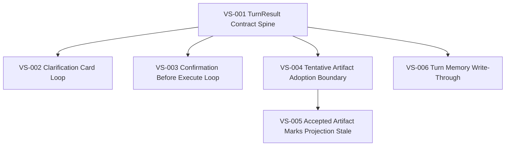

# 承重竖切面 DAG

> 状态：试行
>
> 角色：记录当前 slice 之间的依赖关系，并把 DAG 转换成线性执行批次。

---

## 1. 当前 DAG

---

## 2. 线性批次

| Batch | Slice | 目标 | 状态 |
|---|---|---|---|
| B1 | VS-001 | 固化 TurnResult 合同出口 | todo |
| B2 | VS-006 | 固化 turn memory write-through | todo |
| B3 | VS-002 | 固化 clarification card loop | todo |
| B4 | VS-003 | 固化 confirmation before execute loop | todo |
| B5 | VS-004 | 固化 tentative artifact adoption boundary | todo |
| B6 | VS-005 | 固化 accepted artifact marks projection stale | todo |

说明：

- VS-006 与 VS-002/VS-003/VS-004 都依赖 VS-001，但执行上先做 VS-006，因为 memory write-through 已有代码基础，适合作为第二个试行 slice 验证规则。
- VS-005 必须晚于 VS-004，因为 projection stale 依赖 accepted artifact 边界成立。

---

## 3. 节点元数据

| Slice | Type | Depends on | Blocks | Contract focus |
|---|---|---|---|---|
| VS-001 | Turn Slice | — | VS-002, VS-003, VS-004, VS-006 | `turn_result_v2` |
| VS-002 | Behavior Slice | VS-001 | — | clarification phase/status + card/action |
| VS-003 | Behavior Slice | VS-001 | — | confirmation phase/status + authority |
| VS-004 | Artifact Slice | VS-001 | VS-005 | adoption lifecycle |
| VS-005 | Projection Slice | VS-004 | — | projection stale + `source_revision_refs` |
| VS-006 | Memory Slice | VS-001 | — | memory write-through |

---

## 4. DAG 维护规则

新增 slice 必须说明：

- `depends_on`: 依赖哪些已完成或正在施工的 contract / invariant
- `blocks`: 会阻塞哪些后续 slice
- `batch`: 建议进入哪个线性批次
- `contract focus`: 主要承重契约

禁止用 DAG 节点表示横向技术任务，例如“建表”“写 API”“做 UI 页面”。

如果 DAG 出现环，说明任务边界切错，需要重新切 slice，而不是强行执行。

