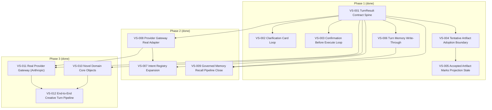

# 承重竖切面 DAG

> 状态：Phase 1 done，Phase 2 done，Phase 3 done
>
> 角色：记录当前 slice 之间的依赖关系，并把 DAG 转换成线性执行批次。

---

## 1. 当前 DAG

---

## 2. 线性批次

| Batch | Slice | 目标 | 状态 |
|---|---|---|---|
| B1 | VS-001 | 固化 TurnResult 合同出口 | done |
| B2 | VS-006 | 固化 turn memory write-through | done |
| B3 | VS-002 | 固化 clarification card loop | done |
| B4 | VS-003 | 固化 confirmation before execute loop | done |
| B5 | VS-004 | 固化 tentative artifact adoption boundary | done |
| B6 | VS-005 | 固化 accepted artifact marks projection stale | done |
| B7 | VS-009 | 收束 Governed Memory Recall Pipeline | done |
| B8 | VS-008 | 实现真实 Provider Gateway (LM Studio) | done |
| B9 | VS-007 | 注册第一批核心 intent + Router LLM 升级 | done |
| B10 | VS-010 | 落地 Novel Domain 核心对象模型 | done |
| B11 | VS-011 | 接入 Anthropic API 真实 Provider | done |
| B12 | VS-012 | 端到端创作对话链路打通 | done |

说明：

- VS-008 与 VS-009 无相互依赖，可并行（B7/B8 顺序可互换）。
- VS-007 必须排在 B8 之后：Router LLM 升级依赖 Provider Gateway 已就位。
- VS-009 有未提交代码基础（26 files, +411/-180），收束优先级高于从零建设的 VS-008。
- **Phase 3**：VS-010 与 VS-011 无相互依赖（VS-010 在 domain，VS-011 在 agent），可并行（B10/B11）。
- VS-012 必须排在 B10+B11 之后：端到端链路依赖领域对象 + 真实 Provider 都就位。

---

## 3. 节点元数据

| Slice | Type | Depends on | Blocks | Contract focus |
|---|---|---|---|---|
| VS-001 | Turn Slice | — | VS-002, VS-003, VS-004, VS-006, VS-008 | `turn_result_v2` |
| VS-002 | Behavior Slice | VS-001 | — | clarification phase/status + card/action |
| VS-003 | Behavior Slice | VS-001 | — | confirmation phase/status + authority |
| VS-004 | Artifact Slice | VS-001 | VS-005 | adoption lifecycle |
| VS-005 | Projection Slice | VS-004 | — | projection stale + `source_revision_refs` |
| VS-006 | Memory Slice | VS-001 | VS-009 | memory write-through |
| VS-007 | Turn Slice | VS-001, VS-008 | — | intent registry + Router LLM 升级 |
| VS-008 | Turn Slice | VS-001 | VS-007 | Provider Gateway + Anthropic adapter |
| VS-009 | Memory Slice | VS-001, VS-006 | — | governed memory recall pipeline 收束 |
| VS-010 | Artifact Slice | VS-001 | VS-012 | novel domain 核心对象（Volume/Chapter/Scene/Draft/Character） |
| VS-011 | Turn Slice | VS-001, VS-008 | VS-012 | Anthropic API adapter + Gateway 升级 |
| VS-012 | Turn Slice | VS-010, VS-011 | — | WorkspaceChat → LLM → Draft Card → Adopt → ReadingMode 全链路 |

---

## 4. DAG 维护规则

新增 slice 必须说明：

- `depends_on`: 依赖哪些已完成或正在施工的 contract / invariant
- `blocks`: 会阻塞哪些后续 slice
- `batch`: 建议进入哪个线性批次
- `contract focus`: 主要承重契约

禁止用 DAG 节点表示横向技术任务，例如"建表""写 API""做 UI 页面"。

如果 DAG 出现环，说明任务边界切错，需要重新切 slice，而不是强行执行。
