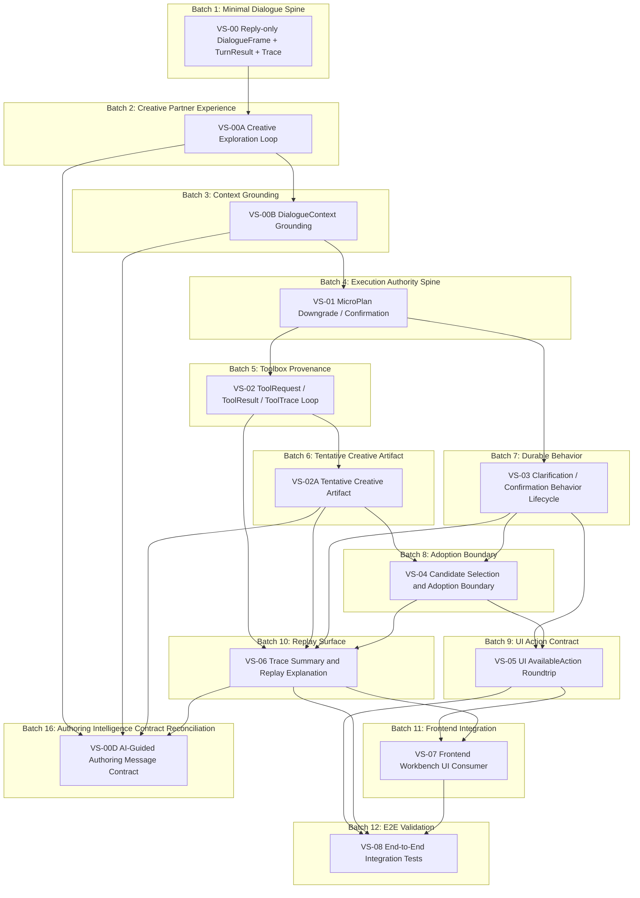

# v3 承重竖切面 DAG

> 状态：VS-00 ~ VS-08 done；VS-09 done（最小核心，剩余高级场景待续）；VS-10 done（2026-05-14，已补原生 Tauri 验证）；VS-11 done（2026-05-18，桌面 stage 进程所有权收束）；VS-00D docs-ready（2026-06-13，AI 引导式创作三层 + message contract）
>
> 角色：把 `docs/design-v3/00c-state-and-contract-atlas.md` §9 的候选入口排序为 v3 承重竖切面 DAG。B1-B14 已闭环；下一阶段入口待从 acceptance gap / product slice ledger 中挑选。
>
> 2026-05-25 纠偏记录：v3 creative artifact runtime 已重新对齐 DAG 边界。Toolbox runtime 归 `novel_agent`，ToolRequest / ToolResult / CapabilityRegistryEntry / CreativeRequest / CreativeProviderResult / ToolOutputContract 归 `novel_common`，`ArtifactAssembler` 归 `novel_application`；synthetic task_state_events 移除，Formal TaskState / Long-running Creative Job Contract deferred。

---

## 1. 当前 DAG

---

## 2. 线性批次

| Batch | Slice | 目标 | 状态 |
|---|---|---|---|
| B1 | VS-00 | 固化 reply-only 的 DialogueFrame / TurnResult / Trace 最小主链 | **done** |
| B2 | VS-00A | 固化模糊创作想法先自然展开，而不是自动表单化 | **done** |
| B3 | VS-00B | 固化 AI 回应必须被当前小说上下文约束，缺上下文时不编造 | **done** |
| B4 | VS-01 | 固化 MicroPlan 只是建议，OrchestratorDecision / gate order 才能裁决 | **done** |
| B5 | VS-02 | 固化 ToolRequest / ToolResult / ToolTrace provenance 闭环 | **done** |
| B6 | VS-02A | 固化 AI 可产出小说草稿，但默认只是待采纳材料 | **done** |
| B7 | VS-03 | 固化 clarification / confirmation durable behavior 生命周期 | **done** |
| B8 | VS-04 | 固化 candidate selection 不等于 adoption，production write 有边界 | **done** |
| B9 | VS-05 | 固化 UI 只能提交 AvailableAction，stale / invented action 重新校验 | **done** |
| B10 | VS-06 | 固化 trace summary 脱敏与 replay explanation | **done** |
| B11 | VS-07 | 前端 Workbench 消费 v3 Channel，证明端到端 UI 闭环 | **done** |
| B12 | VS-08 | 端到端集成测试，真实 provider + 真实 persistence 全链路 | **done** |
| B13 | VS-09 | Work Management Closed Loop（消除 mock_work_123，落地 SU-02 核心 7 场景）| **done**（最小核心）|
| B14 | VS-10 | Observability Spine（业务日志体系骨架 + ADR-0018 schema 冻结）| **done** |
| B15 | VS-11 | Desktop Stage Process Ownership（dev/stage 启停所有权与窗口关闭契约）| **done** |
| B16 | VS-00D | AI 引导式创作三层 + message contract，证明每次创作相关 AI 调用可重建 NovelLayer / WorkState / TurnGuidance | **docs-ready** |

说明：

- VS-00A / VS-00B 是根据最终愿景补入的体验承重切面：先证明 AI 像创作伙伴，再证明 AI 带着小说上下文回应，之后才进入执行权主链。
- VS-02 与 VS-03 都依赖 VS-01；它们可并行分析，但默认线性落地，避免同时改动 Orchestrator decision / trace 边界。
- VS-02A 是根据最终愿景补入的产物承重切面：证明 AI 可以生成小说草稿或候选材料，但这些材料默认不等于正式作品事实。
- VS-04 依赖 VS-02A 和 VS-03：candidate / adoption 需要真实创作草稿来源，也需要 confirmation / behavior lifecycle。
- VS-05 依赖 VS-03 和 VS-04：UI action roundtrip 必须先有 durable behavior 和 adoption boundary。
- VS-06 放在首批末尾：replay surface 需要前面至少出现 decision、tool、创作草稿、behavior 和 adoption 的代表性 trace。
- VS-00D 是后置 contract reconciliation：它不推翻已完成主链，而是把 VS-00A 的创作伙伴体验、VS-00B 的上下文 grounding、VS-02A 的创作产物和 VS-06 的 trace/replay 收束到统一 AI message envelope。

---

## 3. 节点元数据

| Slice | Type | Planning depends on | Implementation blockers | Blocks | Contract focus |
|---|---|---|---|---|---|
| VS-00 | Turn Slice | ADR-0001 | done | VS-00A, VS-06 | `DialogueFrame` / `TurnResult` / `DecisionTrace` |
| VS-00A | Experience Slice | VS-00, ADR-0001, ADR-0015 | done | VS-00B, VS-01, VS-05, VS-06 | `DialogueFrame.frame_type=exploration` / `CandidateDirectionSet` / `TurnResult` |
| VS-00B | Context Slice | VS-00A, ADR-0001, ADR-0013 | done | VS-01, VS-05, VS-06 | `DialogueContext` / `ContextSourceRef` / `DecisionTrace.context_refs` |
| VS-01 | Turn Slice | VS-00B, ADR-0002, ADR-0003, ADR-0004, ADR-0005 | done | VS-02, VS-03, VS-04, VS-05, VS-06 | `MicroPlan` / `OrchestratorDecision` / `Execution Gate Order` |
| VS-02 | Turn Slice | VS-01, ADR-0011, ADR-0012, ADR-0013 | done | VS-02A, VS-04, VS-06 | `CapabilityRegistryEntry` / `ToolRequest` / `ToolResult` / `ToolTrace` / `DecisionTrace` |
| VS-02A | Artifact Slice | VS-00B, VS-01, VS-02, ADR-0010 | done | VS-04, VS-05, VS-06 | `TentativeArtifactSet` / creative `ToolResult` / `TurnResult` / `DecisionTrace` |
| VS-03 | Behavior Slice | VS-01, ADR-0006, ADR-0007, ADR-0008, ADR-0009 | done | VS-04, VS-05, VS-06 | `BehaviorState` / `TurnPhase` / `TurnStatus` / `AvailableAction` / `ConfirmationBinding` |
| VS-04 | Artifact Slice | VS-02A, VS-03, ADR-0010, ADR-0016 | done | VS-05, VS-06 | `CandidateSet` / `AuthorActionInput` / `AdoptionBoundary` / `ProjectionHint` |
| VS-05 | UI Contract Slice | VS-03, VS-04, ADR-0014, ADR-0015 | done | VS-07, VS-08 | `TurnResultViewModel` / `AvailableAction` / `AuthorActionInput` / `TraceSummaryView` |
| VS-06 | Memory Slice | VS-02, VS-02A, VS-03, VS-04, VS-05, ADR-0013, ADR-0014, ADR-0017 | done | VS-07, VS-08 | `DecisionTrace` / `TraceSummaryView` / `ReplayReport` |
| VS-07 | Integration Slice | VS-05 (done), VS-06 (done), Tauri 2 + React 19 + TypeScript 6 | 前端 Channel 连接与 Tauri dev 可运行 | VS-08 | `TurnResult` JSON / AvailableAction / Phoenix Channel WebSocket / Tauri Workbench UI |
| VS-08 | Validation Slice | VS-07 (done), real LM Studio, real SQLite3 | done | — | full umbrella chain: web → application → agent → domain → persistence |
| VS-11 | Infrastructure Slice | Desktop shell contract, stage walkthrough gap | none | cleaner walkthrough / Tauri verification | dev/stage launcher ownership / Tauri close event |
| VS-00D | Contract Reconciliation Slice | VS-00A, VS-00B, VS-02A, VS-06, VS-00D contract pack, AU-11 | implementation plan not authorized | future Planner / Context / Provider message slices | `AIMessageEnvelope` / `NovelLayerMessage` / `WorkStateMessage` / `TurnGuidanceMessage` |

---

## 4. Slice 开工检查索引

### VS-00：Reply-only DialogueFrame + TurnResult + Trace

Slice 文件：`tasks/slices/v3/VS-00-reply-only-dialogue-frame-turn-result-trace.md`

| 问题 | 回答 |
|---|---|
| Contract | `AuthorInput`、`DialogueContext`、`DialogueFrame`、`TurnResult`、`DecisionTrace` |
| Invariant | `00c` §7 #1、#9、#14：每 turn 必有 frame；TurnResult 是 canonical 输出；replay 默认不重新调用 LLM |
| Boundary | 切过 web / application / agent planner draft / trace；不碰 production write |
| Consumer | Application test 或 Channel response |
| Proof | 普通创作讨论输出 reply-only TurnResult，trace 能解释未调用工具 |

### VS-00A：模糊创作想法的自然探索闭环

Slice 文件：`tasks/slices/v3/VS-00A-creative-exploration-loop.md`

| 问题 | 回答 |
|---|---|
| Contract | `AuthorInput`、`DialogueContext`、`DialogueFrame.frame_type=exploration`、`ExplorationPolicy`、`CandidateDirectionSet`、`TurnResult`、`DecisionTrace` |
| Invariant | `00c` §7 #1、#8、#9、#14：每 turn 必有 frame；缺 slot 不自动等于表单；TurnResult 是 canonical 输出；replay 默认不重新调用 LLM |
| Boundary | 切过 web / application / agent planner draft / TurnResult / trace；不碰 tool dispatch、durable behavior、production write 或 adoption |
| Consumer | Application contract test 或 Channel response |
| Proof | 模糊创作输入产生自然探索回应和 2-3 个候选方向；不得打开机械 slot 表单；trace 能解释为什么停留在 exploration |

### VS-00B：带着当前小说上下文回应

Slice 文件：`tasks/slices/v3/VS-00B-dialogue-context-grounding.md`

| 问题 | 回答 |
|---|---|
| Contract | `DialogueContext`、`CurrentWorkSnapshot`、`MemoryContextSummary`、`ContextSourceRef`、`DialogueFrame`、`TurnResult`、`DecisionTrace.context_refs` |
| Invariant | `00c` §7 #1、#8、#9、#13、#14：每 turn 必有 frame；缺上下文不自动表单化；TurnResult 是 canonical 输出；trace summary 脱敏；replay 默认不重新调用 LLM |
| Boundary | 切过 application context assembly / persistence read model 或测试 stub / agent planner input / TurnResult / trace；不让 agent 直接访问 Repo；不写 production state |
| Consumer | Application context assembly test 或 planner contract test |
| Proof | 同一作者输入在有作品上下文时回应引用真实上下文；无上下文时不编造事实；trace 能列出被使用的 context refs |

### VS-00D：AI 引导式创作三层 + Message Contract

Slice 文件：`tasks/slices/v3/VS-00D-ai-guided-authoring-message-contract.md`

| 问题 | 回答 |
|---|---|
| Contract | 小说层（NovelLayerMessage）、当前作品层（WorkStateMessage）、本轮引导层（TurnGuidanceMessage）、`AIMessageEnvelope`、`DialogueFrame` / trace 过渡承载、`CreativeDecisionPacket` |
| Invariant | AI 必须参与创作语义判断；作品状态必须有来源；message envelope 可重建；AI 判断不能越过 Orchestrator 和作者采纳边界 |
| Boundary | 切过 application context assembly / agent planner message / domain frame validation / creative provider input / trace；不新增并行 Router，不让 provider 自行读取 Repo，不写 production state |
| Consumer | Planner message、FrameTrace、MicroPlan、CreativeProvider tool input、AU-11 验收场景 |
| Proof | “这一章不够爽”场景能重建 NovelLayer / WorkState / TurnGuidance 三层 message；缺当前章上下文时不编造；若进入重写仍需 Orchestrator 裁决 |

### VS-01：MicroPlan 被 Orchestrator 降级或要求确认

Slice 文件：`tasks/slices/v3/VS-01-micro-plan-downgrade-confirmation.md`

| 问题 | 回答 |
|---|---|
| Contract | `MicroPlan`、`OrchestratorDecision`、`Execution Gate Order`、`GateResult`、`NextAction`、`BehaviorState`、`DecisionTrace` |
| Invariant | `00c` §7 #2、#3、#4、#6、#12：MicroPlan 只是建议；Orchestrator 是唯一门禁；默认只放行下一步；写入 tentative-first；confirmation answer 重新 gate |
| Boundary | 切过 agent draft / application gate orchestration / toolbox availability / trace；不执行真实 production write |
| Consumer | Orchestrator contract test 或 TurnResult Builder |
| Proof | 多步或高风险 MicroPlan 产生 `downgrade_to_dialogue` 或 `require_confirmation`，trace 记录 first blocking gate |

### VS-02：ToolRequest / ToolResult / ToolTrace 闭环

Slice 文件：`tasks/slices/v3/VS-02-tool-request-result-trace-loop.md`

| 问题 | 回答 |
|---|---|
| Contract | `CapabilityRegistryEntry`、`ToolRequest`、`ToolResult`、`ToolTrace`、`DecisionTrace` |
| Invariant | `00c` §7 #3、#5、#6、#9、#14：未经 decision 的 ToolRequest 不 dispatch；工具调用有 trace；ToolResult 不直接等于 production fact；TurnResult 是 canonical 输出；replay 默认不重新调用 LLM |
| Boundary | 切过 application approving decision / agent toolbox runtime / trace coordination；不写 domain production state；不让 web 或 frontend 直接调用 toolbox |
| Consumer | Replay / audit test |
| Proof | 一个 read-only 或 validation tool 调用能从 decision 到 request/result/trace 完整 replay，且 replay 不重新调用 provider |

### VS-02A：AI 创作草稿与待采纳产物

Slice 文件：`tasks/slices/v3/VS-02A-tentative-creative-artifact.md`

| 问题 | 回答 |
|---|---|
| Contract | `DialogueContext`、`MicroPlan`、`ToolRequest`、`ToolResult`、`TentativeArtifactSet`、`TurnResult`、`DecisionTrace` |
| Invariant | `00c` §7 #3、#5、#6、#9、#11、#14：Orchestrator 是唯一门禁；工具调用有 trace；写入默认 tentative；TurnResult 是 canonical 输出；candidate selection 不等于 adoption；replay 默认不重新调用 LLM |
| Boundary | 切过 application decision / agent creative tool runtime / TurnResult / trace；不写 production state；不让 ToolResult 直接变成 adopted state |
| Consumer | Application artifact contract test 或 Workbench candidate card |
| Proof | 生成角色设定或章节片段时只产生 tentative artifact；TurnResult 明确这是草案；未经过选择和 adoption 不写入权威作品事实 |

### VS-03：Clarification / Confirmation Behavior 生命周期

Slice 文件：`tasks/slices/v3/VS-03-clarification-confirmation-behavior-lifecycle.md`

| 问题 | 回答 |
|---|---|
| Contract | `TurnPhase`、`TurnStatus`、`NextAction`、`AvailableAction`、`BehaviorState`、`ConfirmationBinding`、`DecisionTrace` |
| Invariant | `00c` §7 #7、#8、#10、#12、#14：durable behavior 必须 open / close / resolution；缺 slot 不自动等于表单；UI 只能提交 available action；confirmation answer 重新 gate；replay 默认不重新调用 LLM |
| Boundary | 切过 application behavior lifecycle / TurnResult / UI action ingestion / trace；不写 production state；不让 frontend 直接改 BehaviorState |
| Consumer | Workbench action roundtrip 或 application behavior test |
| Proof | 用户回答 clarification / confirmation 后 behavior 关闭或推进，并留下 decision / behavior trace |

### VS-04：Candidate selection 与 adoption 边界

Slice 文件：`tasks/slices/v3/VS-04-candidate-selection-adoption-boundary.md`

| 问题 | 回答 |
|---|---|
| Contract | `CandidateSet`、`AuthorActionInput.choose_candidate`、`AvailableAction`、`AdoptionDecision`、`AdoptionBoundary`、`ProjectionHint`、`DecisionTrace`、`StateTrace` |
| Invariant | `00c` §7 #6、#10、#11、#12、#14、#15：写入 tentative-first；UI 只能提交 available action；candidate selection 不等于 adoption；confirmation answer 重新 gate；replay 默认不重新调用 LLM；projection hints 只触发刷新 |
| Boundary | 切过 UI action / application adoption boundary / domain pure validation / projection read model / trace；不让 frontend 直接写 production；不让 agent ToolResult 直接变 canon |
| Consumer | Workbench candidate card 或 projection refresh test |
| Proof | 选择候选后只产生 adoption evaluation、confirmation 或 adopted state trace；未授权不写 production fact |

### VS-05：UI AvailableAction roundtrip

Slice 文件：`tasks/slices/v3/VS-05-ui-available-action-roundtrip.md`

| 问题 | 回答 |
|---|---|
| Contract | `TurnResultViewModel`、`AvailableAction`、`AuthorActionInput`、`TraceSummaryView`、`ProjectionHint` |
| Invariant | `00c` §7 #9、#10、#13、#15：UI 只消费 TurnResult；UI 只能提交 available actions；trace summary 脱敏；projection hints 只触发刷新 |
| Boundary | 切过 web API boundary / frontend contract / application action ingestion / trace redaction；不让 frontend 直接调用 toolbox、写 BehaviorState 或写 adopted state |
| Consumer | Workbench UI smoke test 或 API contract test |
| Proof | invented / stale / disabled action 被拒绝，合法 action 回到主链并产生新 TurnResultViewModel |

### VS-06：Trace summary 与 replay explanation

Slice 文件：`tasks/slices/v3/VS-06-trace-summary-replay-explanation.md`

| 问题 | 回答 |
|---|---|
| Contract | `DecisionTrace`、`ToolTrace`、`BehaviorTrace`、`StateTrace`、`TraceSummaryView`、`ReplayCase`、`ReplayReport` |
| Invariant | `00c` §7 #5、#9、#13、#14：工具调用 trace 完整；TurnResult 是 canonical 输出；trace summary 脱敏；replay 默认不重新调用 LLM |
| Boundary | 切过 trace store/read model / replay / API redaction / developer report；不暴露 raw prompt 给作者主流程；不让 replay 修改 production state |
| Consumer | Replay console、UI trace summary 或 audit test |
| Proof | 同一个 turn 可生成 author-safe summary 和 developer ReplayReport，replay 不调用 provider |

---

### VS-07：前端 Workbench 消费 v3 Channel

Slice 文件：`tasks/slices/v3/VS-07-frontend-workbench-ui-consumer.md`

| 问题 | 回答 |
|---|---|
| Contract | `TurnResult`、`AvailableAction`、`AuthorActionInput`、`BehaviorState`、`candidate_directions`、`orchestrator_decision`、`tool_result`、`tentative_artifacts` |
| Invariant | `00c` §7 #9、#10、#13、#15：TurnResult canonical；UI 只提交 available actions；trace 脱敏；projection hints 只刷新 |
| Boundary | `novel_web` Channel ↔ Tauri/React frontend（WebSocket JSON）；前端不碰 application/agent/domain 内部，不直接写 DB |
| Consumer | Tauri Workbench 视图 — MessageList + MessageInput + ActionPanel + CandidateCards + StatusBar |
| Proof | user_message → turn_result roundtrip；author_action reply；invented/stale 拒绝；exploration 无表单；candidate cards 显示 |

### VS-08：端到端集成测试

Slice 文件：`tasks/slices/v3/VS-08-end-to-end-integration-tests.md`

| 问题 | 回答 |
|---|---|
| Contract | 全部 10 个 contract pack 的集成行为；真实 LM Studio + SQLite3 |
| Invariant | `00c` §7 #1、#2、#3、#5、#6、#9、#14、#15 — 8 条可在集成测试中直接断言 |
| Boundary | 切穿全部 5 个 umbrella app：web ChannelTest → application Gateway（真实 LM Studio）→ agent HTTP → domain validate → persistence SQLite3 |
| Consumer | CI pipeline（`mix test --include integration`）；测试文件 `apps/novel_web/test/integration/` |
| Proof | 11 个 E2E 场景：reply-only / exploration / context / downgrade / confirmation / tool dispatch / creative artifact / action validation / replay / persistence / error recovery |

---

## 5. 进入 implementation plan 的门槛

进入任意 slice implementation plan 前，必须满足：

1. 对应 slice 文件已创建，并复述本 DAG 中的 Contract / Invariant / Boundary / Consumer / Proof。
2. 依赖的上游 slice 已完成，或评审明确允许并行分析。
3. DAG planning 可以消费 Proposed ADR；implementation plan / code 需要相关核心 ADR 进入 Accepted，或在具体 slice 文件中明确例外、风险和评审结论。
4. Proof 能写成测试或可运行命令，不能只写“人工检查”。
5. 不新增横向任务节点，例如“建表”“写 API”“做 UI 页面”。

---

## 6. DAG 维护规则

新增或调整 v3 slice 时必须说明：

- `planning depends on`：DAG 排序依赖哪些已完成或待评审 contract / invariant
- `implementation blockers`：进入 implementation plan 前还需要哪些 Accepted ADR、schema 草案或明确例外
- `blocks`：阻塞哪些后续 slice
- `batch`：建议进入哪个线性批次
- `contract focus`：主要承重契约
- `proof`：最小可运行证明

如果 DAG 出现环，说明 slice 边界切错，需要重新切 slice，而不是强行执行。
